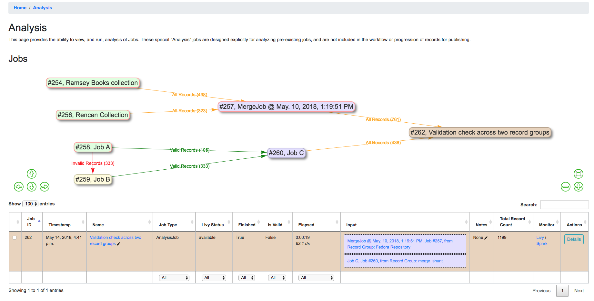
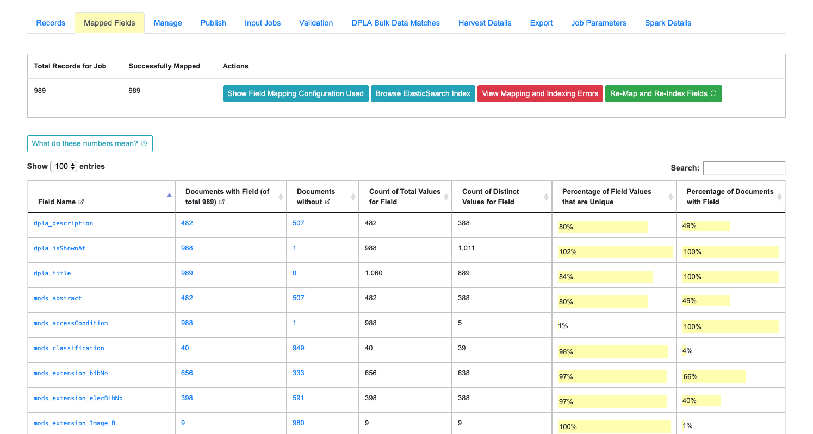
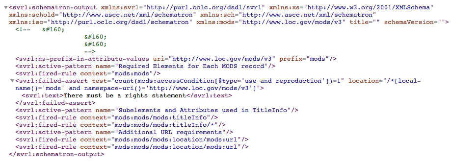
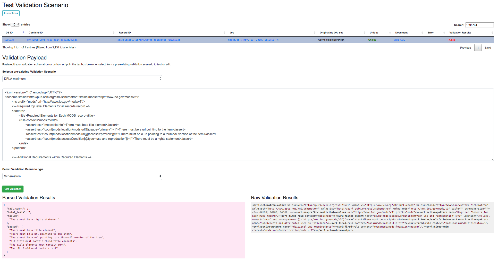

********
Analysis
********

In addition to supporting the actual harvesting, transformation, and publishing of metadata for aggregation purposes, Combine strives to also support the analysis of groups of Records.  Analysis may include looking at the use of metadata fields across Records, or viewing the results of Validation tests performed across Records.

This section will describe some areas of Combine related to analysis.  This includes `Analysis Jobs <#analysis-jobs>`__ proper, a particular kind of Job in Combine, and analysis more broadly when looking at the results of Jobs and their Records.

Analysis Jobs
=============

Analysis Jobs are a bit of an island.  On the back-end, they are essentially Duplicate / Merge Jobs, and have the same input and configuration requirements.  They can pull input Jobs from across Organizations and Records Groups.

Analysis Jobs *differ* in that they do not exist within a Record Group.  They are imagined to be ephemeral, disposable Jobs used entirely for analysis purposes.  

You can see previously run, or start a new Analysis Job, from the "Analysis" link from the top-most navigation.

Below, is an example of an Analysis Job comparing two Jobs, from *different* Record Groups.  This ability to pull Jobs from different Record Groups is shared with Merge Jobs.  You can see only one Job in the table, but the entire lineage of what Jobs contribute to this Analysis Job.  When the Analysis Job is deleted, none of the other Jobs will be touched (and currently, they are not aware of the Analysis Job in their own lineage).

   Analysis Job showing analysis of two Jobs, across two different Record Groups

Analyzing Indexed Fields
========================

Undoubtedly one of Combine's more interesting, confusing, and potentially powerful areas is the indexing of Record's XML into ElasticSearch.  This section will outline how that happens, and some possible insights that can be gleamed from the results.

How and Why?
------------

All Records in Combine store their raw metadata as XML in MySQL.  With that raw metadata, are some other fields about validity, internal identifiers, etc., as they relate to the Record.  But, because the metadata is still an opaque XML "blob" at this point, it does not allow for inspection or analysis.  To this end, when all Jobs are run, all Records are also **indexed** in ElasticSearch.

As many who have worked with complex metadata can attest to, flattening or mapping hierarchical metadata to a flat document store like ElasticSearch or Solr is difficult.  Combine approaches this problem by generically flattening all elements in a Record's XML document into XPath paths, which are converted into field names that are stored in ElasticSearch.  This includes attributes as well, further dynamically defining the ElasticSearch field name.

For example, the following XML metadata element:

.. code-block:: xml

    <mods:accessCondition type="useAndReproduction">This book is in the public domain.</mods:accessCondition>

would become the following ElasticSearch field name:

.. code-block:: text

    mods_accessCondition_@type_useAndReproduction

While ``mods_accessCondition_@type_useAndReproduction`` is not terribly pleasant to look at, it's telling where this value came from inside the XML document.  And most importantly, this generic XPath flattening approach can be applied across all XML documents that Combine might encounter.

When running Jobs, users `can select what "Index Mapper" to use <workflow.html#id2>`_, and a user may notice in addition to the ``Generic XPath based mapper``, which is outlined above, Combine also ships with another mapper called ``Custom MODS mapper``.  This is mentioned to point out that other, custom mappers could be created and used if desired.

The ``Custom MODS mapper`` is based on an old XSLT flattening map from MODS to Solr that early versions of Islandora used.  The results from this mapper result in far fewer indexed fields, which has pros and cons.  If the mapping is known and tightly controlled, this could be helpful for precise analysis of where information is going.  But, the generic mapper will -- in some way -- map all values from the XML record to ElasicSearch for analysis, albeit with unsightly field names.  Choices, choices!

Creating a custom mapper would require writing a new class in the file ``core/spark/es.py``, matching the functionality of a pre-existing mapper like ``class GenericMapper(BaseMapper)``.

Breakdown of indexed fields for a Job
~~~~~~~~~~~~~~~~~~~~~~~~~~~~~~~~~~~~~

When viewing the details of a Job, the tab "Field Analysis" shows a breakdown of all fields, for all documents in ElasticSearch, from this job in a table.  These are essentially facets.

   Example of Field Analysis tab from Job details, showing all indexed fields for a Job

There is a button "Show field analysis explanation" that outlines what the various columns mean:

.. figure:: img/field_analysis_explain.png
   :alt: Collapsible explanation of indexed fields breakdown table
   :target: _images/field_analysis_explain.png

   Collapsible explanation of indexed fields breakdown table

All columns are sortable, and some are linked out to another view that drills further into that particular field.  One way to drill down into a field is to click on the field name itself.  This will present another view with values from that field.  Below is doing that for the field ``mods_subject_topic``:

.. figure:: img/mods_subject_topic.png
   :alt: Drill down to ``mods_subject_topic`` indexed field
   :target: _images/mods_subject_topic.png

   Drill down to ``mods_subject_topic`` indexed field

At the top, you can see some high-level metrics that recreate numbers from the overview, such as:

  - how many documents have this field
  - how many do not
  - how many total *values* are there, remembering that a single document can have multiple values
  - how many *distinct* values are there
  - percentage of unique (distinct / total values)
  - and percentage of all documents that have this field

In the table, you can see actual values for the field, with counts across documents in this Job.  In the last column, you can click to see Records that **have** or **do not have** this particular value for this particular field.

Clicking into a subject like "fairy tales", we get the following screen:

.. figure:: img/fairy_tales_drilldown.png
   :alt: Details for "fairy tales" ``mods_subject_topic`` indexed field
   :target: _images/fairy_tales_drilldown.png

   Details for "fairy tales" ``mods_subject_topic`` indexed field

At this level, we have the option to click into individual Records.

Validation Tests Results
========================

Results for Validation Tests run on a particular Job are communicated in the following ways:

  - in the Records Table from a Job's details page
  - a quick overview of all tests performed, and number passed, from a Job's details page
  - exported as an Excel or .csv from a Job's details page
  - results for each Validation test on a Record's details page

When a Record fails *any* test from *any* applied Validation Scenario to its parent Job, it is considered "invalid".  When selecting an input Job for another Job, users have the options of selecting all Records, those that passed all validations tests, or those that may have failed one or more.

The following is a screenshot from a Job Details page, showing that one Validation Scenario was run, and 761 Records failed validation:

.. figure:: img/job_details_validation_results.png
   :alt: All Validation Tests run for this Job
   :target: _images/job_details_validation_results.png

   Results of all Validation Tests run for this Job

Clicking into "See Failures" brings up the resulting screen:

.. figure:: img/validation_failures_table.png
   :alt: Table of all Validation failures, for a particular Validation, for a Job
   :target: _images/validation_failures_table.png

   Table of all Validation failures, for a particular Validation, for a Job

The column ``Validation Results Payload`` contains the message from the Validation Test (results may be generated from Schematron, or Python, and there may be multiple results), and the ``Failure Count`` column shows how many specific tests were failed for that Record (a single Validation Scenario may contain multiple individual tests).

Clicking into a single Record from this table will reveal the Record details page, which has its own area dedicated to what Validation Tests it may have failed:

.. figure:: img/record_validation_results.png
   :alt: Record's Validation Results tab
   :target: _images/record_validation_results.png

   Record's Validation Results tab

From this screen, it is possible to Run the Validation and receive the raw results from the "Run Validation" link:

   Raw Schematron validation results

Or, a user can send this single Record to the Validation testing area to re-run validation scenarios, or test new ones, by clicking the "Test Validation Scenario on this Record" button.  From this page, it is possible select pre-existing Validation Scenarios to apply to this Record in real-time, users can then edit those to test, or try completely new ones (see `Validation Scenarios for more on testing <configuration.html#validation-scenario>`_):

   Validation Scenario testing screen

