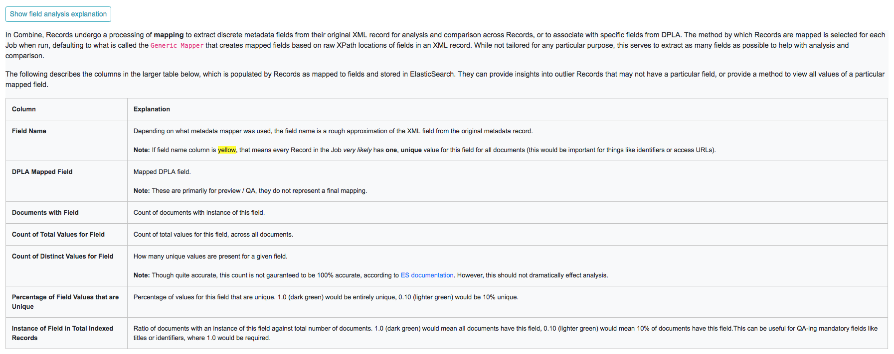
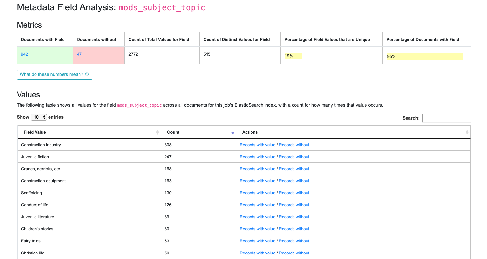
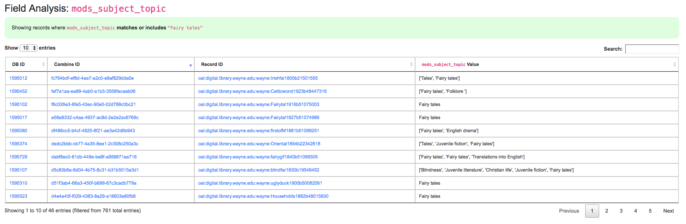

********
Analysis
********

This section will describe some areas of Combine related to analysis.  This includes Analysis Jobs proper, a particular kind of Job in Combine, and analysis more broadly when looking at the results of Jobs and their Records.

Analysis Jobs
=============

Analysis Jobs are a bit of an island.  On the back-end, they are essentially Duplicate / Merge Jobs, and have the same input and configuration requirements.  They can pull input Jobs from across Organizations and Records Groups.

Analysis Jobs *differ* in that they do not exist within a Record Group.  They are imagined to be emphemeral, disposable Jobs used entirely for analysis purposes.  

You can see previously run, or start a new Analysis Job, from the "Analysis" link from the top-most navigation.

Analyzing Indexed Fields
========================

Undoubtedly one of Combine's more interesting, confusing, and potentially powerful areas is the indexing of Record's XML into ElasticSearch.  This section will outline how that happens, and some possible insights that can be gleamed from the results.

How and Why?
------------

All Records in Combine store their raw metadata as XML in MySQL.  With that raw metadata, are some other fields about validity, internal identifiers, etc.  But, because the metadata is still an opaque XML "blob" at this point, it does not allow for inspection or analysis.  To this end, when all Jobs are run, all Records are also **indexed** in ElasticSearch.

As many who have worked with complex metadata can attest to, flattening or mapping hierarchical metadata to a flat document store like ElasticSearch or Solr is difficult.  Combine approaches this problem by generically flattening all elements in a Record's XML document into XPath paths, which are converted into field names that are stored in ElasticSearch.  This includes attributes as well, further specifying the ElasticSearch field name.

For example, the following XML metadata element:

.. code-block:: xml

    <mods:accessCondition type="useAndReproduction">This book is in the public domain.</mods:accessCondition>

would become the following ElasticSearch field name:

.. code-block:: text

    mods_accessCondition_@type_useAndReproduction

While ``mods_accessCondition_@type_useAndReproduction`` is not terribly pleasant to look at, it's telling where this value came from inside the XML document.  And most importantly, this generic XPath flattening approach can be applied across all XML documents that Combine might encounter.

When running Jobs, users `can select what "Index Mapper" to use <workflow.html#index-mapping>`_, and a user may notice in addition to the ``Generic XPath based mapper``, which is outlined above, Combine also ships with another mapper called ``Custom MODS mapper``.  This is mentioned to point out that other, custom mappers could be created and used if desired.

The ``Custom MODS mapper`` is based on an old XSLT flattening map from MODS to Solr that early versions of Islandora used.  The results from this mapper result in far fewer indexed fields, which has pros and cons.  If the mapping is known and tightly controlled, this could be helpful for precise analysis of where information is going.  But, the generic mapper will -- in some way -- map all values from the XML record to ElasicSearch for analysis, albeit with unsightly field names.  Choices, choices!

Creating a custom mapper would require writing a new class in the file ``core/spark/es.py``, matching the functionality of a pre-existing mapper like ``class GenericMapper(BaseMapper)``.

Breakdown of indexed fields for a Job
~~~~~~~~~~~~~~~~~~~~~~~~~~~~~~~~~~~~~

When viewing the details of a Job, the tab "Field Analysis" shows a breakdown of all fields, for all documents in ElasticSearch, from this job in a table.  These are essentially facets.

There is a button "Show field analysis explanation" that outlines what the various columns mean:

   Collapsible explanation of indexed fields breakdown table

All columns are sortable, and some are linked out to another view that drills further into that particular field.  One way to drill down into a field is to click on the field name itself.  This will present another view with values from that field.  Below is doing that for the field ``mods_subject_topic``:

   Drill down to ``mods_subject_topic`` indexed field

At the top, you can see some high-level metrics that recreate numbers from the overview like:

  - how many documents have this field
  - how many do not
  - how many total *values* are there, remembering that a single document can have multiple values
  - how many *distinct* values are there
  - percentage of unique (distinct / total values)
  - and percentage of all documents that have this field

In the table, you can see actual values for the field, with counts across documents in this Job.  In the last column, you can click to see Records that **have** or **do not have** this particular value for this particular field.

Clicking into a subject like "fairy tales", we get the following screen:

   Details for "fairy tales" ``mods_subject_topic`` indexed field

At this level, we have the option to click into individual Records.

