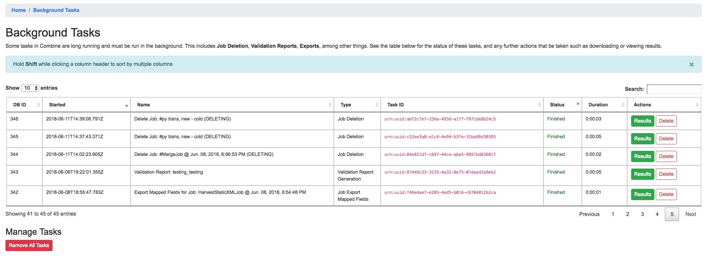
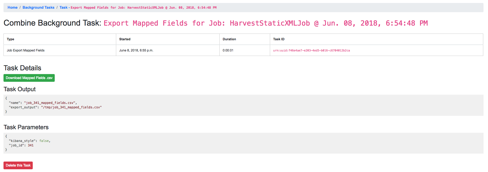

****************
Background Tasks
****************

Combine includes a section for viewing and managing long running tasks.  This can be accessed from the "Background Tasks" link at the top-most navigation from any page.

**Note:** Background tasks do *not* include normal workflow Jobs such as Harvests, Transforms, Merges, etc., but do include the following tasks in Combine:

  - deleting of Organizations, Record Groups, or Jobs
  - generating reports of Validations run for a Job
  - exportings Jobs as mapped fields or XML documents
  - re-indexing Job with optionally changed mapping parameters
  - running new / removing validations from Job

The following screenshot shows a table of all Background Tasks, and their current status:

   Table of running and completed Background Tasks

Clicking on the "Results" button for a single task will take you to details about that task:

   Example of completed Job Export Background Task

The results page for each task type will be slightly different, depending on what further actions may be taken, but an example would be a download link (as in the figure above) for job export or validation reports.