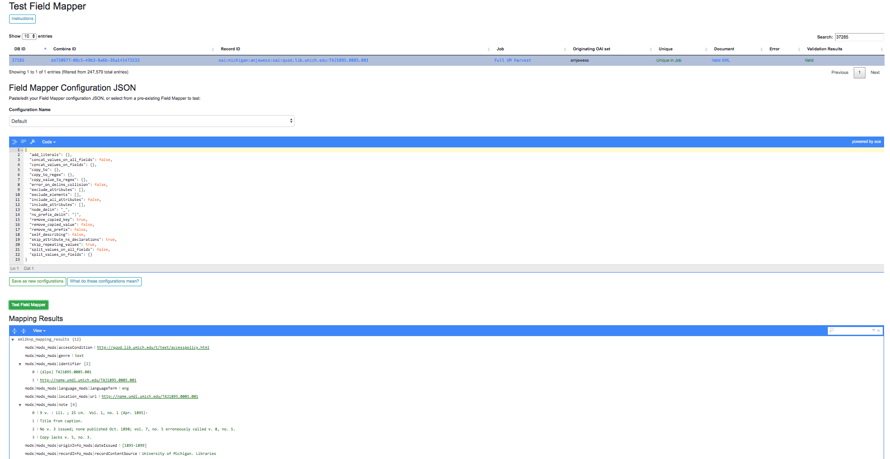
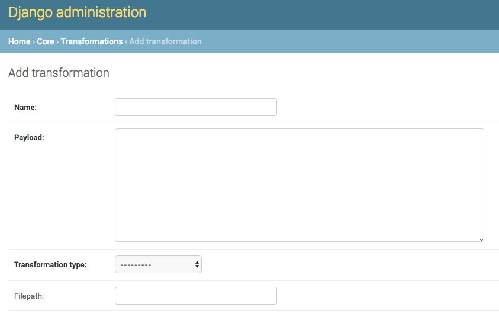
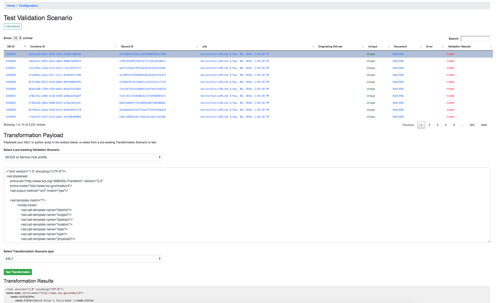
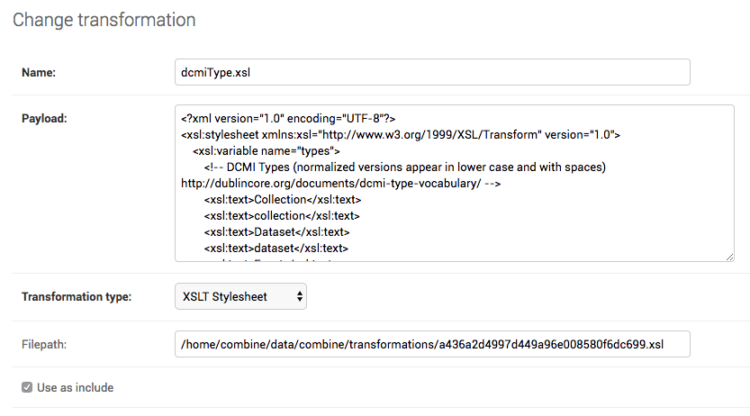
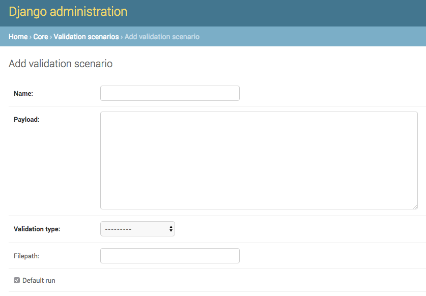
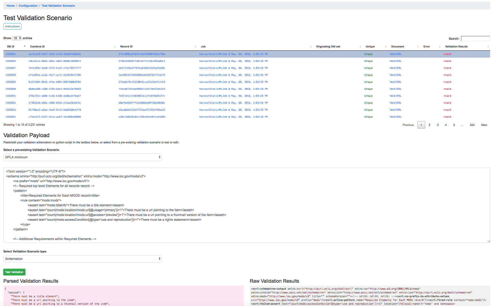
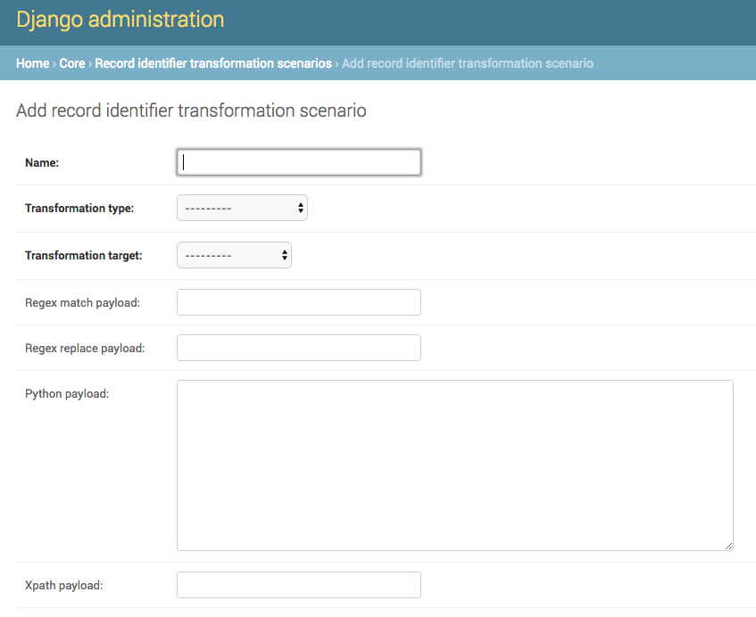
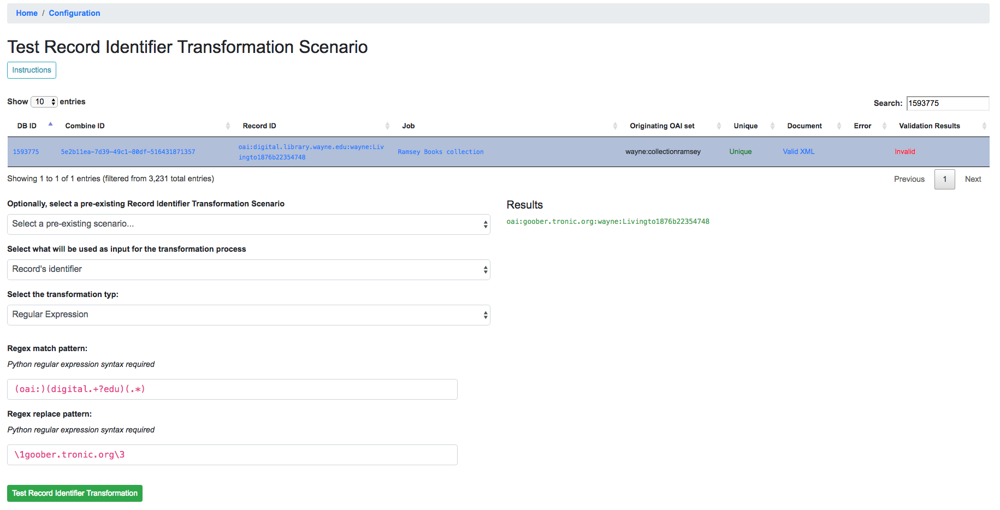
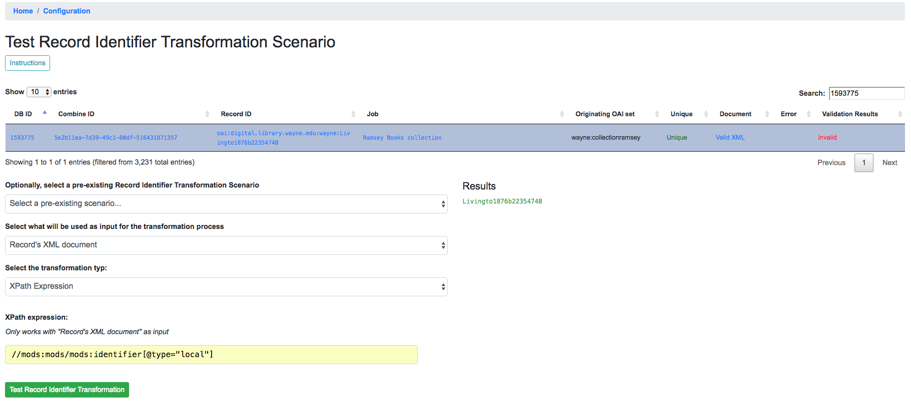
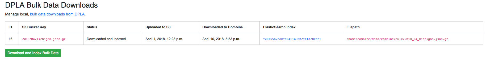

*************
Configuration
*************

Combine relies heavily on front-loading configuration, so that the process of running Jobs is largely selecting pre-existing "scenarios" that have already been tested and configured.

This section will outline configuration options and associated configuration pages.

  - `Field Mapping <#field-mapper-configurations>`__
  - `OAI-PMH Harvesting Endpoints <#oai-server-endpoints>`__
  - `Transformation Scenarios <#transformation-scenario>`__
  - `Validation Scenarios <#validation-scenario>`__
  - `Record Identifier Transformation Scenarios (RITS) <#record-identifier-transformation-scenario>`__
  - `Built-In OAI-PMH server <#combine-oai-pmh-server>`__
  - `DPLA Bulk Data Downloads <#dpla-bulk-data-downloads-dbdd>`__

**Note:** Currently, Combine leverages Django's built-in admin interface for editing and creating model instances -- transformations, validations, and other scenarios -- below.  This will likely evolve into more tailored CRUDs for each, but for the time being, there is a link to the Django admin panel on the Configuration screen.

**Note:** What settings are not configurable via the GUI in Combine, are configurable in the file ``combine/localsettings.py``.


Field Mapper Configurations
===========================

Field Mapping is the process of mapping values from a Record's sourece document (likely XML) and to meaningful and analyzable key/value pairs that can be stored in ElasticSearch.  These mapped values from a Record's document are used in Combine for:

  - analyzing distribution of XML elements and values across Records
  - exporting to mapped field reports
  - for single Records, querying the DPLA API to check existence
  - comparing Records against DPLA bulk data downloads
  - and much more!

To perform this mapping, Combine uses an internal library called ``XML2kvp``, which stands for "XML to Key/Value Pairs", to map XML to key/value JSON documents.  Under the hood, ``XML2kvp`` uses `xmltodict <https://github.com/martinblech/xmltodict>`_ to parse the Record XML into a hierarchical dictionary, and then loops through that, creating fields based on the configurations below.


I've mapped DC or MODS to Solr or ElasticSearch, why not do something similar?
------------------------------------------------------------------------------

Each mapping is unique: to support different access, preservation, or analysis purposes.  A finely tuned mapping for one metadata format or institution, might be unusable for another, even for the same metadata format.  Combine strives to be metadata format agnostic for harvesting, transformation, and analysis, and furthermore, performing these actions before a mapping has even been created or considered.  To this end, a "generic" but customizable mapper was needed to take XML records and convert them into fields that can be used for developing an understanding about a group of Records.

While applications like Solr and ElasticSearch more recently support hierarchical documents, and would likely support a straight XML to JSON converted document (with `xmltodict <https://github.com/martinblech/xmltodict>`_, or `Object Management Group (OMG)'s XML to JSON conversion standard <https://www.omg.org/cgi-bin/doc?ad/13-09-04>`_), the attributes in XML give it a dimensionality beyond simple hierarchy, and can be critical to understanding the nature and values of a particular XML element.  These direct mappings would function, but would not provide the same scannable, analysis of a group of XML records.  

XML2kvp provides a way to blindly map most any XML document, providing a broad overview of fields and structures, with the ability to further narrow and configure.  A possible update/improvement would be the ability for users to upload mappers of their making (e.g. XSLT) that would result in a flat mapping, but that is currently not implemented.


How does it work
----------------

XML2kvp converts elements from XML to key/value pairs by converting hierarchy in the XML document to character delimiters.

Take for example the following, "unique" XML:

.. code-block:: xml

	<?xml version="1.0" encoding="UTF-8"?>
	<root xmlns:internet="http://internet.com">
		<foo>
			<bar>42</bar>
			<baz>109</baz>
		</foo>
		<foo>
			<bar>42</bar>
			<baz>109</baz>
		</foo>
		<foo>
			<bar>9393943</bar>
			<baz>3489234893</baz>
		</foo>
		<tronic type='tonguetwister'>Sally sells seashells by the seashore.</tronic>
		<tronic type='tonguetwister'>Red leather, yellow leather.</tronic>
		<tronic>You may disregard</tronic>
		<goober scrog='true' tonk='false'>
			<depths>
				<plunder>Willy Wonka</plunder>
			</depths>
		</goober>
		<nested_attribs type='first'>
			<another type='second'>paydirt</another>
		</nested_attribs>
		<nested>
			<empty></empty>
		</nested>
		<internet:url url='http://example.com'>see my url</internet:url>
		<beat type="4/4">four on the floor</beat>
		<beat type="3/4">waltz</beat>
		<ordering>
			<duck>100</duck>
			<duck>101</duck>
			<goose>102</goose>
			<it>run!</it>
		</ordering>
		<ordering>
			<duck>200</duck>
			<duck>201</duck>
			<goose>202</goose>
			<it>run!</it>
		</ordering>
	</root>


Converted with default options from XML2kvp, you would get the following key/value pairs in JSON form:

.. code-block:: js

	{'root_beat': ('four on the floor', 'waltz'),
	 'root_foo_bar': ('42', '9393943'),
	 'root_foo_baz': ('109', '3489234893'),
	 'root_goober_depths_plunder': 'Willy Wonka',
	 'root_nested_attribs_another': 'paydirt',
	 'root_ordering_duck': ('100', '101', '200', '201'),
	 'root_ordering_goose': ('102', '202'),
	 'root_ordering_it': 'run!',
	 'root_tronic': ('Sally sells seashells by the seashore.',
	  'Red leather, yellow leather.',
	  'You may disregard'),
	 'root_url': 'see my url'}

Some things to notice...

  - the XML root element ``<root>`` is present for all fields as ``root``
  - the XML hierarchy ``<root><foo><bar>`` repeats twice in the XML, but is collapsed into a single field ``root_foo_bar``
    
    - moreover, because ``skip_repeating_values`` is set to ``true``, the value ``42`` shows up only once, if set to ``false`` we would see the value ``('42', '42', '9393943')``

  - a distinct absence of all attributes from the original XML, this is because ``include_all_attributes`` is set to ``false`` by default.

Running with ``include_all_attributes`` set to ``true``, we see a more complex and verbose output, with ``@`` in various field names, indicating attributes:

.. code-block:: js

	{'root_beat_@type=3/4': 'waltz',
	 'root_beat_@type=4/4': 'four on the floor',
	 'root_foo_bar': ('42', '9393943'),
	 'root_foo_baz': ('109', '3489234893'),
	 'root_goober_@scrog=true_@tonk=false_depths_plunder': 'Willy Wonka',
	 'root_nested_attribs_@type=first_another_@type=second': 'paydirt',
	 'root_ordering_duck': ('100', '101', '200', '201'),
	 'root_ordering_goose': ('102', '202'),
	 'root_ordering_it': 'run!',
	 'root_tronic': 'You may disregard',
	 'root_tronic_@type=tonguetwister': ('Sally sells seashells by the seashore.',
	  'Red leather, yellow leather.'),
	 'root_url_@url=http://example.com': 'see my url'}

A more familiar example may be Dublin Core XML:

.. code-block:: xml

	<oai_dc:dc xmlns:xsi="http://www.w3.org/2001/XMLSchema-instance" xmlns:dc="http://purl.org/dc/elements/1.1/" xmlns:oai_dc="http://www.openarchives.org/OAI/2.0/oai_dc/" xmlns="http://www.openarchives.org/OAI/2.0/" xsi:schemaLocation="http://www.openarchives.org/OAI/2.0/oai_dc/ http://www.openarchives.org/OAI/2.0/oai_dc.xsd">
		<dc:title>Fragments of old book</dc:title>
		<dc:creator>Unknown</dc:creator>
		<dc:date>1601</dc:date>
		<dc:description>An object of immense cultural and historical worth</dc:description>
		<dc:subject>Writing--Materials and instruments</dc:subject>
		<dc:subject>Archaeology</dc:subject>
		<dc:coverage>1600-1610</dc:coverage>
		<dc:identifier>book_1234</dc:identifier>
	</oai_dc:dc>

And with default configurations, would map to:

.. code-block:: js

	{'dc_coverage': '1600-1610',
	 'dc_creator': 'Unknown',
	 'dc_date': '1601',
	 'dc_description': 'An object of immense cultural and historical worth',
	 'dc_identifier': 'book_1234',
	 'dc_subject': ('Writing--Materials and instruments', 'Archaeology'),
	 'dc_title': 'Fragments of old book'}


Configurations
--------------


Within Combine, the configurations passed to XML2kvp are referred to as "Field Mapper Configurations", and like many other parts of Combine, can be named, saved, and updated in the database for later, repeated use.  This following table describes the configurations that can be used for field mapping.

+------------------------------------+--------------------------+--------------------------------------------------------------------------------------------------------------------------------------------------------------------------------------------------------------------------------------------------------------------------------------------------------------------------------------------------------------------------------------------------------------------------------------------------------------------------------------------------------------------------+
| Parameter                          | Type                     | Description                                                                                                                                                                                                                                                                                                                                                                                                                                                                                                              |
+====================================+==========================+==========================================================================================================================================================================================================================================================================================================================================================================================================================================================================================================================+
| ``add_literals``                   | ``object``               | Key/value pairs for literals to mixin, e.g. ``foo``:``bar`` would create field ``foo`` with value ``bar`` [Default: ``{}``]                                                                                                                                                                                                                                                                                                                                                                                              |
+------------------------------------+--------------------------+--------------------------------------------------------------------------------------------------------------------------------------------------------------------------------------------------------------------------------------------------------------------------------------------------------------------------------------------------------------------------------------------------------------------------------------------------------------------------------------------------------------------------+
| ``capture_attribute_values``       | ``array``                | Array of attributes to capture values from and set as standalone field, e.g. if [``age``] is provided and encounters ``<foo age='42'/>``, a field ``foo_@age@`` would be created (note the additional trailing ``@`` to indicate an attribute value) with the value ``42``. [Default: ``[]``, Before: ``copy_to``, ``copy_to_regex``]                                                                                                                                                                                    |
+------------------------------------+--------------------------+--------------------------------------------------------------------------------------------------------------------------------------------------------------------------------------------------------------------------------------------------------------------------------------------------------------------------------------------------------------------------------------------------------------------------------------------------------------------------------------------------------------------------+
| ``concat_values_on_all_fields``    | [``boolean``,``string``] | Boolean or String to join all values from multivalued field on [Default: ``false``]                                                                                                                                                                                                                                                                                                                                                                                                                                      |
+------------------------------------+--------------------------+--------------------------------------------------------------------------------------------------------------------------------------------------------------------------------------------------------------------------------------------------------------------------------------------------------------------------------------------------------------------------------------------------------------------------------------------------------------------------------------------------------------------------+
| ``concat_values_on_fields``        | ``object``               | Key/value pairs for fields to concat on provided value, e.g. ``foo_bar``:``-`` if encountering ``foo_bar``:[``goober``,``tronic``] would concatenate to ``foo_bar``:``goober-tronic`` [Default: ``{}``]                                                                                                                                                                                                                                                                                                                  |
+------------------------------------+--------------------------+--------------------------------------------------------------------------------------------------------------------------------------------------------------------------------------------------------------------------------------------------------------------------------------------------------------------------------------------------------------------------------------------------------------------------------------------------------------------------------------------------------------------------+
| ``copy_to_regex``                  | ``object``               | Key/value pairs to copy one field to another, optionally removing original field, based on regex match of field, e.g. ``.*foo``:``bar`` would copy create field ``bar`` and copy all values fields ``goober_foo`` and ``tronic_foo`` to ``bar``.  Note: Can also be used to remove fields by setting the target field as false, e.g. ``.*bar``:``false``, would remove fields matching regex ``.*bar`` [Default: ``{}``]                                                                                                 |
+------------------------------------+--------------------------+--------------------------------------------------------------------------------------------------------------------------------------------------------------------------------------------------------------------------------------------------------------------------------------------------------------------------------------------------------------------------------------------------------------------------------------------------------------------------------------------------------------------------+
| ``copy_to``                        | ``object``               | Key/value pairs to copy one field to another, optionally removing original field, e.g. ``foo``:``bar`` would create field ``bar`` and copy all values when encountered for ``foo`` to ``bar``, removing ``foo``.  However, the original field can be retained by setting ``remove_copied_key`` to ``true``.  Note: Can also be used to remove fields by setting the target field as false, e.g. 'foo':``false``, would remove field ``foo``. [Default: ``{}``]                                                           |
+------------------------------------+--------------------------+--------------------------------------------------------------------------------------------------------------------------------------------------------------------------------------------------------------------------------------------------------------------------------------------------------------------------------------------------------------------------------------------------------------------------------------------------------------------------------------------------------------------------+
| ``copy_value_to_regex``            | ``object``               | Key/value pairs that match values based on regex and copy to new field if matching, e.g. ``http.*``:``websites`` would create new field ``websites`` and copy ``http://exampl.com`` and ``https://example.org`` to new field ``websites`` [Default: ``{}``]                                                                                                                                                                                                                                                              |
+------------------------------------+--------------------------+--------------------------------------------------------------------------------------------------------------------------------------------------------------------------------------------------------------------------------------------------------------------------------------------------------------------------------------------------------------------------------------------------------------------------------------------------------------------------------------------------------------------------+
| ``error_on_delims_collision``      | ``boolean``              | Boolean to raise ``DelimiterCollision`` exception if delimiter strings from either ``node_delim`` or ``ns_prefix_delim`` collide with field name or field value (``false`` by default for permissive mapping, but can be helpful if collisions are essential to detect) [Default: ``false``]                                                                                                                                                                                                                             |
+------------------------------------+--------------------------+--------------------------------------------------------------------------------------------------------------------------------------------------------------------------------------------------------------------------------------------------------------------------------------------------------------------------------------------------------------------------------------------------------------------------------------------------------------------------------------------------------------------------+
| ``exclude_attributes``             | ``array``                | Array of attributes to skip when creating field names, e.g. [``baz``] when encountering XML ``<foo><bar baz='42' goober='1000'>tronic</baz></foo>`` would create field ``foo_bar_@goober=1000``, skipping attribute ``baz`` [Default: ``[]``]                                                                                                                                                                                                                                                                            |
+------------------------------------+--------------------------+--------------------------------------------------------------------------------------------------------------------------------------------------------------------------------------------------------------------------------------------------------------------------------------------------------------------------------------------------------------------------------------------------------------------------------------------------------------------------------------------------------------------------+
| ``exclude_elements``               | ``array``                | Array of elements to skip when creating field names, e.g. [``baz``] when encountering field ``<foo><baz><bar>tronic</bar></baz></foo>`` would create field ``foo_bar``, skipping element ``baz`` [Default: ``[]``, After: ``include_all_attributes``, ``include_attributes``]                                                                                                                                                                                                                                            |
+------------------------------------+--------------------------+--------------------------------------------------------------------------------------------------------------------------------------------------------------------------------------------------------------------------------------------------------------------------------------------------------------------------------------------------------------------------------------------------------------------------------------------------------------------------------------------------------------------------+
| ``include_all_attributes``         | ``boolean``              | Boolean to consider and include all attributes when creating field names, e.g. if ``false``, XML elements ``<foo><bar baz='42' goober='1000'>tronic</baz></foo>`` would result in field name ``foo_bar`` without attributes included.  Note: the use of all attributes for creating field names has the the potential to balloon rapidly, potentially encountering ElasticSearch field limit for an index, therefore ``false`` by default.  [Default: ``false``, Before: ``include_attributes``, ``exclude_attributes``] |
+------------------------------------+--------------------------+--------------------------------------------------------------------------------------------------------------------------------------------------------------------------------------------------------------------------------------------------------------------------------------------------------------------------------------------------------------------------------------------------------------------------------------------------------------------------------------------------------------------------+
| ``include_attributes``             | ``array``                | Array of attributes to include when creating field names, despite setting of ``include_all_attributes``, e.g. [``baz``] when encountering XML ``<foo><bar baz='42' goober='1000'>tronic</baz></foo>`` would create field ``foo_bar_@baz=42`` [Default: ``[]``, Before: ``exclude_attributes``, After: ``include_all_attributes``]                                                                                                                                                                                        |
+------------------------------------+--------------------------+--------------------------------------------------------------------------------------------------------------------------------------------------------------------------------------------------------------------------------------------------------------------------------------------------------------------------------------------------------------------------------------------------------------------------------------------------------------------------------------------------------------------------+
| ``include_meta``                   | ``boolean``              | Boolean to include ``xml2kvp_meta`` field with output that contains all these configurations [Default: ``false``]                                                                                                                                                                                                                                                                                                                                                                                                        |
+------------------------------------+--------------------------+--------------------------------------------------------------------------------------------------------------------------------------------------------------------------------------------------------------------------------------------------------------------------------------------------------------------------------------------------------------------------------------------------------------------------------------------------------------------------------------------------------------------------+
| ``node_delim``                     | ``string``               | String to use as delimiter between XML elements and attributes when creating field name, e.g. ``___`` will convert XML ``<foo><bar>tronic</bar></foo>`` to field name ``foo___bar`` [Default: ``_``]                                                                                                                                                                                                                                                                                                                     |
+------------------------------------+--------------------------+--------------------------------------------------------------------------------------------------------------------------------------------------------------------------------------------------------------------------------------------------------------------------------------------------------------------------------------------------------------------------------------------------------------------------------------------------------------------------------------------------------------------------+
| ``ns_prefix_delim``                | ``string``               | String to use as delimiter between XML namespace prefixes and elements, e.g. ``|`` for the XML ``<ns:foo><ns:bar>tronic</ns:bar></ns:foo>`` will create field name ``ns|foo_ns:bar``.  Note: a ``|`` pipe character is used to avoid using a colon in ElasticSearch fields, which can be problematic. [Default: ``|``]                                                                                                                                                                                                   |
+------------------------------------+--------------------------+--------------------------------------------------------------------------------------------------------------------------------------------------------------------------------------------------------------------------------------------------------------------------------------------------------------------------------------------------------------------------------------------------------------------------------------------------------------------------------------------------------------------------+
| ``remove_copied_key``              | ``boolean``              | Boolean to determine if originating field will be removed from output if that field is copied to another field [Default: ``true``]                                                                                                                                                                                                                                                                                                                                                                                       |
+------------------------------------+--------------------------+--------------------------------------------------------------------------------------------------------------------------------------------------------------------------------------------------------------------------------------------------------------------------------------------------------------------------------------------------------------------------------------------------------------------------------------------------------------------------------------------------------------------------+
| ``remove_copied_value``            | ``boolean``              | Boolean to determine if value will be removed from originating field if that value is copied to another field [Default: ``false``]                                                                                                                                                                                                                                                                                                                                                                                       |
+------------------------------------+--------------------------+--------------------------------------------------------------------------------------------------------------------------------------------------------------------------------------------------------------------------------------------------------------------------------------------------------------------------------------------------------------------------------------------------------------------------------------------------------------------------------------------------------------------------+
| ``remove_ns_prefix``               | ``boolean``              | Boolean to determine if XML namespace prefixes are removed from field names, e.g. if ``false``, the XML ``<ns:foo><ns:bar>tronic</ns:bar></ns:foo>`` will result in field name ``foo_bar`` without ``ns`` prefix [Default: ``true``]                                                                                                                                                                                                                                                                                     |
+------------------------------------+--------------------------+--------------------------------------------------------------------------------------------------------------------------------------------------------------------------------------------------------------------------------------------------------------------------------------------------------------------------------------------------------------------------------------------------------------------------------------------------------------------------------------------------------------------------+
| ``self_describing``                | ``boolean``              | Boolean to include machine parsable information about delimeters used (reading right-to-left, delimeter and its length in characters) as suffix to field name, e.g. if ``true``, and ``node_delim`` is ``___`` and ``ns_prefix_delim`` is ``|``, suffix will be ``___3|1``.  Can be useful to reverse engineer field name when not re-parsed by XML2kvp. [Default: ``false``]                                                                                                                                            |
+------------------------------------+--------------------------+--------------------------------------------------------------------------------------------------------------------------------------------------------------------------------------------------------------------------------------------------------------------------------------------------------------------------------------------------------------------------------------------------------------------------------------------------------------------------------------------------------------------------+
| ``skip_attribute_ns_declarations`` | ``boolean``              | Boolean to remove namespace declarations as considered attributes when creating field names [Default: ``true``]                                                                                                                                                                                                                                                                                                                                                                                                          |
+------------------------------------+--------------------------+--------------------------------------------------------------------------------------------------------------------------------------------------------------------------------------------------------------------------------------------------------------------------------------------------------------------------------------------------------------------------------------------------------------------------------------------------------------------------------------------------------------------------+
| ``skip_repeating_values``          | ``boolean``              | Boolean to determine if a field is multivalued, if those values are allowed to repeat, e.g. if set to ``false``, XML ``<foo><bar>42</bar><bar>42</bar></foo>`` would map to ``foo_bar``:``42``, removing the repeating instance of that value. [Default: ``true``]                                                                                                                                                                                                                                                       |
+------------------------------------+--------------------------+--------------------------------------------------------------------------------------------------------------------------------------------------------------------------------------------------------------------------------------------------------------------------------------------------------------------------------------------------------------------------------------------------------------------------------------------------------------------------------------------------------------------------+
| ``skip_root``                      | ``boolean``              | Boolean to determine if the XML root element will be included in output field names [Default: ``false``]                                                                                                                                                                                                                                                                                                                                                                                                                 |
+------------------------------------+--------------------------+--------------------------------------------------------------------------------------------------------------------------------------------------------------------------------------------------------------------------------------------------------------------------------------------------------------------------------------------------------------------------------------------------------------------------------------------------------------------------------------------------------------------------+
| ``split_values_on_all_fields``     | [``boolean``,``string``] | If present, string to use for splitting values from all fields, e.g. `` `` will convert single value ``a foo bar please`` into the array of values [``a``,``foo``,``bar``,``please``] for that field [Default: ``false``]                                                                                                                                                                                                                                                                                                |
+------------------------------------+--------------------------+--------------------------------------------------------------------------------------------------------------------------------------------------------------------------------------------------------------------------------------------------------------------------------------------------------------------------------------------------------------------------------------------------------------------------------------------------------------------------------------------------------------------------+
| ``split_values_on_fields``         | ``object``               | Key/value pairs of field names to split, and the string to split on, e.g. ``foo_bar``:``,`` will split all values on field ``foo_bar`` on comma ``,`` [Default: ``{}``]                                                                                                                                                                                                                                                                                                                                                  |
+------------------------------------+--------------------------+--------------------------------------------------------------------------------------------------------------------------------------------------------------------------------------------------------------------------------------------------------------------------------------------------------------------------------------------------------------------------------------------------------------------------------------------------------------------------------------------------------------------------+

Saving and Reusing
------------------

Field Mapper sonfigurations may be saved, named, and re-used.  This can be done anytime field mapper configurations are being set, e.g. when running a new Job, or re-indexing a previously run Job. 


Testing 
-------

Field Mapping can also be tested against a single record, accessible from a Record's page under the "Run/Test Scenarios for this Record" tab.  The following is a screenshot of this testing page:



   Testing Field Mapper Configurations

In this screenshot, you can see a single Record is used as input, a Field Mapper Configurations applied, and the resulting mapped fields at the bottom.


OAI Server Endpoints
====================

Configuring OAI endpoints is the first step for harvesting from OAI endpoints.

To configure a new OAI endpoint, navigate to the Django admin screen, under the section "Core" select ``Oai endpoints``.

This model is unique among other Combine models in that these values are sent almost untouched to the DPLA Ingestion 3 OAI harvesting codebase.  More `information on these fields can be found here <https://digitalpubliclibraryofamerica.atlassian.net/wiki/spaces/TECH/pages/87658172/Spark+OAI+Harvester>`_.

The following fields are all required:

  - ``Name`` - Human readable name for OAI endpoint, used in dropdown menu when running harvest
  - ``Endpoint`` - URL for OAI server endpoint.  This should include the full URL up until, but not including, GET parameters that begin with a question mark ``?``.
  - ``Verb`` - This pertains to the OAI-PMH verb that will be used for harvesting.  Almost always, ``ListRecords`` is the required verb here.  So much, this will default to ``ListRecords`` if left blank.
  - ``MetadataPrefix`` - Another OAI-PMH term, the metadata prefix that will be used during harvesting.
  - ``Scope type`` - Not an OAI term, this refers to what kind of harvesting should be performed.  Possible values include:

    - ``setList`` - This will harvest the comma separated sets provided for ``Scope value``.
    - ``harvestAllSets`` - The most performant option, this will harvest all sets from the OAI endpoint.  If this is set, the ``Scope value`` field must be set to ``true``.
    - ``blacklist`` - Comma separated list of OAI sets to **exclude** from harvesting.

  - ``Scope value`` - String to be used in conjunction with ``Scope type`` outline above.

    - If ``setList`` is used, provide a comma separated string of OAI sets to harvest
    - If ``harvestAllSets``, provide just the single string ``true``.

 Once the OAI endpoint has been added in the Django admin, from the configurations page you are presented with a table showing all configured OAI endpoints.  The last column includes a link to issue a command to view all OAI sets from that endpoint.


Transformation Scenario
=======================

Transformation Scenarios are used for transforming the XML of Records during Transformation Jobs.  Currently, there are two types of well-supported transformation supported: **XSLT** and **Python code snippets**.  A third type, transforming Records based on actions performed in `Open Refine <http://openrefine.org/>`_ exists, but is not well tested or documented at this time.  These are described in more detail below.

It is worth considering, when thinking about transforming Records in Combine, that multiple transformations can be applied to same Record; "chained" together as separate Jobs.  Imagine a scenario where ``Transformation A`` crosswalks metadata from a repository to something more aligned with a state service hub, ``Transformation B`` fixes some particular date formats, and ``Transformation C`` -- a python transformation -- looks for a particular identifier field and creates a new field based on that.  Each of the transformations would be a separate Transformation Scenario, and would be run as separate Jobs in Combine, but in effect would be "chained" together by the user for a group of Records.

All Transformations require the following information:

  - ``Name`` - Human readable name for Transformation Scenario
  - ``Payload`` - This is where the actual transformation code is added (more on the different types below)
  - ``Transformation Type`` - ``xslt`` for XSLT transformations, or ``python`` for python code snippets
  - ``Filepath`` - *This may be ignored* (in some cases, transformation payloads were written to disk to be used, but likely deprecated moving forward)



   Adding Transformation Scenario in Django admin screen

Finally, Transformation Scenarios may be tested within Combine over a pre-existing Record.  This is done by clicking the "Test Transformation Scenario" button from Configuration page.  This will take you to a screen that is similarly used for testing Transformations, Validations, and Record Identifier Transformations.  For Transformations, it looks like the following:



   Testing Transformation Scenario with pre-existing Record

In this screenshot, a few things are happening:

  - a single Record has been clicked from the sortable, searchable table, indicating it will be used for the Transformation testing
  - a *pre-existing* Transformation Scenario has been selected from the dropdown menu, automatically populating the payload and transformation type inputs

    - however, a user may also add or edit the payload and transformation types live here, for testing purposes

  - at the very bottom, you can see the immediate results of the Transformation as applied to the selected Record

*Currently, there is no way to save changes to a Transformation Scenario, or add a new one, from this screen, but it allows for real-time testing of Transformation Scenarios.*

XSLT
----

XSLT transformations are performed by a small XSLT processor servlet called via `pyjxslt <https://github.com/cts2/pyjxslt>`_.  Pyjxslt uses a built-in Saxon HE XSLT processor that supports XSLT 2.0.

When creating an XSLT Transformation Scenario, one important thing to consider are XSLT **includes** and **imports**.  XSL stylesheets allow the inclusion of other, external stylesheets.  Usually, these includes come in two flavors:

  - locally on the same filesystem, e.g. ``<xsl:include href="mimeType.xsl"/>``
  - remote, retrieved via HTTP request, e.g. ``<xsl:include href="http://www.loc.gov/standards/mods/inc/mimeType.xsl"/>``

In Combine, the primary XSL stylesheet provided for a Transformation Scenario is uploaded to the pyjxslt servlet to be run by Spark.  This has the effect of breaking XSL ``include`` s that use a **local, filesystem** ``href`` s.  Additionally, depending on server configurations, pyjxslt sometimes has trouble accessing **remote** XSL ``include`` s.  But Combine provides workarounds for both scenarios.


Local Includes
~~~~~~~~~~~~~~

For XSL stylesheets that require local, filesystem ``include`` s, a workaround in Combine is to create Transformation Scenarios for each XSL stylesheet that is imported by the primary stylesheet.  Then, use the local filesystem path that Combine creates for that Transformation Scenario, and **update** the ``<xsl:include>`` in the original stylesheet with this new location on disk.

For example, let's imagine a stylesheet called ``DC2MODS.xsl`` that has the following ``<xsl:include>`` s:

.. code-block:: xml

    <xsl:include href="dcmiType.xsl"/>
    <xsl:include href="mimeType.xsl"/>

Originally, ``DC2MODS.xsl`` was designed to be used in the *same directory* as two files: ``dcmiType.xsl`` and ``mimeType.xsl``.  This is not possible in Combine, as XSL stylesheets for Transformation Scenarios are uploaded to another location to be used.

The workaround, would be to create two new special kinds of Transformation Scenarios by checking the box ``use_as_include``, perhaps with fitting names like "dcmiType" and "mimeType", that have payloads for those two stylesheets.  When creating those Transformation Scenarios, saving, and then re-opening the Transformation Scenario in Django admin, you can see a ``Filepath`` attribute has been made which is a copy written to disk.



   Filepath for saved Transformation Scenarios

This ``Filepath`` value can then be used to replace the original ``<xsl:include>`` s in the primary stylesheet, in our example, ``DC2MODS.xsl``:

.. code-block:: xml

    <xsl:include href="/home/combine/data/combine/transformations/a436a2d4997d449a96e008580f6dc699.xsl"/> <!-- formerly dcmiType.xsl -->
    <xsl:include href="/home/combine/data/combine/transformations/00eada103f6a422db564a346ed74c0d7.xsl"/> <!-- formerly mimeType.xsl -->


Remote Includes
~~~~~~~~~~~~~~~

When the ``href`` s for XSL ``includes`` s are remote HTTP URLs, Combine attempts to rewrite the primary XSL stylesheet automatically by:

  - downloading the external, remote ``include`` s from the primary stylesheet
  - saving them locally
  - rewriting the ``<xsl:include>`` element with this local filesystem location

This has the added advantage of effectively caching the remote include, such that it is not retrieved each transformation.

For example, let's imagine our trusty stylesheet called ``DC2MODS.xsl``, but with this time external, remote URLs for ``href`` s:

.. code-block:: xml

    <xsl:include href="http://www.loc.gov/standards/mods/inc/dcmiType.xsl"/>
    <xsl:include href="http://www.loc.gov/standards/mods/inc/mimeType.xsl"/>

With no action by the user, when this Transformation Scenario is saved, Combine will attempt to download these dependencies and rewrite, resulting in ``include`` s that look like the following:

.. code-block:: xml

  <xsl:include href="/home/combine/data/combine/transformations/dcmiType.xsl"/>
  <xsl:include href="/home/combine/data/combine/transformations/mimeType.xsl"/>

**Note:** If sytlesheets that remote ``include`` s rely on external stylesheets that may change or update, the primary Transformation stylesheet -- e.g. ``DC2MODS.xsl`` -- will have to be re-entered, with the original URLs, and re-saved in Combine to update the local dependencies.


Python Code Snippet
-------------------

An alternative to XSLT transformations are created Transformation Scenarios that use python code snippets to transform the Record.  The key to making a successful python Transformation Scenario is code that adheres to the pattern Combine is looking for from a python Transformation.  This requires a bit of explanation about how Records are transformed in Spark.

For Transformation Jobs in Combine, each Record in the input Job is fed to the Transformation Scenario.  If the ``transformation type`` is ``xslt``, the XSLT stylesheet for that Transformation Scenario is used as-is on the Record's raw XML.  However, if the ``transformation type`` is ``python``, the python code provided for the Transformation Scenario will be used.

The python code snippet may include as many imports or function definitions as needed, but will require one function that each Record will be passed to, and this function must be named ``python_record_transformation``.  Additionally, this function must expect one function argument, a passed instance of what is called a `PythonUDFRecord <https://github.com/WSULib/combine/blob/master/core/spark/utils.py#L45-L105>`_.  In Spark, "UDF" often refers to a "User Defined Function"; which is precisely what this parsed Record instance is passed to in the case of a Transformation.  This is a convenience class that parses a Record in Combine for easy interaction within Transformation, Validation, and Record Identifier Transformation Scenarios.   A ``PythonUDFRecord`` instance has the following representations of the Record:

  - ``record_id`` - The Record Identifier of the Record
  - ``document`` - raw, XML for the Record (what is passed to XSLT records)
  - ``xml`` - raw XML parsed with lxml's etree, an ``ElementTree`` instance
  - ``nsmap`` - dictionary of namespaces, useful for working with ``self.xml`` instance

Finally, the function ``python_record_transformation`` must return a python **list** with the following, ordered elements: [ *transformed XML as a string*, *any errors if they occurred as a string*, *True/False for successful transformation* ].  For example, a valid return might be, with the middle value a blank string indicating no error:

.. code-block:: python

    [ "<xml>....</xml>", "", True ]

A full example of a python code snippet transformation might look like the following.  In this example, a ``<mods:accessCondition>`` element is added or updated.  Note the imports, the comments, the use of the ``PythonUDFRecord`` as the single argument for the function ``python_record_transformation``, all fairly commonplace python code:

.. code-block:: python

    # NOTE: ability to import libraries as needed
    from lxml import etree

    def python_record_transformation(record):

      '''
      Python transformation to add / update <mods:accessCondition> element
      '''

      # check for <mods:accessCondition type="use and reproduction">
      # NOTE: not built-in record.xml, parsed Record document as etree instance
      # NOTE: not built-in record.nsmap that comes with record instance
      ac_ele_query = record.xml.xpath('mods:accessCondition', namespaces=record.nsmap)

      # if single <mods:accessCondition> present
      if len(ac_ele_query) == 1:

        # get single instance
        ac_ele = ac_ele_query[0]

        # confirm type attribute
        if 'type' in ac_ele.attrib.keys():

          # if present, but not 'use and reproduction', update
          if ac_ele.attrib['type'] != 'use and reproduction':
            ac_ele.attrib['type'] = 'use and reproduction'


      # if <mods:accessCondition> not present at all, create
      elif len(ac_ele_query) == 0:
        
        # build element
        rights = etree.Element('{http://www.loc.gov/mods/v3}accessCondition')
        rights.attrib['type'] = 'use and reproduction'
        rights.text = 'Here is a blanket rights statement for our institution in the absence of a record specific one.'

        # append
        record.xml.append(rights)


      # finally, serialize and return as required list [document, error, success (bool)]
      return [etree.tostring(record.xml), '', True]

In many if not most cases, XSLT will fit the bill and provide the needed transformation in Combine.  But the ability to write python code for transformation opens up the door to complex and/or precise transformations if needed.


Validation Scenario
===================

Validation Scenarios are by which Records in Combine are validated against.  Validation Scenarios may be written in the following formats: XML Schema (XSD), Schematron, Python code snippets, and ElasticSearch DSL queries.  Each Validation Scenario requires the following fields:

  - ``Name`` - human readable name for Validation Scenario
  - ``Payload`` - pasted Schematron or python code
  - ``Validation type`` - ``sch`` for Schematron, ``python`` for python code snippets, or ``es_query`` for ElasticSearch DSL query type validations
  - ``Filepath`` - *This may be ignored* (in some cases, validation payloads were written to disk to be used, but likely deprecated moving forward)
  - ``Default run`` - if checked, this Validation Scenario will be automatically checked when running a new Job



   Adding Validation Scenario in Django admin

When running a Job, **multiple** Validation Scenarios may be applied to the Job, each of which will run for every Record.  Validation Scenarios may include multiple tests or "rules" with a single scenario.  So, for example, ``Validation A`` may contain ``Test 1`` and ``Test 2``.  If run for a Job, and ``Record Foo`` fails ``Test 2`` for the ``Validation A``, the results will show the failure for that Validation Scenario as a whole.  

When thinking about creating Validation Scenarios, there is flexibility in how many tests to put in a single Validation Scenario, versus splitting up those tests between distinct Validation Scenarios, recalling that **multiple** Validation Scenarios may be run for a single Job.  It is worth pointing out, multiple Validation Scenarios for a Job will likely degrade performance *more* than a multiple tests within a single Scenario, though this has not been testing thoroughly, just speculation based on how Records are passed to Validation Scenarios in Spark in Combine.

Like Transformation Scenarios, Validation Scenarios may also be tested in Combine.  This is done by clicking the button, "Test Validation Scenario", resulting in the following screen:



   Testing Validation Scenario

In this screenshot, we an see the following happening:

  - a single Record has been clicked from the sortable, searchable table, indicating it will be used for the Validation testing
  - a pre-existing Validation Scenario -- ``DPLA minimum``, a Schematron validation -- has been selected, automatically populating the payload and validation type inputs

    - However, a user may choose to edit or input their own validation payload here, understanding that editing and saving cannot currently be done from this screen, only testing

  - Results are shown at the bottom in two areas:

    - ``Parsed Validation Results`` - parsed results of the Validation, showing tests that have **passed**, **failed**, and a **total count** of failures
    - ``Raw Validation Results`` - raw results of Validation Scenario, in this case XML from the Schematron response, but would be a JSON string for a python code snippet Validation Scenario

As mentioned, two types of Validation Scenarios are currently supported, Schematron and python code snippets, and are detailed below.

XML Schema (XSD)
----------------

XML Schemas (XSD) may be used to validate a Record's document.  One limitation of XML Schema is that many python based validators will bail on the first error encountered in a document, meaning the resulting Validation failure will only show the **first** invalid XML segment encountered, though there may be many.  However, knowing that a Record has failed even one part of an XML Schema, might be sufficient to look in more detail with an external validator and determine where else it is invalid, or, fix that problem through a transform or re-harvest, and continue to run the XML Schema validations.

Schematron
----------

A valid `Schematron XML <http://schematron.com/>`_ document may be used as the Validation Scenario payload, and will validate the Record's raw XML.  Schematron validations are rule-based, and can be configured to return the validation results as XML, which is the case in Combine.  This XML is parsed, and each distinct, defined test is noted and parsed by Combine.

Below is an example of a small Schematron validation that looks for some required fields in an XML document that would help make it DPLA compliant:

.. code-block:: xml

    <?xml version="1.0" encoding="UTF-8"?>
    <schema xmlns="http://purl.oclc.org/dsdl/schematron" xmlns:mods="http://www.loc.gov/mods/v3">
      <ns prefix="mods" uri="http://www.loc.gov/mods/v3"/>
      <!-- Required top level Elements for all records record -->
      <pattern>
        <title>Required Elements for Each MODS record</title>
        <rule context="mods:mods">
          <assert test="mods:titleInfo">There must be a title element</assert>
          <assert test="count(mods:location/mods:url[@usage='primary'])=1">There must be a url pointing to the item</assert>
          <assert test="count(mods:location/mods:url[@access='preview'])=1">There must be a url pointing to a thumnail version of the item</assert>
          <assert test="count(mods:accessCondition[@type='use and reproduction'])=1">There must be a rights statement</assert>
        </rule>
      </pattern>
       
      <!-- Additional Requirements within Required Elements -->
      <pattern>
        <title>Subelements and Attributes used in TitleInfo</title>
        <rule context="mods:mods/mods:titleInfo">
          <assert test="*">TitleInfo must contain child title elements</assert>
        </rule>
        <rule context="mods:mods/mods:titleInfo/*">
          <assert test="normalize-space(.)">The title elements must contain text</assert>
        </rule>
      </pattern>
      
      <pattern>
        <title>Additional URL requirements</title>
        <rule context="mods:mods/mods:location/mods:url">
          <assert test="normalize-space(.)">The URL field must contain text</assert>
        </rule> 
      </pattern>
      
    </schema>


Python Code Snippet
-------------------

Similar to Transformation Scenarios, python code may also be used for the Validation Scenarios payload.  When a Validation is run for a Record, and a python code snippet type is detected, all defined function names that begin with ``test_`` will be used as separate, distinct Validation tests.  This very similar to how `pytest <https://docs.pytest.org/en/latest/contents.html>`_ looks for function names prefixed with ``test_``.  It is not perfect, but relatively simple and effective.

These functions must expect two arguments.  The first is an instance of a `PythonUDFRecord <https://github.com/WSULib/combine/blob/master/core/spark/utils.py#L45-L105>`_.  As detailed above, ``PythonUDFRecord`` instances are a parsed, convenient way to interact with Combine Records.  A ``PythonUDFRecord`` instance has the following representations of the Record:

  - ``record_id`` - The Record Identifier of the Record
  - ``document`` - raw, XML for the Record (what is passed to XSLT records)
  - ``xml`` - raw XML parsed with lxml's etree, an ``ElementTree`` instance
  - ``nsmap`` - dictionary of namespaces, useful for working with ``self.xml`` instance

The second argument is named and must be called ``test_message``.  The string value for the ``test_message`` argument will be used for reporting if that particular test if failed; this is the human readable name of the validation test.

All validation tests, recalling the name of the function must be prefixed with ``test_``, must return ``True`` or ``False`` to indicate if the Record passed the validation test.

An example of an arbitrary Validation Scenario that looks for MODS titles longer than 30 characters might look like the following:

.. code-block:: python

    # note the ability to import (just for demonstration, not actually used below)
    import re


    def test_title_length_30(record, test_message="check for title length > 30"):

      # using PythonUDFRecord's parsed instance of Record with .xml attribute, and namespaces from .nsmap
      titleInfo_elements = record.xml.xpath('//mods:titleInfo', namespaces=record.nsmap)
      if len(titleInfo_elements) > 0:
        title = titleInfo_elements[0].text
        if len(title) > 30:
          # returning False fails the validation test
          return False
        else:
          # returning True, passes
          return True


    # note ability to define other functions
    def other_function():
      pass


    def another_function();
      pass


ElasticSearch DSL query
-----------------------

ElasticSearch DSL query type Validations Scenarios are a bit different.  Instead of validating the document for a Record, ElasticSearch DSL validations validate by performing ElasticSearch queries against mapped fields for a Job, and marking Records as valid or invalid based on whether they are matches for those queries.

These queries may be written such that Records matches are **valid**, or they may be written where matches are **invalid**.  

An example structure of an ElasticSearch DSL query might look like the following:

.. code-block:: json

    [
      {
        "test_name": "field foo exists",
        "matches": "valid",
        "es_query": {
          "query": {
            "exists": {
              "field": "foo"
            }
          }
        }
      },
      {
        "test_name": "field bar does NOT have value 'baz'",
        "matches": "invalid",
        "es_query": {
          "query": {
            "match": {
              "bar.keyword": "baz"
            }
          }
        }
      }
    ]

This example contains **two** tests in a single Validation Scenario: checking for field ``foo``, and checking that field ``bar`` does *not* have value ``baz``.  Each test must contain the following properties:

  - ``test_name``: name that will be returned in the validation reporting for failures
  - ``matches``: the string ``valid`` if matches to the query can be consider valid, or ``invalid`` if query matches should be considered invalid
  - ``es_query``: the raw, ElasticSearch DSL query


ElasticSearch DSL queries can support complex querying (boolean, and/or, fuzzy, regex, etc.), resulting in an additional, rich and powerful way to validate Records.


Record Identifier Transformation Scenario
=========================================

Another configurable "Scenario" in Combine is a Record Identifier Transformation Scenario or "RITS" for short.  A RITS allows the transformation of a Record's "Record Identifier".  A Record has `three identifiers in Combine <data_model.html#identifiers>`_, with the Record Identifier (``record_id``) as the only changeable, mutable of the three.  The Record ID is what is used for publishing, and for all intents and purposes, the unique identifier for the Record *outside* of Combine.

Record Identifiers are created during Harvest Jobs, when a Record is first created.  This Record Identifier may come from the OAI server in which the Record was harvested from, it might be derived from an identifier in the Record's XML in the case of a static harvest, or it may be minted as a UUID4 on creation.  Where the Record ID is picked up from OAI or the Record's XML itself, it might not need transformation before publishing, and can "go out" just as it "came in."  However, there are instances where transforming the Record's ID can be quite helpful.

Take the following scenario.  A digital object's metadata is harvested from ``Repository A`` with the ID ``foo``, as part of OAI set ``bar``, by ``Metadata Aggregator A``.  Inside ``Metadata Aggregator A``, which has its own OAI server prefix of ``baz`` considers the full identifier of this record: ``baz:bar:foo``.  Next, ``Metadata Aggregator B`` harvests this record from ``Metadata Aggregator A``, under the OAI set ``scrog``.  ``Metadata Aggregator B`` has its own OAI server prefix of ``tronic``.  Finally, when a terminal harvester like DPLA harvests this record from ``Metadata Aggregator B`` under the set ``goober``, it might have a motley identifier, constructed through all these OAI "hops" of something like: ``tronic:scrog:goober:baz:bar:foo``.  

If one of these hops were replaced by an instance of Combine, one of the OAI "hops" would be removed, and the dynamically crafted identifier for that same record would change.  Combine allows the ability to transform the identifier -- emulating previous OAI "hops", completely re-writing, or any other transformation -- through a Record Identifier Transformation Scenario (RITS).

RITS are performed, just like Transformation Scenarios or Validation Scenarios, for every Record in the Job.  RITS may be in the form of:

  - **Regular Expressions** - specifically, python flavored regex
  - **Python code snippet** - a snippet of code that will transform the identifier
  - **XPATH expression** - given the Record's raw XML, an XPath expression may be given to extract a value to be used as the Record Identifier

All RITS have the following values:

  - ``Name`` - Human readable name for RITS
  - ``Transformation type`` - ``regex`` for Regular Expression, ``python`` for Python code snippet, or ``xpath`` for XPath expression
  - ``Transformation target`` - the RITS payload and type may use the pre-existing Record Identifier as input, or the Record's raw, XML record
  - ``Regex match payload`` - If using regex, the regular expression to **match**
  - ``Regex replace payload`` - If using regex, the regular expression to **replace** that match with (allows values from groups)
  - ``Python payload`` - python code snippet, that will be passed an instance of a `PythonUDFRecord <https://github.com/WSULib/combine/blob/master/core/spark/utils.py#L45-L105>`_
  - ``Xpath payload`` - single XPath expression as a string



   Adding Record Identifier Transformation Scenario (RITS)

Payloads that do not pertain to the ``Transformation type`` may be left blank (e.g. if using python code snippet, regex match and replace payloads, and xpath payloads, may be left blank).

Similar to Transformation and Validation scenarios, RITS can be tested by clicking the "Test Record Identifier Transformation Scenario" button at the bottom.  You will be presented with a familiar screen of a table of Records, and the ability to select a pre-existing RITS, edit that one, and/or create a new one.  Similarly, without the ability to update or save a new one, merely to test the results of one.


These different types will be outline in a bit more detail below.


Regular Expression
------------------

If transforming the Record ID with regex, two "payloads" are required for the RITS scenario: a match expression, and a replace expression.  Also of note, these regex match and replace expressions are the python flavor of regex matching, performed with python's ``re.sub()``.

The screenshot belows shows an example of a regex match / replace used to replace ``digital.library.wayne.edu`` with ``goober.tronic.org``, also highlighting the ability to use groups:



   Example of RITS with Regular Expression

A contrived example, this shows a regex expression applied to the input Record identifier of ``oai:digital.library.wayne.edu:wayne:Livingto1876b22354748```.  


Python Code Snippet
-------------------

Python code snippets for RITS operate similarly to Transformation and Validation scenarios in that the python code snippet is given an instance of a PythonUDFRecord for each Record.  However, it differs slightly in that if the RITS ``Transformation target`` is the Record ID only, the PythonUDFRecord will have only the ``.record_id`` attribute to work with.

For a python code snippet RITS, a function named ``transform_identifier`` is required, with a single unnamed, passed argument of a PythonUDFRecord instance.  An example may look like the following:

.. code-block:: python

    # ability to import modules as needed (just for demonstration)
    import re
    import time

    # function named `transform_identifier`, with single passed argument of PythonUDFRecord instance
    def transform_identifier(record):
      
      '''
      In this example, a string replacement is performed on the record identifier,
      but this could be much more complex, using a combination of the Record's parsed
      XML and/or the Record Identifier.  This example is meant ot show the structure of a 
      python based RITS only.
      '''

      # function must return string of new Record Identifier  
        return record.record_id.replace('digital.library.wayne.edu','goober.tronic.org')

And a screenshot of this RITS in action:

.. figure:: img/test_rits_python.png
   :alt: Example of RITS with Python code snippet
   :target: _images/test_rits_python.png

   Example of RITS with Python code snippet


XPath Expression
----------------

Finally, a single XPath expression may be used to extract a new Record Identifier from the Record's XML record.  **Note:** The input must be the Record's Document, not the current Record Identifier, as the XPath must have valid XML to retrieve a value from.  Below is a an example screenshot:



   Example of RITS with XPath expression


Combine OAI-PMH Server
======================

Combine comes with a built-in OAI-PMH server to serve published Records.  Configurations for the OAI server, at this time, are not configured with Django's admin, but may be found in ``combine/localsettings.py``.  These settings include:

  - ``OAI_RESPONSE_SIZE`` - How many records to return per OAI paged response
  - ``COMBINE_OAI_IDENTIFIER`` - It is common for OAI servers (producers) to prefix Record identifiers on the way out with an identifier unique to the server. This setting can also be configured to mirror the identifier used in other/previous OAI servers to mimic downstream identifiers


DPLA Bulk Data Downloads (DBDD)
===============================

One of the more experimental features of Combine is to compare the Records from a Job (or, of course, multiple Jobs if they are `Merged into one <merging.html>`_) against a `bulk data download from DPLA <https://pro.dp.la/developers/bulk-download>`_.

To use this function, S3 credentials must but added to the ``combine/localsettings.py`` settings file that allow for downloading of bulk data downloads from S3.  Once added, and Combine restarted, it is possible to download previous bulk data dumps.  This can be done from the configuration page by clicking on "Download and Index Bulk Data", then selecting a bulk data download from the long dropdown.  When the button is clicked, this data set will be downloaded and indexed locally in ElasticSearch, all as a background task.  This will be reflected in the table on the Configuration page as complete when the row reads "Downloaded and Indexed":



   Downloaded and Indexed DPLA Bulk Data Download (DBDD)

Comparison can be triggered from any `Job's optional parameters <workflow.html#optional-parameters>`_ under the tab `DPLA Bulk Data Compare <workflow.html#dpla-bulk-data-matches>`_.  Comparison is performed by attempting to match a Record's Record Identifier to the ``_id`` field in the DPLA Item document.

Because this comparison is using the Record Identifier for matching, this is a great example of where a Record Identifier Transformation Scenario (RITS) can be a powerful tool to emulate or recreate a known or previous identifier pattern.  So much so, it's conceivable that passing a RITS along with the DPLA Bulk Data Compare -- just to temporarily transform the Record Identifier for comparison's sake, but not in the Combine Record itself -- might make sense.


