*********
Exporting
*********

There are different ways and level of granularites for exporting and importing data in Combine.  These include:

  - `State Export / Import <#state-export-and-import>`_

    - *export and import of Organizations, Record Groups, Jobs, and all Configuration Scenarios*

  - `Record Export <#exporting-records>`_

    - *export of Record documents or mapped fields*

  - `Export to S3 <#exporting-to-s3>`_

    - *export to S3 Buckets*

State Export and Import
=======================

  - `Overview <#overview>`_
  - `How does it work? <#id2>`_
  - `Exporting States <#id3>`_
  - `Importing States <#id4>`_

Overview
--------

Exporting and Importing of "States" in Combine is the ability to select various level of hierarchy (Organizations, Record Groups, and/or Jobs), and optionally Configuration Scenarios (OAI Endpoints, Transformations, Validations, etc.), and export to a fully serialized, downloadable, archive file.  This file can then be imported into the same, or another, instance of Combine and reconstitute all the pieces that would support those Jobs and Configurations.

**Note:** Importantly, when exporting Jobs, the export process takes into account:

  - what other Jobs are connected -- either upstream or downstream -- and would need to be exported as well for that Job's pipeline to function
  - what configuration scenarios were used, such as OAI Endpoints, Transformations, Validations, etc., that are needed

and exports these as well.  In this way, you can export or import a collection of Jobs (or a collection of Configurations, or both), and be confident that when exporting all the necessary configurations, levels of organization and hierarchy, and related Jobs will come along as well.

For example, take this contrived example Record Group:

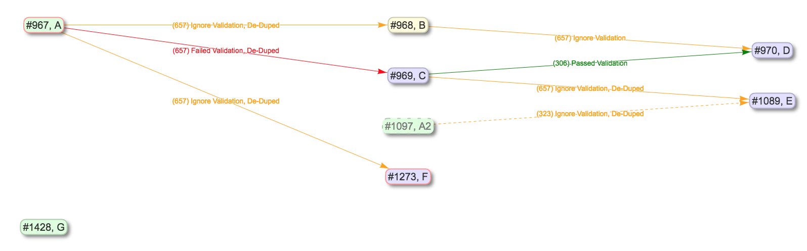

   Example Record Group for Export

In this example, if we were to select Job `C` for export, with the intention of importing to another instance of Combine that had none of the supporting pieces, what would be needed?  Because exports include all "downstream" Jobs as well, quite a few things would be included:

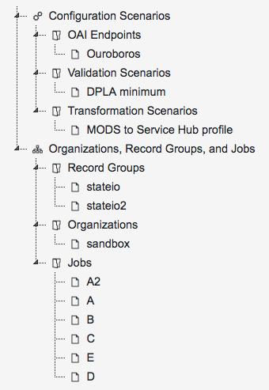

   Job C export, with accompanying objects

From this list of exported objects, we can see Job `C` down near the bottom under "Jobs".  From the image above, it's clear that Job `C` is taking input Records from Job `A`, so it's unsurprising that Job is included as well.  We also see the Organization "sandbox", and the Record Group "stateio" are included as well.  When exporting state, the organizing hierarchies are included as well.

Why then, are we seeing the Record Group "stateio2"?  This is because Job `A2` falls under that Record Group, and is a "downstream" Job for Job `A`, and so it gets swept up in the export.  The exports are, by design, greedy in what they assume will be needed to support the export of a Job.

Of note, we also see some Configuration Scenarios that were used by the Jobs `A`, `B`, `C`, `D`, `E`, and `A2`.  During import, if they exist already, they will be skipped, but they are needed in the event they do not yet exist.

Finally, note that Job `G` is not included, as this Job is truly not related to Job `C` other than falling under the same Record Group.

How does it work?
-----------------

When Jobs are exported, the following happens:

  - all associated Django models, including Organizations, Record Groups, Jobs, and Configuration Scenarios, are serialized to JSON and written to disk
  - all Records stored in Mongo are written to disk
  - all Mapped Fields for those Records, stored in ElasticSearch, are written to disk
  - an export_manifest.json file is created
  - all these files are compressed into a single archive

A typical export might look like the following:

.. code-block:: text

  .
  └── 21627afc4d0042baae56f826e19bbcf2
      ├── django_objects.json
      ├── export_manifest.json
      ├── mapped_fields_exports
      │   ├── j1089_mapped_fields.json
      │   ├── j1097_mapped_fields.json
      │   ├── j967_mapped_fields.json
      │   ├── j968_mapped_fields.json
      │   ├── j969_mapped_fields.json
      │   └── j970_mapped_fields.json
      ├── record_exports
      │   ├── j1089_mongo_records.json
      │   ├── j1097_mongo_records.json
      │   ├── j967_mongo_records.json
      │   ├── j968_mongo_records.json
      │   ├── j969_mongo_records.json
      │   └── j970_mongo_records.json
      └── validation_exports
          ├── j1089_mongo_validations.json
          ├── j1097_mongo_validations.json
          ├── j967_mongo_validations.json
          ├── j968_mongo_validations.json
          ├── j969_mongo_validations.json
          └── j970_mongo_validations.json

This is the export from the Job `C` export example above.  You can see the various exported Jobs are represented in the Record exports, but all Django ORM objects are serialized to the single `django_objects.json` file.

On import, this zip file is decompressed, and the various pieces are imported in the correct order.  To extend the example above, if we were to re-import that export for Job `C`, we would see the following created:

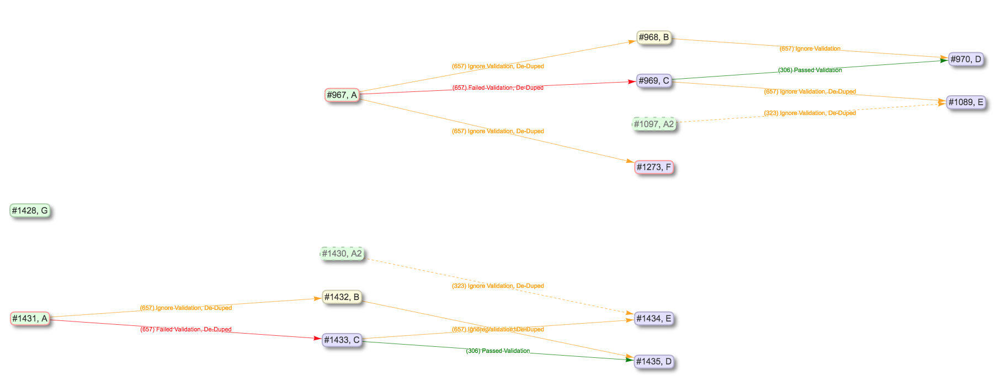

   Results of Job C export, re-imported

As you can see, it's a virtual duplication of the Jobs and linkages, and behind the scenes, all the Configuration Scenarios and organizing hierarchy to support them.  All imported items get newly minted identifiers as if they were new, but because they have pre-existing linkages and relationships, special care is made to ensure those linkages persist even to the new identifiers.

Exporting States
----------------

To export a state in Combine, first navigate to "Configuration" from the navbar at the top, and then "Combine State Export/Import" at the very bottom.  This should land you at a screen that looks like the following:

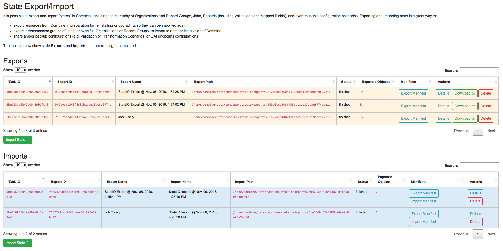

   State Export/Import main view

The page is defined by two tables, **Exports** and **Imports**.  Exports originated from this instance of Combine, Imports may come from this instance of Combine or another.  When an export is conducted, it is stamped with a unique identifier.  This identifier is referenced during the import process, allowing the tethering of imports to exports.  This will become more clear as you click around the Export and Import views.

To begin an export, click "Export State" under the Export table.  On the next screen, you will be presented with something similar to the following:

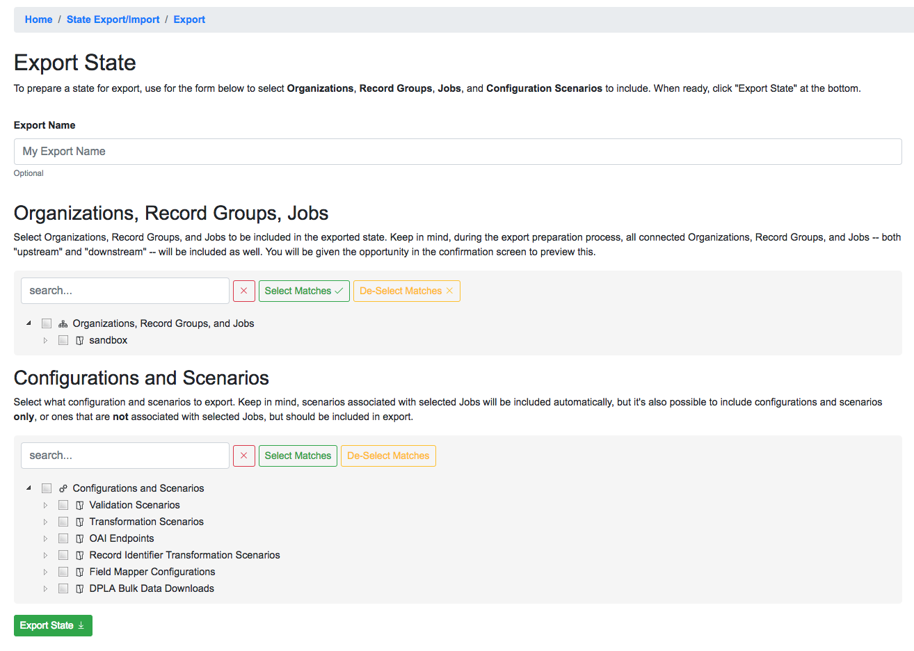

   State export form

Names for exports (and imports) are optional.  The idea is to select **Organizations**, **Record Groups**, **Jobs**, and **Configuration Scenarios** that will be included in the Export, from the hierarchical trees.  The trees are searchable, and have some capacity for selecting search matches.

For example, a search for "static" brings up a couple of Job matches, and clicking "Select Matches" would include these in the export:

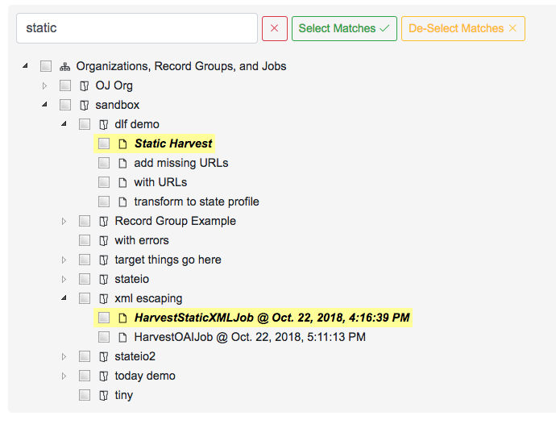

   Export: Searching for Jobs

**Note:** While there is a dedicated "Configurations and Scenarios" tree to select items from, it is worth remembering that any configurations *used* by selected Jobs will automatically be included in the Export.  Think about a fictional Job `foo` that has two Validation Scenarios applied, `bar` and `baz`.  If `foo` were to be imported into another instance of Combine, it would require those Validation Scenarios to exist such that they could be rerun and referenced.

When all desired export objects have been selected from both "Organizations, Record Groups, Jobs" and "Configurations and Scenarios", click "Export State" at the bottom.  This will redirect back to the State Export/Import overview table, with the export running as a background tasks, and the following has been created:

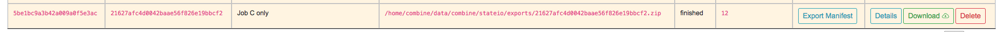

   Export for Job C

Once finished, we can click into details about the Export from the "Details" button for the export row.  This looks like the following:

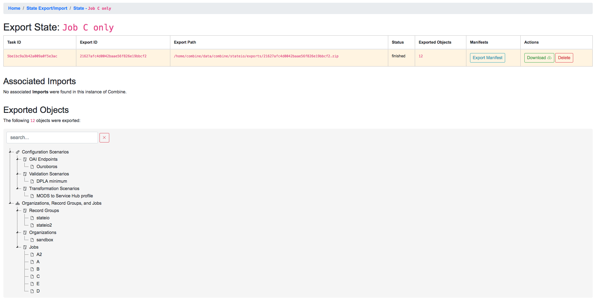

   Details for Job C export

Of note, we see details about the Export itself in the first table, a second table where any imports that reference this table would show up, and another hierarchical tree showing all "objects" that were exported.  This can be helpful for getting a sense of what Configuration Scenarios might have been included, or connected Jobs that may not have been immediately obvious during export.

At this point, a user may download the export, or in our case, note the filepath location on disk that we'll use for importing.

Importing States
----------------

To import a previously exported state, click on the "Import State" button from the main State Export/Import page.  You will be presented with a form that looks like the following:

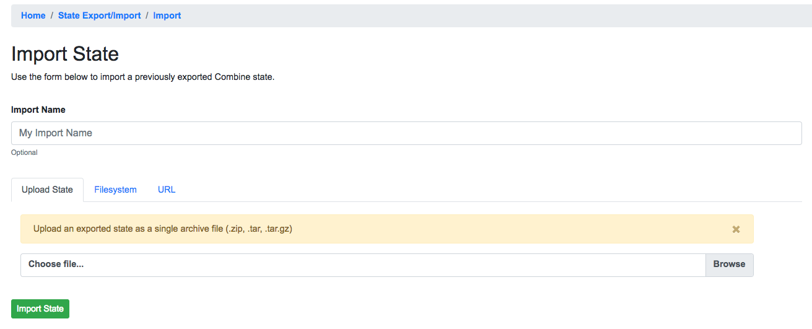

   Details for Job C export

Similar to an export, there is an optional name field for the Import task.  But now, a user may select to:

  - upload an export zip/tar file
  - provide a location on disk to an export directory or archive file
  - provide a URL where an export archive file may be found (*coming soon*)

To continue the example, we can use the filepath location ``/home/combine/data/combine/stateio/exports/21627afc4d0042baae56f826e19bbcf2.zip`` from our previous export, by clicking the "Filesystem" tab in the import form.  Then, click "Import State" to initialize another background process for importing the state.

Immediately we are redirected, and a new Import row is created indicating it is "running":

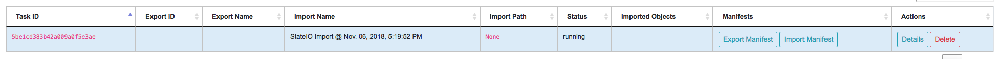

   Details for Job C export

At this time, it has no ``Export ID`` or ``Export Name``, or much of anything.  But once the import is complete, this information populates:

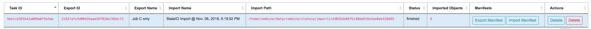

   Details for Job C export

Clicking into this Import's details, we see the following:

.. figure:: img/sio_import_details.png
   :alt: Details for Job C import
   :target: _images/sio_import_details.png

   Details for Job C import

The first table is details about this **Import**, but the following table shows what **Export** was used.  This linkage is only possible when the Export exists in the same instance of Combine.  Finally, at the bottom, a similar "results" tree to the Export, but this time showing what objects were imported.

However, the tree showing what objects were imported has a warning message about not all objects being imported, and looks suspiciously smaller than the amount of exported objects.  `What's going on here? <#state-import-and-duplication>`_

State Import and Duplication
~~~~~~~~~~~~~~~~~~~~~~~~~~~~

When importing, the import process attempts to skip the duplication of:

  - Organizations and Record Groups
  - Configuration Scenarios

Jobs *are* happily duplicated, as this is often the point of state export / import, and have value even in the duplicate.  But all "supporting" infrastructure like Organizations or Record Groups, or any configuration scenarios like OAI Endpoints, Transformations, or Validations, as long as they function identically, nothing is gained by having a duplicate.

For configuration scenarios, a duplicated is deemed identical when **the name and "payload" of the scenario is identical**.  So, if an export contains a Transformation called ``MODS to Dublin Core``, but one already exists by that name, and the XLST payload is byte-for-byte identical, a new Transformation scenario will *not* be created, and all references will now point to this pre-existing Transformation Scenario.

For Organizations and Record Groups, the decision was a bit more complicated, but feedback suggested it would be most beneficial to have Jobs "slot in" to pre-existing Record Groups if they existed under an identically named Organization.  For example, if Job `C` was exported under Record Group `foo`, which was under Organization `bar`, but a Record Group with name `foo` already exists under an Organization named `bar`, neither will be created, and Job `C` will import under the pre-existing `foo` Record Group.  This decisions hints at the singularly organizational role of Organizations and Record Groups, with their uncontrolled, human readable name as their primary characteristic.

Final Thoughts
--------------

Exporting and Importing State in Combine provides a powerful way to "parachute" data out of Combine, supporting reinstalls, upgrades, or movements to another server.  However, it does not come without complexity.  It is encouraged to experiment with some exports and imports of small Jobs and Record Groups, with varying configuration scenarios applied, to get a feel for what is included in export, and how de-duplication works.

Note, also, that size of exports can get large!  A Job that has 500k records, might actually include:

  - 500k XML records stored in MongoDB
  - 500k documents in ElasticSearch with mapped fields
  - 500k+ Validation failures in MongoDB (small, but potentially numerous)

That's effectively 1.5million documents to export.  If this exists in a "pipeline" with 3 other Jobs of similar size, you're looking at potentially 6 million record exports.  The upside is, all the computation time that went into transformations, validations, field mapping, etc., is complete and included with an import of a state.  The import time is purely I/O to the databases, but it should recreate the "state" of the original export.

Exporting Records
=================

Records can be exported in three ways:

  * `XML Documents <#export-xml-documents>`_

    * *a series of XML files aggregating the XML document for each Record*

  * `Mapped Fields <#export-mapped-fields>`_

    * *Mapped fields for each Record as structured data (CSV or JSON)*

  * `Tabular Data <#export-tabular-data>`_

    * *Export that is suitable for editing "outside" of Combine and re-harvesting (CSV or JSON)*

For any of these methods, records from a single Job, or all Published Records, may be exported.

Export XML Documents
--------------------

Exporting documents will export the XML document for all Records in a Job or published, distributed across a series of XML files with an optional number of Records per file and a root element ``<root>`` to contain them.  This is for ease of working with outside of Combine, where a single XML document containing 50k, 500k, 1m records is cumbersome to work with.  The default is 500 Records per file.

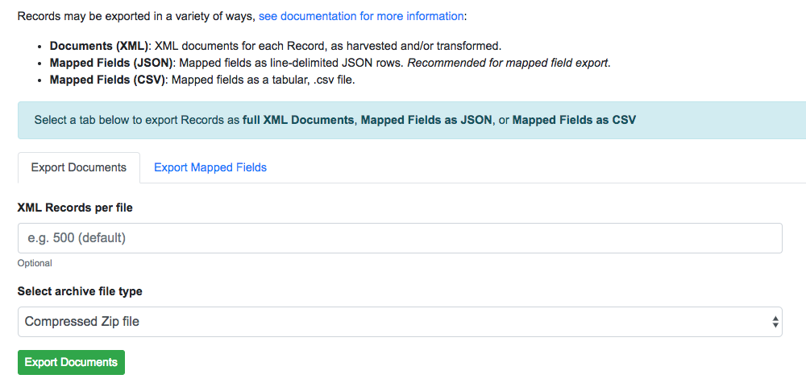

   Export Documents tab

You may enter how many records per file, and what kind of compression to use (if any) on the output archive file.  For example, 1000 records where a user selects 250 per file, for Job ``#42``, would result in the following structure:

.. code-block:: text

    - archive.zip|tar
        - j42/ # folder for Job
            - part00000.xml # each XML file contains 250 records grouped under a root XML element <documents>
            - part00001.xml
            - part00002.xml
            - part00003.xml

The following screenshot shows the actual result of a Job with 1,070 Records, exporting 50 per file, with a zip file and the resulting, unzipped structure:

.. figure:: img/job_export_structure.png
   :alt: Example structure of an exported Job as XML Documents
   :target: _images/job_export_structure.png

   Example structure of an exported Job as XML Documents

Why export like this?  Very large XML files can be problematic to work with, particularly for XML parsers that attempt to load the entire document into memory (which is most of them).  Combine is naturally pre-disposed to think in terms of the parts and partitions with the Spark back-end, which makes for convenient writing of all Records from Job in smaller chunks.  The size of the "chunk" can be set by specifying the ``XML Records per file`` input in the export form.  Finally, .zip or .tar files for the resulting export are both supported.

When a Job is exported as Documents, this will send users to the `Background Tasks <background_tasks.html>`_ screen where the task can be monitored and viewed.

Export Mapped Fields
--------------------

Mapped fields from Records may also be exported, in one of two ways:

  - Line-delimited JSON documents (**recommended**)
  - Comma-seperated, tabular .csv file

Both default to exporting all fields, but these may be limited by selecting specific fields to include in the export by clicking the "Select Mapped Fields for Export".

Both styles may be exported with an optional compression for output.

JSON Documents
~~~~~~~~~~~~~~

This is the preferred way to export mapped fields, as it handles characters for field values that may disrupt column delimiters and/or newlines.

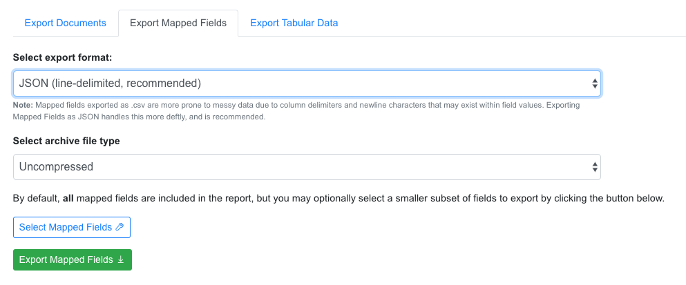

   Export Mapped Fields as JSON documents

Combine uses `ElasticSearch-Dump <https://github.com/taskrabbit/elasticsearch-dump>`_  to export Records as line-delimited JSON documents.  This library handles well special characters and newlines, and as such, is recommended.  This output format also handles multivalued fields and maintains field type (integer, string).

CSV
~~~

Alternatively, mapped fields can be exported as comma-seperated, tabular data in .csv format.  As mentioned, this does not as deftly handle characters that may disrupt column delimiters

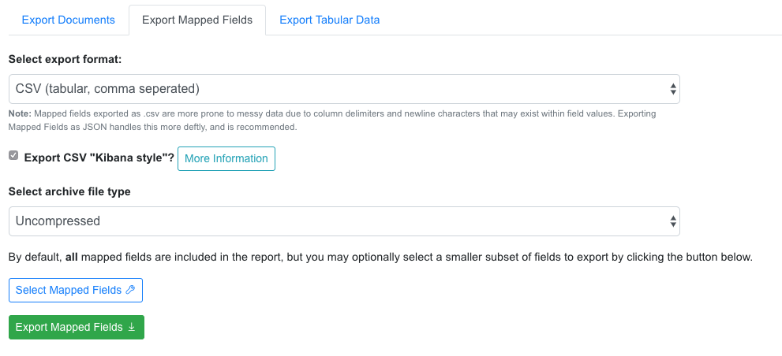

   Export Mapped Fields as JSON documents

If a Record contains a mapped field such as ``mods_subject_topic`` that is repeating, the default export format is to create multiple columns in the export, appending an integer for each instance of that field, e.g.,

.. code-block:: text

    mods_subject_topic.0, mods_subject_topic.1, mods_subject_topic.0
    history, michigan, snow

But if the checkbox, ``Export CSV "Kibana style"?`` is checked, all multi-valued fields will export in the "Kibana style" where a single column is added to the export and the values are comma separated, e.g.,

.. code-block:: text

    mods_subject_topic
    history,michigan,snow

Export Tabular Data
-------------------

Exporting Tabular Data has some similarity with exporting `mapped fields <#export-mapped-fields>`_, but for a different purpose.  Exporting Tabular Data will export either CSV or JSON suitable for re-harvesting back into Combine as a `Tabular Data Harvest <harvesting.html#tabular-data-spreadsheet-harvesting>`_.  To this end, Tabular Data harvesting is a bit more forgiving for field names, and total number of fields.  More tecnically, the export is not coming from ElasticSearch where mapped fields live for a Job, but instead, directly from the XML documents.

Some options looks similar to mapped fields exporting, but also include a section for "Export Parameters":

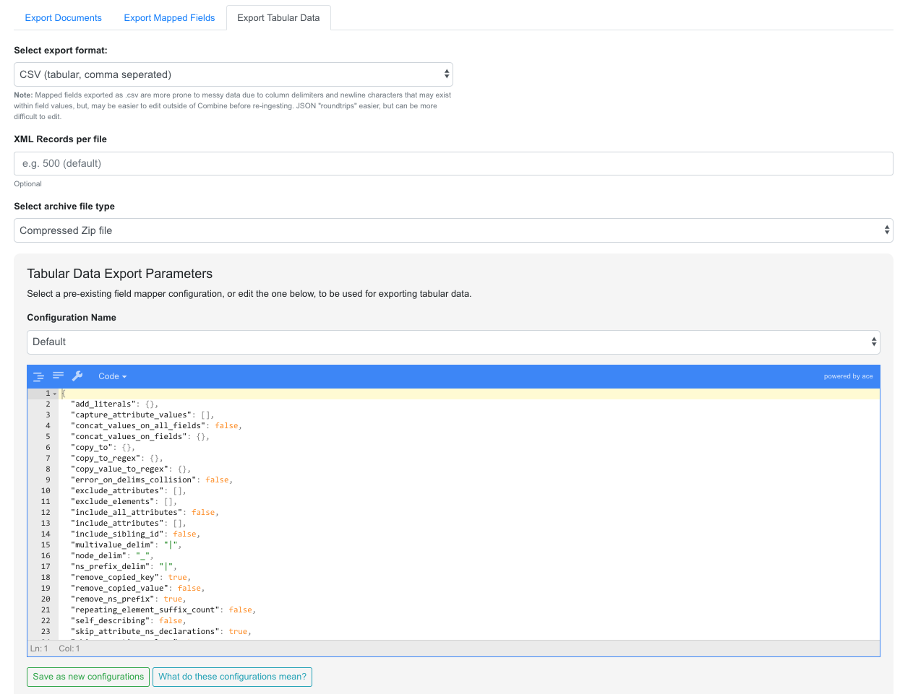

   Export Mapped Fields as JSON documents

These export parameters -- either configured at the time of export, or loaded from a pre-existing configuration -- are used to modify delimiters and other options for the CSV or JSON export.  You can `read more about harvesting tabular data here <harvesting.html#tabular-data-spreadsheet-harvesting>`_, but suffice it to say now that it can be helpful to **save** the configurations used when exporting such that they can be used later for re-harvesting.  In short, they provide a shared set of configurations for round-tripping data.

Exporting to S3
===============

It is also possible to export assets directly to `Amazon AWS S3 buckets <https://aws.amazon.com/s3/>`_ from some locations in Combine.  At the time of this writing, it is possible to export to S3 for all types of `Record exports <#exporting-records>`_, but each type of export varies slightly in how it exports to S3.

**Note:** All examples below are of exporting Published Records to S3, but the same workflows apply to a single Job as well.

Motivation
----------

The motivation to support exporting to S3 from Combine has the following helpful breakdown:

  1. To provide an online, universally accessible version of exports that were formerly restricted to downloading from Combine only.
  2. To more readily support utilizing data from exports in `Apache Spark <https://spark.apache.org/>`_ contexts.

The second reason, providing online, accessible data dumps that are readily read by other instances of Spark, is perhaps the most compelling.  By exporting, or "publishing", to S3 as `parquet files <https://parquet.apache.org/>`_ or `JSONLines <http://jsonlines.org/>`_, it is possible for others to load data exported from Combine without sacrificing some dimensionality of the data as it exists in the database.

One use case might be exporting Records published in Combine to S3, thereby "publishing" them for another entity to read via Spark and act on, where formerly that entity would have had to harvest via OAI-PMH from Combine, relying on network uptime and connections.  If the Records are stored in a database already, with ancillary metadata like Record identifiers, why not share that directly if possible!  S3 buckets provide a convenient way to do this.

Authenticating
--------------

Authentication to read/write from S3 is configured in ``localsettings.py`` under the following two variables:

  - ``AWS_ACCESS_KEY_ID``
  - ``AWS_SECRET_ACCESS_KEY``

After these are added for the first time, restarting the `Livy/Spark session <spark_and_livy.html>`_ and `backround tasks worker <background_tasks.html>`_ is required.

Exporting Record documents to S3
--------------------------------

From the "Export Documents" tab of a Job or Published Records export screen, it is possible to export to S3 by clicking the "Export to Amazon S3 Bucket?" checkbox:

.. figure:: img/s3_checkbox.png
   :alt: Checkbox for exporting to S3
   :target: _images/s3_checkbox.png

   Checkbox for exporting to S3

This opens a form to enter S3 export information:

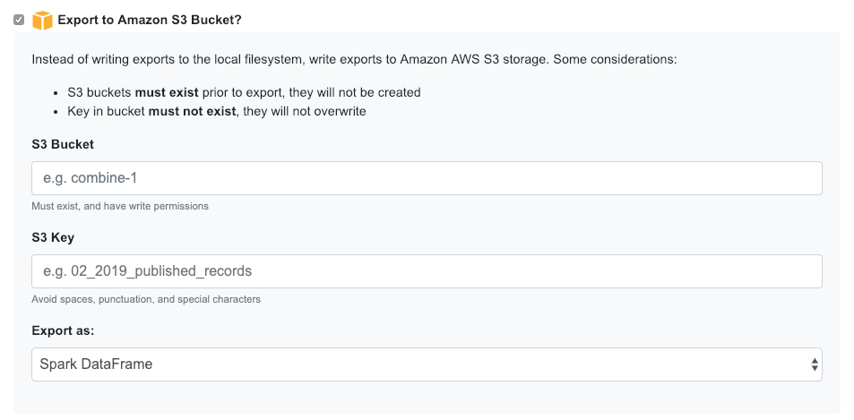

   Form for exporting Documents to S3 bucket

For any S3 export, a bucket name ``S3 Bucket`` and key ``S3 Key`` are required.

When exporting documents to S3, two options are available:

  - ``Spark DataFrame``: This is a multi-columned DataFrame that mirrors the database entry for each Record in MongoDB

    - *exports as Parquet file, leveraging compression and performance of this format for Spark reading*

  - ``Archive file``: The same archive file that would have been downloadble from Combine for this export type, is uploaded to S3

If exporting as Spark DataFrame, a couple particularly important columns are:

  - ``document``: the XML string of the Record document
  - ``record_id``: The Record identifier that would have been used during OAI publishing, but is accessible in this DataFrame

    - **Note:** This identifier will no longer contain the OAI server identifier or Publish Set identifier that would have accompanied it in the OAI output.

Exporting Mapped Fields to S3
-----------------------------

From the "Export Mapped Fields" tab of a Job or Published Records export screen, it is possible to export to S3 by clicking the "Export to Amazon S3 Bucket?" checkbox:

.. figure:: img/s3_checkbox.png
   :alt: Checkbox for exporting to S3
   :target: _images/s3_checkbox.png

   Checkbox for exporting to S3

This opens a form to enter S3 export information:

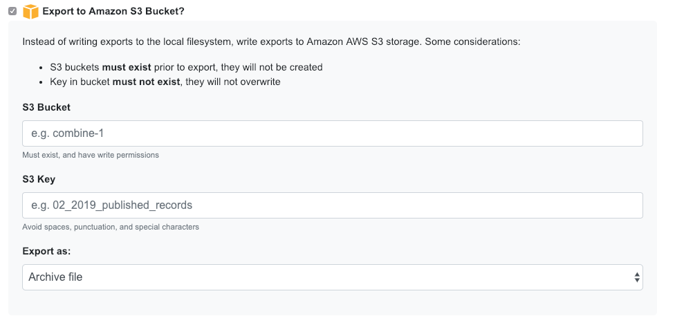

   Form for exporting Mapped Fields to S3 bucket

When exporting documents to S3, two options are available:

  - ``Spark DataFrame``: This is a multi-columned DataFrame that mirrors the database entry for each Record in MongoDB
  - ``Archive file``: The same archive file that would have been downloadble from Combine for this export type, is uploaded to S3

Unlike exporting Documents or Tabular Data, Mapped Fields may *only* be exported to S3 as an archive file.

Exporting Tabuular Data to S3
-----------------------------

From the "Export Tabular Data" tab of a Job or Published Records export screen, it is possible to export to S3 by clicking the "Export to Amazon S3 Bucket?" checkbox:

.. figure:: img/s3_checkbox.png
   :alt: Checkbox for exporting to S3
   :target: _images/s3_checkbox.png

   Checkbox for exporting to S3

This opens a form to enter S3 export information:

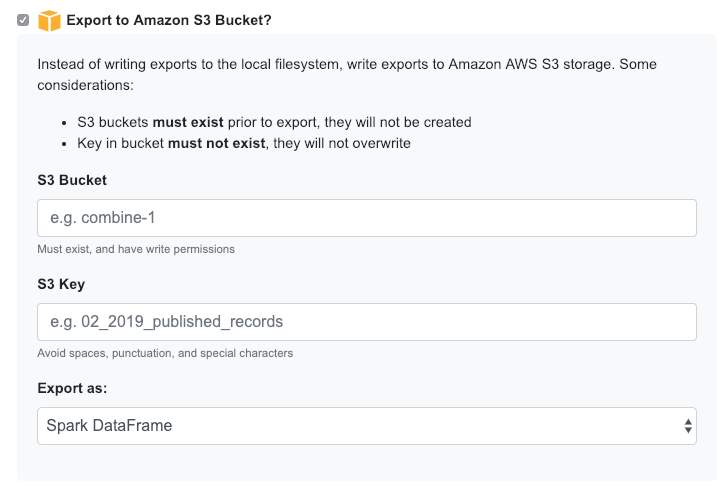

   Form for exporting Tabular Data to S3 bucket

For any S3 export, a bucket name ``S3 Bucket`` and key ``S3 Key`` are required.

When exporting documents to S3, two options are available:

  - ``Spark DataFrame``: This Spark DataFrame will include *all* field names that were generated during Tabular Data exporting, which can be extremely numerous

    - *exports as JSONLines, due to unpredictable nature of column names, while not as efficient as parquet, nonetheless works*

  - ``Archive file``: The same archive file that would have been downloadble from Combine for this export type, is uploaded to S3

