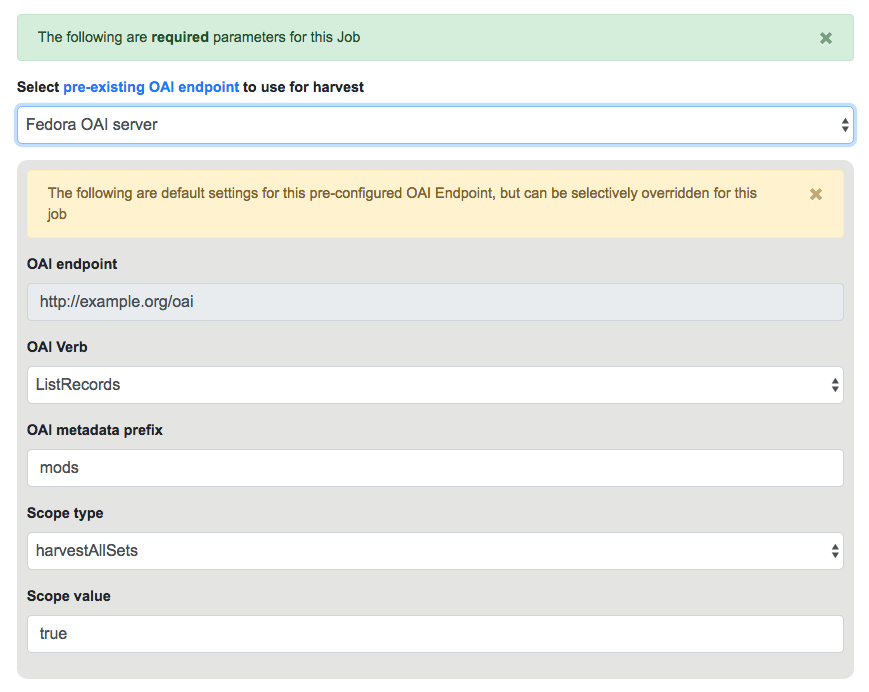
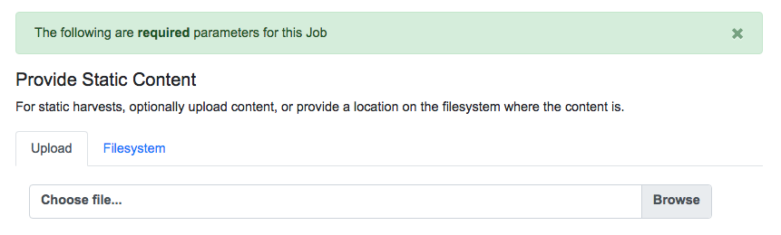
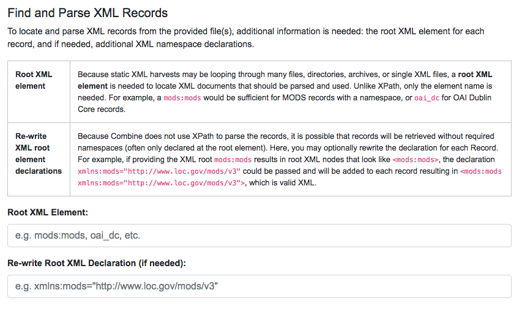
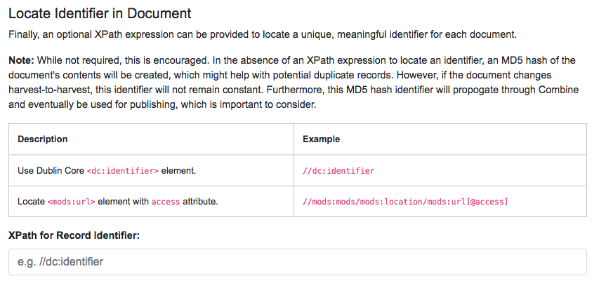

******************
Harvesting Records
******************

Harvesting is how Records are first introduced to Combine.  Like all Jobs, Harvest Jobs are run from the the Record Group overview page.

The following will outline specifics for running Harvest Jobs, with more `general information about running Jobs here <workflow.html#running-jobs>`_.

OAI-PMH Harvesting
==================

OAI-PMH harvesting in Combine utilizes the Apache Spark OAI harvester from `DPLA's Ingestion 3 engine <https://github.com/dpla/ingestion3>`_.

Before running an OAI harvest, you must first `configure an OAI Endpoint <configuration.html#oai-server-endpoints>`_ in Combine that will be used for harvesting from.  This only needs to be done once, and can then be reused for future harvests.

From the Record Group page, click the "Harvest OAI-PMH" button at the bottom.

Like all Jobs, you may optionally give the Job a name or add notes.  

Below that, indicated by a green alert, are the required parameters for an OAI Job.  First, is to select your pre-configured OAI endpoint.  In the screenshot below, an example OAI endpoint has been selected:

   Selecting OAI endpoint and configuring parameters

Default values for harvesting are automatically populated from your configured endpoint, but can be overridden at this time, for this harvest only.  Changes are not saved for future harvests.

Once configurations are set, click "Run Job" at the bottom to harvest.

Identifiers for OAI-PMH harvesting
----------------------------------

As an Harvest type Job, OAI harvests are responsible for creating a Record Identifier (``record_id``) for each Record.  The ``record_id`` is pulled from the ``record/header/identifier`` field for each Record harvested.

As you continue on your metadata harvesting, transforming, and publishing journey, and you are thinking about how identifiers came to be, or might be changed, this is a good place to start from to see what the originating identifier was.

Static File Harvest
===================

It is also possible to harvest Records from static sources, e.g. XML uploads.  Combine uses `Databricks Spark-XML <https://github.com/databricks/spark-xml>`_ to parse XML records from uploaded content.  This utilizes the powerful `globbing capabilities of Hadoop <https://hail.is/docs/stable/hadoop_glob_patterns.html>`_ for locating XML files.  Users may also provide a location on disk as opposed to uploading a file, but this is probably less commonly used, and the documentation will focus on uploads.

   Upload file, or provide location on disk for Static harvest

Using the Spark-XML library provides an efficient and powerful way of locating and parsing XML records, but it does so in a way that might be unfamiliar at first.  Instead of providing XPath expressions for locating Records, only the **XML Record's root element is required**, and the Records are located as raw strings.

For example, a MODS record that looks like the following:

.. code-block:: xml

    <mods:mods>
        <mods:titleInfo>
            <mods:title>Amazing Record of Incalculable Worth</mods:title>
        </mods:titleInfo>
        ...
        ...
    </mods:mods>

Would need only the following Root XML element string to be found: ``mods:mods``.  No angle brackets, no XPath expressions, just the element name!

However, a close inspect reveals this MODS example record does not have the required namespace declaration, ``xmlns:mods="http://www.loc.gov/mods/v3"``.  It's possible this was declared in a different part of the XML Record.  Because Spark-XML locates XML records more as strings, as opposed to parsed documents, Combine also allows users to include an **XML root element declaration** that will be used for each Record found.  For this example, the following could be provided:

.. code-block:: xml

    xmlns:mods="http://www.loc.gov/mods/v3"

Which would result in the following, final, valid XML Record in Combine:

.. code-block:: xml

    <mods:mods xmlns:mods="http://www.loc.gov/mods/v3">
        <mods:titleInfo>
            <mods:title>Amazing Record of Incalculable Worth/mods:title>
        </mods:titleInfo>
        ...
        ...
    </mods:mods>

   Showing form to provide root XML element for locating Records, and optional XML declarations

Once a file has been selected for uploading, and these required parameters are set, click "Run Job" at the bottom to harvest.

Is this altering the XML records that I am providing Combine?
-------------------------------------------------------------

The short answer is, **yes**.  But, it's important to remember that XML files are often altered in some way when parsed and re-serialized.  Their integrity is not character-by-character similarlity, but what data can be parsed.  This approach only alters the declarations in the root XML element.  

Uploads to Combine that already include namespaces, and all required declarations, at the level of each individual Record, do not require this re-writing and will leave the XML untouched.

What kind of files and/or structures can be uploaded?
-----------------------------------------------------

Quite a few!  Static harvests will scour what is uploaded -- through a single XML file, across multiple files within a zipped or tarred archive file, even recursively through directories if they are present in an archive file -- for the **root XML element**, e.g. ``mods:mods``, parsing each it encounters.

Examples include:

  - METS file with metadata in ``<dmdSec>`` sections
  - zip file of directories, each containing multiple XML files
  - single MODS XML *file*, that contains multiple MODS *records*
  - though not encouraged, even a ``.txt`` file with XML strings contained therein!

Identifiers for Static harvesting
----------------------------------

For static harvests, identifiers can be created in one of two ways:

  - by providing an XPath expression to retrieve a string from the parsed XML record
  - a random, UUID is assigned based on a hash of the XML record as a string

   Form for providing optional XPath for retrieving identifier

