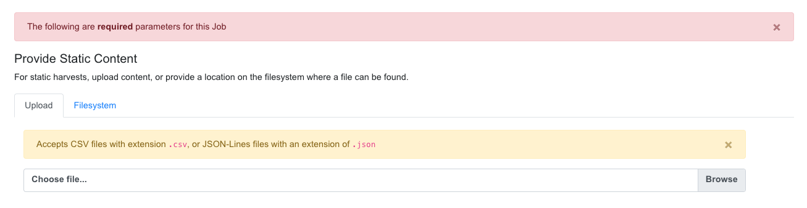
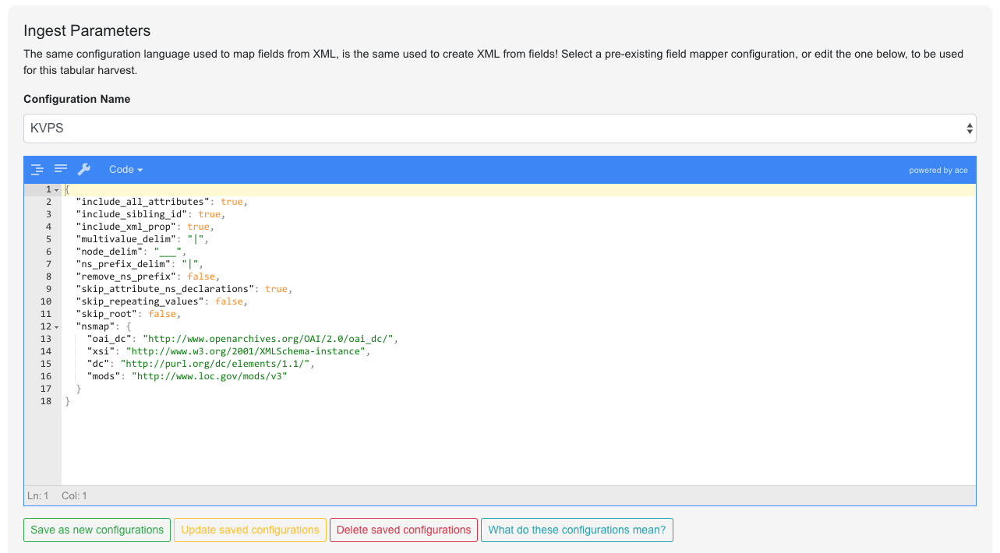

******************
Harvesting Records
******************

Harvesting is how Records are first introduced to Combine.  Like all Jobs, Harvest Jobs are run from the the Record Group overview page.

The following will outline specifics for running Harvest Jobs, with more `general information about running Jobs here <workflow.html#running-jobs>`_.  Currently, Combine supports the following types of harvests:

  * `OAI-PMH <#oai-pmh-harvesting>`_
  * `Static XML <#static-xml-file-harvest>`_
  * `Tabular / Spreadsheet <#tabular-data-spreadsheet-harvesting>`_

OAI-PMH Harvesting
==================

OAI-PMH harvesting in Combine utilizes the Apache Spark OAI harvester from `DPLA's Ingestion 3 engine <https://github.com/dpla/ingestion3>`_.

Before running an OAI harvest, you must first `configure an OAI Endpoint <configuration.html#oai-server-endpoints>`_ in Combine that will be used for harvesting from.  This only needs to be done once, and can then be reused for future harvests.

From the Record Group page, click the "Harvest OAI-PMH" button at the bottom.

Like all Jobs, you may optionally give the Job a name or add notes.

Below that, indicated by a green alert, are the required parameters for an OAI Job.  First, is to select your pre-configured OAI endpoint.  In the screenshot below, an example OAI endpoint has been selected:

.. figure:: img/oai_harvest_required.png
   :alt: Selecting OAI endpoint and configuring parameters
   :target: _images/oai_harvest_required.png

   Selecting OAI endpoint and configuring parameters

Default values for harvesting are automatically populated from your configured endpoint, but can be overridden at this time, for this harvest only.  Changes are not saved for future harvests.

Once configurations are set, click "Run Job" at the bottom to harvest.

Identifiers for OAI-PMH harvesting
----------------------------------

As an Harvest type Job, OAI harvests are responsible for creating a Record Identifier (``record_id``) for each Record.  The ``record_id`` is pulled from the ``record/header/identifier`` field for each Record harvested.

As you continue on your metadata harvesting, transforming, and publishing journey, and you are thinking about how identifiers came to be, or might be changed, this is a good place to start from to see what the originating identifier was.

Static XML File Harvest
=======================

It is also possible to harvest Records from static sources, e.g. XML uploads.  Combine uses `Databricks Spark-XML <https://github.com/databricks/spark-xml>`_ to parse XML records from uploaded content.  This utilizes the powerful `globbing capabilities of Hadoop <https://hail.is/docs/stable/hadoop_glob_patterns.html>`_ for locating XML files.  Users may also provide a location on disk as opposed to uploading a file, but this is probably less commonly used, and the documentation will focus on uploads.

.. figure:: img/static_harvest_upload.png
   :alt: Upload file, or provide location on disk for Static harvest
   :target: _images/static_harvest_upload.png

   Upload file, or provide location on disk for Static harvest

Using the Spark-XML library provides an efficient and powerful way of locating and parsing XML records, but it does so in a way that might be unfamiliar at first.  Instead of providing XPath expressions for locating Records, only the **XML Record's root element is required**, and the Records are located as raw strings.

For example, a MODS record that looks like the following:

.. code-block:: xml

    <mods:mods>
        <mods:titleInfo>
            <mods:title>Amazing Record of Incalculable Worth</mods:title>
        </mods:titleInfo>
        ...
        ...
    </mods:mods>

Would need only the following Root XML element string to be found: ``mods:mods``.  No angle brackets, no XPath expressions, just the element name!

However, a close inspect reveals this MODS example record does not have the required namespace declaration, ``xmlns:mods="http://www.loc.gov/mods/v3"``.  It's possible this was declared in a different part of the XML Record.  Because Spark-XML locates XML records more as strings, as opposed to parsed documents, Combine also allows users to include an **XML root element declaration** that will be used for each Record found.  For this example, the following could be provided:

.. code-block:: xml

    xmlns:mods="http://www.loc.gov/mods/v3"

Which would result in the following, final, valid XML Record in Combine:

.. code-block:: xml

    <mods:mods xmlns:mods="http://www.loc.gov/mods/v3">
        <mods:titleInfo>
            <mods:title>Amazing Record of Incalculable Worth/mods:title>
        </mods:titleInfo>
        ...
        ...
    </mods:mods>

.. figure:: img/static_harvest_locate_records.png
   :alt: Showing form to provide root XML element for locating Records, and optional XML declarations
   :target: _images/static_harvest_locate_records.png

   Showing form to provide root XML element for locating Records, and optional XML declarations

Once a file has been selected for uploading, and these required parameters are set, click "Run Job" at the bottom to harvest.

Is this altering the XML records that I am providing Combine?
-------------------------------------------------------------

The short answer is, **yes**.  But, it's important to remember that XML files are often altered in some way when parsed and re-serialized.  Their integrity is not character-by-character similarlity, but what data can be parsed.  This approach only alters the declarations in the root XML element.

Uploads to Combine that already include namespaces, and all required declarations, at the level of each individual Record, do not require this re-writing and will leave the XML untouched.

What kind of files and/or structures can be uploaded?
-----------------------------------------------------

Quite a few!  Static harvests will scour what is uploaded -- through a single XML file, across multiple files within a zipped or tarred archive file, even recursively through directories if they are present in an archive file -- for the **root XML element**, e.g. ``mods:mods``, parsing each it encounters.

Examples include:

  - METS file with metadata in ``<dmdSec>`` sections
  - zip file of directories, each containing multiple XML files
  - single MODS XML *file*, that contains multiple MODS *records*
  - though not encouraged, even a ``.txt`` file with XML strings contained therein!

Identifiers for Static harvesting
----------------------------------

For static harvests, identifiers can be created in one of two ways:

  - by providing an XPath expression to retrieve a string from the parsed XML record
  - a random, UUID is assigned based on a hash of the XML record as a string

.. figure:: img/static_harvest_identifier.png
   :alt: Form for providing optional XPath for retrieving identifier
   :target: _images/static_harvest_identifier.png

   Form for providing optional XPath for retrieving identifier

Tabular Data (Spreadsheet) Harvesting
=====================================

Tabular (Spreadsheet) Data based harvesting allows the creation of XML records in Combine originating from tabular data such as CSV.  While not tabular in the same way as CSV with delimiters used for parsing data, Tabular Harvesting also supports JSON.  In fact, JSON has a higher accuracy rate for tabular harvest, but because it cannot be easily opened in spreadsheet software like Excel, is also potentially more complex to work with.

Preparing Tabular Data for Harvest
----------------------------------

Tabular harvesting cannot take just any CSV or JSON data, however, it must follow some fairly prescriptive rules to generate valid and faithful XML.  There are two ways in which this tabular data may be prepared:

  * **By hand**: users create tabular data (CSV or JSON) from scratch, paying careful attention to the creation of columns and fields
  * **Export a Combine Job**: users may `export a pre-existing Job <exporting.html#export-tabular-data>`_ in a tabular format that is ready-made to be re-imported at a later time, ostensibly after being edited "outside" of Combine

XML is, by nature, hierarchical.  The field ``foo`` may mean something different in an XML document when the child of ``bar`` or ``baz``.  Additionally, elements may repeat.  The qualities of repitition and hierarchy in XML introduce a notion of "siblings" between elements.  Take, for example, the following XML:

.. code-block:: xml

    <root>
      <foo>
        <!-- sibling set 1 -->
        <bar>42</bar>
        <baz>109</baz>
      </foo>
      <foo>
        <!-- sibling set 2 -->
        <bar>winter</bar>
        <baz>mountain</baz>
      </foo>
    </root>

The instance of ``bar`` that has the value ``42`` and the instance of ``baz`` that has the value of ``109`` are "siblings" in the sense they are both children of the same instance of ``foo``.  There are no qualifying identifiers to the first instance of ``foo`` that make it unique from the second, other than the 1) order in the XML document, and b) its child nodes.  The presents a unique challenge when converting tabular data, which is *not* hierarchical to XML, which *is*.  Combine navigates this situation through the idea of **sibling identifiers**.  By including sibling identifiers in the tabular data (think spreadsheet columns), we can reconstruct XML with the appropriate sibling organization and hierarchy.

Tabular Data Harvesting uses the `same configurations <configurations.html#field-mapper-configurations>`_ that are used for mapping XML records to fields for indexing and analysis, with particular emphasis on some of the configurations like ``node_delim`` or ``multivalue_delim``.

So, how might we create tabular data that would create the XML example above?  The following columns and data (CSV example) would create that XML:

.. code-block:: text

    root(1ac101)_foo(63a901)_bar(460701),root(1ac101)_foo(63a901)_baz(460701),root(1ac101)_foo(63a901)_bar(460702),root(1ac101)_foo(63a901)_baz(460702)
    42,109,winter,mountain

It's not pretty, but it's functional.  The sibling identifiers are affixed at each level of hierarchy in the XML.  The very last one for ``baz``, ``460702``, is a unique id of ``4607`` and a counter of ``02`` which suggests it's part of sibling set #2.

Tt should be noted, if hierarchy and siblings are not important -- like might be the case with popular formats such as Dublin Core -- then the sibling identifiers can be left out entirely.  To create the following XML:

.. code-block:: xml

    <dc>
      <title>Amazing Title here!</title>
      <subject>literature</subject>
      <subject>books</subject>
      <subject>culture</subject>
    </dc>

We would only need the following, paying attention to the ``|`` delimiter used for multivalued cells:

.. code-block:: text

    dc_title,dc_subject
    Amazing Title here!,literature|books|culture

Example
-------

Suppose we want to:
  * export a Job from Combine into tabular form -- CSV -- and edit this data in Excel
  * then, perform a Tabular Harvest to import this data back to Combine

The first step would be to export a Combine Job as Tabular Data, as describe here.  Paying special attention, or better yet saving as a saved Field Mapper Configuration, the **export parameters** used as they will be needed when harvesting.

Second, would be to navigate to a Record Group and select "Harvest Tabular Data" from the New Job section.  Next, would be to either upload the CSV or JSON file, or point to a location on disk:

   Uploading CSV document for Tabular Data Harvest

Next, and arguably the most important piece of the puzzle, is providing **Ingest Parameters** that align with the parameters used to create the tabular data.  This includes things like delimiters used, whether namespace prefixes are included, and importantly, a hash of namespaces that might be encountered if they are.  These configurations are mixed in with defaults, so if none are provided, the defaults are assumed to apply.

In this example, a saved configuration called ``KVPS`` has been selected to use:

   Configurations for Tabular Harvest

Of particular note, the namespaces at the bottom, and delimiters used.  These can be tricky to configure the first time, but the idea is that they can be re-used in the future, by anyone (or exported and shared!)

Select all optional parameters, as per usual for a Job, and click "Run Tabular Harvest Job" at the bottom.

Technical Details
-----------------

As of this writing, Tabular Harvest is a bit slower than OAI-PMH or static files.  This is, in part, because the XML is being contructed during harvest, as opposed to the straight retrieval and saving of pre-formed XML.

Additionally, when harvesting CSV (as opposed to JSON) a couple of flags are particularly important:

  * ``multivalue_delim``: this flag describes the delimiter used inside multivalued cells, it is important this *not* be a comma ``,`` as this will collide with the comma used as the delimiter between columns.  Pipe ``|`` is usually a relatively safe bet.

  * ``include_sibling_id``: required if sibling identifiers have been included in the column names

  * ``nsmap``: required if namespaces are used in XML record

Discussion
----------

At first glance, this may seem more complicated, and more trouble than it's worth.  But, consider the possibility for metadata editing!  Recall that this tabular data can be exported by Combine automatically, edited in the "outside world", and then re-harvested.  This would allow tabular (spreadsheet) editing of a group of Records, which could be very difficult for 1k, 10k, 100k of XML Records, and then have the re-harvested.  Or, as demonstrated with the Dublin Core example above, where sibling identifiers are not needed, the columns are still quite human readable.

