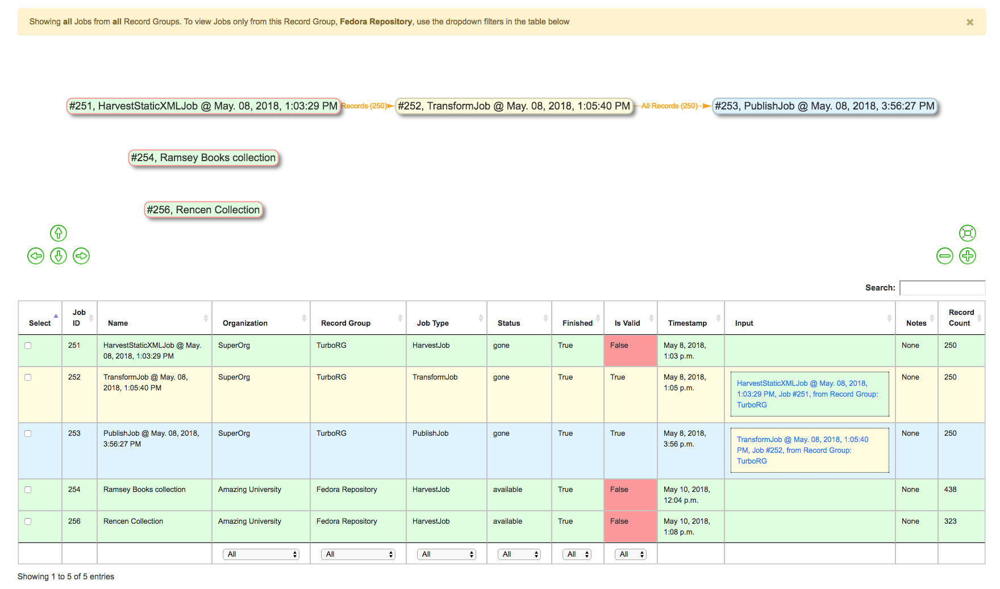
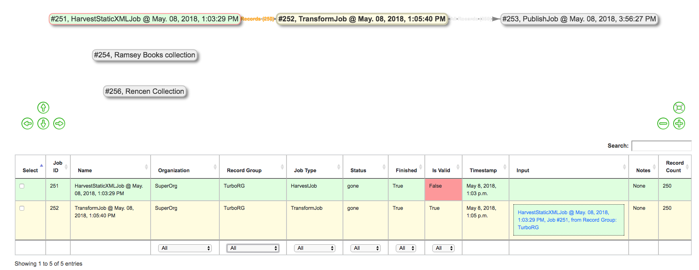
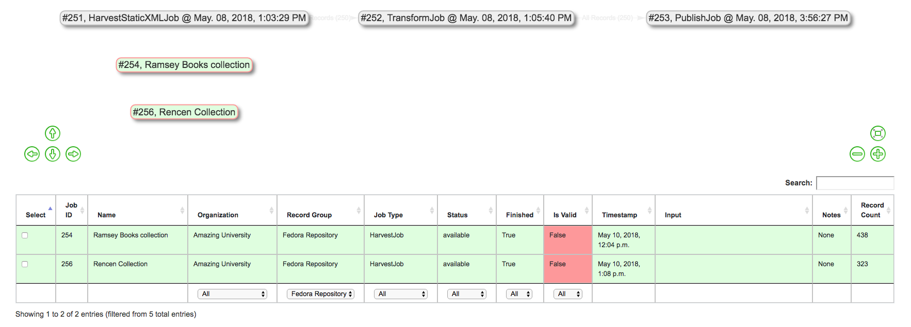
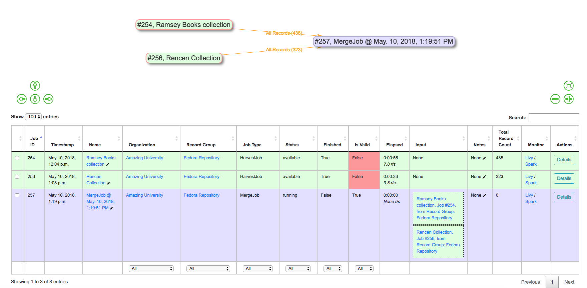

***************
Merging Records
***************

The following will outline specifics for running Merge / Duplicate Jobs, with more `general information about running Jobs here <workflow.html#running-jobs>`_.

"Merge / Duplicate" Jobs are precisely what they sound like: they are used to copy, merge, and/or duplicate Records in Combine.  They might also be referred to as simply "Merge" Jobs throughout.

To run a Merge Job, select "Duplicate / Merge Job" from the Record Group screen.

From the Merge Job page, you may notice there are no required parameters!  However, unlike Transformation Jobs where input Jobs could only be selected from the same Record Group, the input Job selection screen will show Jobs from across *all* Organizations and Record Groups:

   Showing possible input Jobs from all Organizations and Record Groups

There not many Jobs in this instance, but this could get intimidating if lots of Jobs were present in Combine.  Both the Job "lineage graph" -- visual graph near the top -- or the table of Jobs can be useful for limiting.

Clicking on a single Job in the lineage graph will filter the table to include only **that** Job, and all Jobs there **input** for that Job, and graying out Jobs in the lineage graph to represent the same.  Clicking outside of a Job will clear the filter.

   Clicking a Job will highlight that Job, and upstream "input" Jobs

Additionally, filters from the Jobs table can be used to limit by Organization, Record Group, Job Type, Status, or even keyword searching.  When filters are applied, Jobs will be grayed out in the lineage graph.

   Showing filtering table by Record Group "Fedora Repository"

Also of note, you can select **multiple** Jobs for Merge / Duplicate Jobs.  When Jobs are merged, a duplicate check is run for the **Record Identifiers only**.

Select desired Jobs to merge or duplicate -- which can be a single Job -- and click "Run Job".

The following screenshot shows the results of a Merge Job with *two* input Jobs from the Record Group screen:

   Merging two Jobs into one

Why Merge or Duplicate Records?
===============================

With the flexibility of the data model,

.. code-block:: text

    Organization --> Record Group --> Job --> Record

comes some complexity in execution.

Merge Jobs have a variety of possible use cases:

  * duplicate a Job solely for `analysis <analysis.html>`_ purposes
  * with a single Record Group, optionally perform multiple, small harvests, but eventually merge them in preparation for `publishing <publishing.html>`_
  * Merge Jobs are actually what run behind the scenes for `Analysis Jobs <analysis.html#analysis-jobs>`_
  * Merge Jobs are the only Job type that can pull Jobs from *across* Organizations or Record Groups
  * shunt a subset of valid or invalid records from Job for more precise transformations or analysis

As mentioned above, one possible use of Merge / Duplicating Jobs would be to utilize the "Record Input Validity Valve" option to shunt valid or invalid Records into a new Job.  In this possible scenario, you could:

  - from ``Job A``, select only *invalid* Records to create ``Job B``
  - assuming ``Job B`` fixed those validation problems, merge *valid* Records from ``Job A`` with now *valid* Records from ``Job B`` to create ``Job C``

This can be helpful if ``Job A`` is quite large, but only has a few Records that need further transformation, *or*, the Transformation that will fix invalid Records, would break -- invalidate -- other perfectly good Records from ``Job A``.  Here is a visual sense of this possible workflow, notice the record counts for each edge:

.. figure:: img/merge_valid_shunt.png
   :alt: Example of shunting Records based on validity, and eventually merging all valid Records
   :target: _images/merge_valid_shunt.png

   Example of shunting Records based on validity, and eventually merging all valid Records

