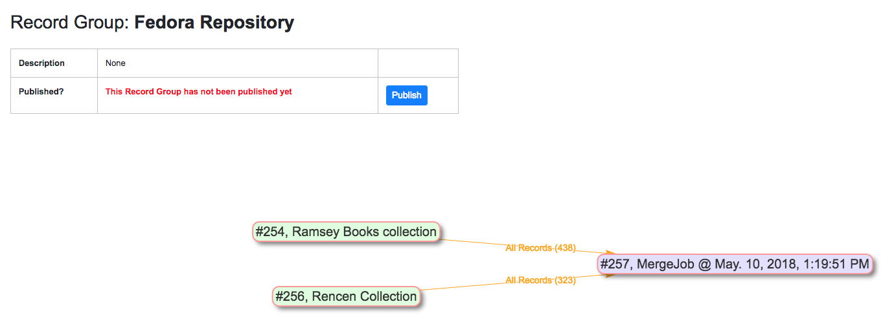
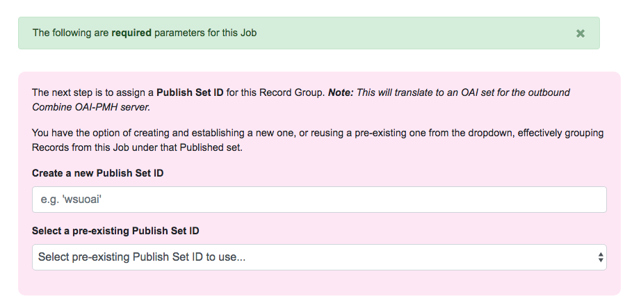
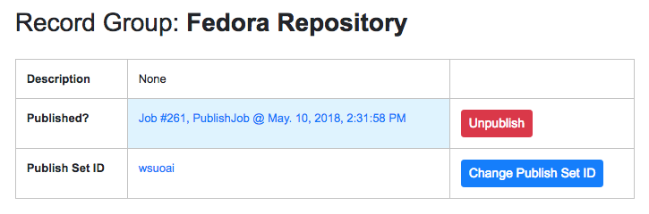
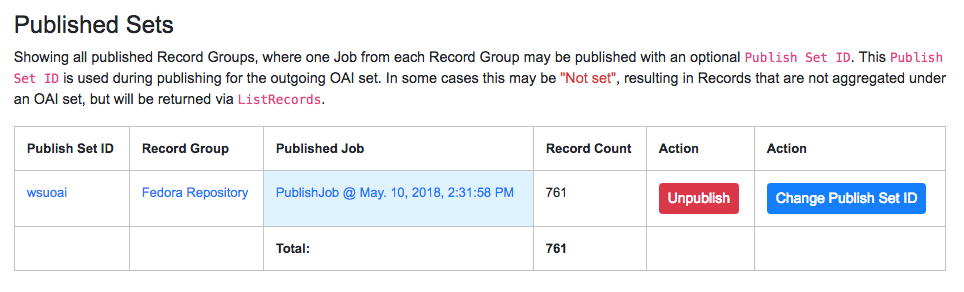
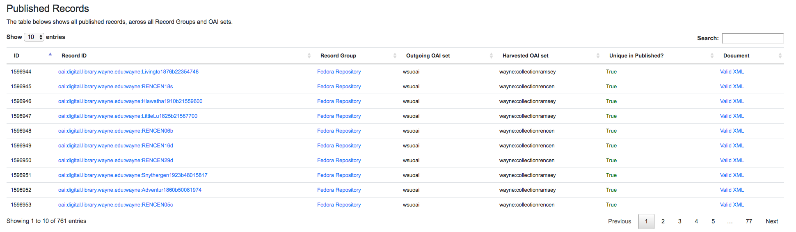
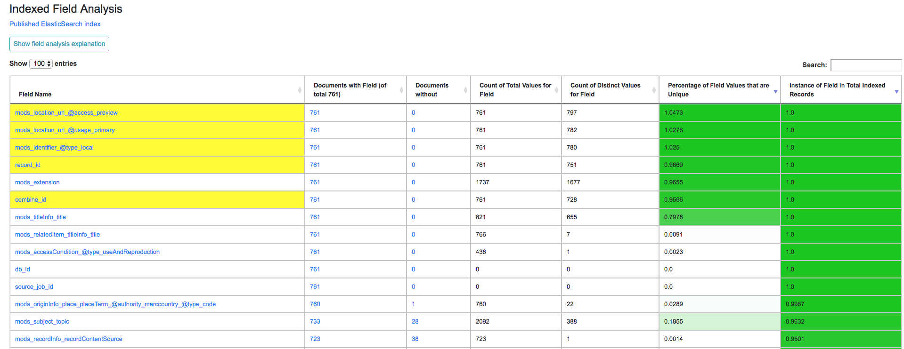
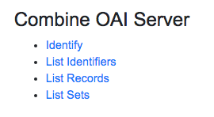

******************
Publishing Records
******************

The following will outline specifics for Publishing a Record Group, with more `general information about running Jobs here <workflow.html#running-jobs>`_.

How does Publishing work in Combine?
====================================

As a tool for aggregating metadata, Combine must also have the ability to serve aggregated Records again.  This is done by "publishing" in Combine, and this happens at the `Record Group level <data_model.html#record-group>`_.  Only **one** Job may be published per Record Group.

When a Record Group is published, a user may create a "Publish Set Identifier" (``publish_id``) that is used to aggregate and group published Records.  For example, in the built-in OAI-PMH server, this Publish ID becomes the OAI set ID.  Multiple Record Groups can publish under the same Publish Set ID, allowing for grouping of materials in publishing.

Why publishing at the Record Group level?  This reinforces the idea that a Record Group is an intellectual group of records, and though it may contain many Jobs of various stages, or previous versions, there should be only one, representative, published body of Records from this intellectual grouping of Records.  This is another instance where `Merge Jobs <merging.html>`_ can be useful, by allowing users to merge all Records / Jobs within a Record Group for publishing.

When a Record Group is published, a Publish Job is run that works very similar to a Merge / Duplicate Job in that it takes the input Job wholesale, copying the Records and the ElasticSearch documents.  What differentiates a Publish job from other Jobs is that each Record contained in that Job is considered "published" and will get returned through publishing routes.

Currently, the only protocol for publishing Records from Combine is a built-in OAI-PMH server.  But, there are plans for static publishing of Records (i.e. data dumps), and `ResourceSync <http://www.openarchives.org/rs/toc>`_ as well.

Publishing a Record Group
=========================

From the Record Group screen, click the blue "Publish" button near the top of the page:

   Beginning the publish process from a Record Group

The next screen will be a familiar Job running screen, with a red section near the top to enter, or use a previously created, Publish Set ID for this Job:

   Create or reuse a Publish Set ID when publishing a Record 

**Note:** When selectin a Publish Set ID, consider that when the Records are later harevested *from* Combine, this Publish Set ID -- at that point, an OAI set ID -- will prefix the Record Identifier to create the OAI identifier.  This behavior is consistent with other OAI-PMH aggregators / servers like REPOX.  It would be wise to consider what OAI sets these Records have been published in the past under, and/or special characters should probably be avoided.

Identifiers during metadata aggregation is a complex issue, and will not be addressed here, but it's important to note that the Publish Set ID set during Publishing Records in Combine will have bearing on those considerations.

Next, select a **single** input Job from the table below, much like Transformation jobs and when ready, click "Publish" near the bottom.

This should return you to the Record Group screen, where you'll see that the Record Group has been published:

   Record Group indicated as published

You can see the Publish Set ID of ``wsuoai``.  Two buttons are provided for Unpublishing this Record Group, effectively deleting the Publish Job, or simply just changing the Publish Set ID.

Viewing Publishing Records
==========================

All published Records can be viewed from the "Published" section in Combine, which can be navigated to from a consistent link at the top of the page.

The "Published Sets" section in the upper-left show all published Record Groups:

   Published Record Groups

Similar to the view from a Record Group, a Record Group can also be unpublished here, or the Publish Set ID changed.

To the right, is an area called "Analysis" that allows for running an `Analysis Job <analysis.html#analysis-jobs>`_ over *all* published records.  While this would be possible from a manually started Analysis Job, carefully selecting all Publish Jobs throughout Combine, this is a convenience option to begin an Analysis Jobs with all published Records as input.

Below these two sections is a table of all published Records.  Similar to tables of Records from a Job, this table also contains some unique colummns specific to Published Records:

  - ``Outgoing OAI Set`` - the OAI set, aka the Publish Set ID, that the Record belongs to
  - ``Harvested OAI Set`` - the OAI set that the Record was *harvested* under (empty if not harvested via OAI-PMH)
  - ``Unique in Published?`` - whether or not the Record ID (``record_id``) is unique among all Published Records

   Table showing all Published Records

Next, there is now hopefully familiar breakdown of indexed fields table, but this time, for all Published Records.

   Section of indexed fields table, dual sorted by total instances and percent of values that are unique

While helpful in the Job setting, this breakdown can be particularly helpful for analyzing the distribution of metadata across Records that are slated for Publishing.

For example, **determining if all records have a thumbnail image**.  Once the field has been identified as where this information should be, in the case of the screenshot above, it is the field ``mods_location_url_@access_preview``.  We can sort the right-most column, ``Instance of Field in Total Indexed Records`` *and then hold shift for perform a secondary sort* and click the second right-most column ``Percentage of Field Values that are Unique``.  This gives us a "dual" sort that orders by fields with the most values across all records, sorted again by their uniquness.  These two qualities would be critical for things like thumbnail or access URLs, both of which can be seen in the screen shot above.  As a convenience feature, Combine attempts to highlight those fields in Yellow that are both found, and are unique, in all Records.  More on this in `Analyzing Indexed Fields Breakdown <analysis.html#analyzing-indexed-fields>`_.

Finally, at the very bottom are some links to Combine's built-in OAI-PMH server that can publish and produce these records for harvesting:

   Simple set of links that expose some of Combine's built-in OAI-PMH server routes

