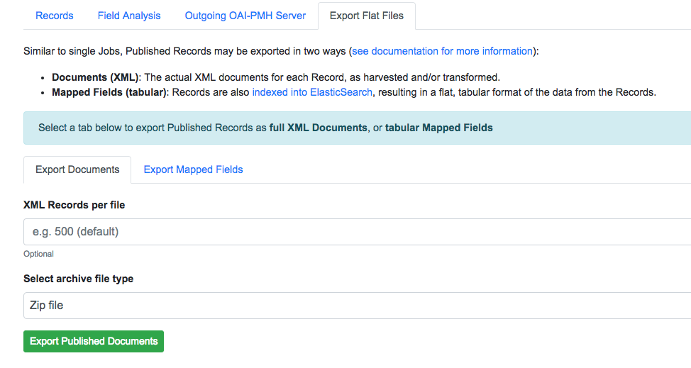

******************
Publishing Records
******************

The following will outline specifics for Publishing a Record Group, with more `general information about running Jobs here <workflow.html#running-jobs>`_.

How does Publishing work in Combine?
====================================

As a tool for aggregating metadata, Combine must also have the ability to serve or distribute aggregated Records again.  This is done by "publishing" in Combine, which happens at the `Job level <data_model.html#job>`_.

When a Job is published, a user may a Publish Set Identifier (``publish_set_id``) that is used to aggregate and group published Records.  For example, in the built-in OAI-PMH server, that Publish Set Identifier becomes the OAI set ID, or for exported flat XML files, the ``publish_set_id`` is used to create a folder hierarchy.  Multiple Jobs can publish under the same Publish Set ID, allowing for grouping of materials when publishing.

On the back-end, publishing a Job adds a flag to Job that indicates it is published, with an optional ``publish_set_id``.  Unpublishing removes these flags, but maintains the Job and its Records.

Currently, the the following methods are avaialable for publishing Records from Combine:

  - `OAI-PMH Server <#oai-pmh-server>`__
  - `Export of Flat Files <#export-flat-files>`__

Publishing a Job
================

Publishing a Job can be initated one of two ways: from the Record Group's list of Jobs which contains a column called "Publishing":

.. figure:: img/publish_column.png
   :alt: Column in Jobs table for publishing a Job
   :target: _images/publish_column.png

   Column in Jobs table for publishing a Job

Or the "Publish" tab from a Job's details page.  Both point a user to the same screen, which shows the current publish status for a Job.

If a Job is unpublished, a user is presented with a field to assign a Publish Set ID and publish a Job:

.. figure:: img/unpublished_job.png
   :alt: Screenshot to publish a Job
   :target: _images/unpublished_job.png

   Screenshot to publish a Job

If a Job is already published, a user is presented with information about the publish status, and the ability to *unpublish*:

.. figure:: img/published_job.png
   :alt: Screenshot of a published Job, with option to unpublish
   :target: _images/published_job.png

   Screenshot of a published Job, with option to unpublish

Both publishing and unpublishing will run a background task.

**Note:** When selecting a Publish Set ID, consider that when the Records are later harvested *from* Combine, this Publish Set ID -- at that point, an OAI set ID -- will prefix the Record Identifier to create the OAI identifier.  This behavior is consistent with other OAI-PMH aggregators / servers like REPOX.  It is good to consider what OAI sets these Records have been published under in the past (thereby effecting their identifiers), and/or special characters should probably be avoided.

Identifiers during metadata aggregation is a complex issue, and will not be addressed here, but it's important to note that the Publish Set ID set during Publishing Records in Combine will have bearing on those considerations.

Viewing Publishing Records
==========================

All published Records can be viewed from the "Published" section in Combine, which can be navigated to from a consistent link at the top of the page.

The "Published Sets" section in the upper-left show all published Jobs:

.. figure:: img/published_jobs.png
   :alt: Published Jobs
   :target: _images/published_jobs.png

   Published Jobs

As can be seen here, two Jobs are published, both from the same Record Group, but with different Publish Set IDs.

To the right, is an area called "Analysis" that allows for running an `Analysis Job <analysis.html#analysis-jobs>`_ over *all* published records.  While this would be possible from a manually started Analysis Job, carefully selecting all Publish Jobs throughout Combine, this is a convenience option to begin an Analysis Jobs with all published Records as input.

Below these two sections is a table of all published Records.  Similar to tables of Records from a Job, this table also contains some unique columns specific to Published Records:

  - ``Outgoing OAI Set`` - the OAI set, aka the Publish Set ID, that the Record belongs to
  - ``Harvested OAI Set`` - the OAI set that the Record was *harvested* under (empty if not harvested via OAI-PMH)
  - ``Unique Record ID`` - whether or not the Record ID (``record_id``) is unique among all Published Records

.. figure:: img/published_records.png
   :alt: Table showing all Published Records
   :target: _images/published_records.png

   Table showing all Published Records

Next, there is a now hopefully familiar breakdown of mapped fields, but this time, for all published Records.

.. figure:: img/published_mapped.png
   :alt: Screenshot of Mapped Fields across ALL published Records
   :target: _images/published_mapped.png

   Screenshot of Mapped Fields across ALL published Records

While helpful in the Job setting, this breakdown can be particularly helpful for analyzing the distribution of metadata across Records that are slated for Publishing.

For example: **determining if all records have an access URL**.  Once the mapped field has been identified as where this information should be -- in this case ``mods_location_url_@usage=primary`` -- we can search for this field and confirm that 100% of Records have a value for that mapped field.

.. figure:: img/confirm_published_field.png
   :alt: Confirm important field exists in published Records
   :target: _images/confirm_published_field.png

   Confirm important field exists in published Records

More on this in `Analyzing Indexed Fields Breakdown <analysis.html#analyzing-indexed-fields>`_.

OAI-PMH Server
==============

Combine comes with a built-in OAI-PMH server that serves records directly from the MySQL database via the OAI-PMH protocol.  This can be found under the "Outgoing OAI-PMH Server" tab:

.. figure:: img/publishing_oai_links.png
   :alt: Simple set of links that expose some of Combine's built-in OAI-PMH server routes
   :target: _images/publishing_oai_links.png

   Simple set of links that expose some of Combine's built-in OAI-PMH server routes

Export Flat Files
=================

Another way to "publish" or distribute Records from Combine is by exporting flat files of Record XML documents as an archive file.  This can be done by clicking the "Export" tab and then "Export Documents" (if not already selected):

   Exporting Published Records as flat files

The Publish Set ID (``publish_id``) for each published Record Group will be used to organzize the exported XML files in the resulting archive file.  For example, if a single Record Group was published under the Publish ID ``foo``, and two Record Groups were published under the Publish ID ``bar``, and the user specified ``100`` Record per file, the resulting export structure would look similar to this:

.. figure:: img/published_export_structure.png
   :alt: Publish IDs as folder structured in exported Published Records
   :target: _images/published_export_structure.png

   Publish IDs as folder structured in exported Published Records

