**********
QuickStart
**********

Notes and Update
================
  
  - This QuickStart guide provides a high level walkthrough of harvesting records from static files, transforming those records with XSLT, and publishing via Combine's built-in OAI server.      
  - As of **9/20/2018**, with ``v0.3`` on the horizon for release, this quickstart is becoming very outdated.  Goal is to update soon, but in the interim, proceed at your own peril!

Overview
========

Sometimes you can't beat kicking the tires to see how an application
works. This "QuickStart" guide will walkthrough the harvesting,
transforming, and publishing of metadata records in Combine, with some
detours for explanation.

Demo data from unit tests will be reused here to avoid the need to
provide actual OAI-PMH endpoints, Transformation or Validation
scenarios, or other configurations unique to a DPLA Service Hub.

This guide will walk through the following areas of Combine,
and it's recommended to do so in order:

-  `sshing into server <#sshing-into-server>`__
-  `python environment <#combine-python-environment>`__
-  `starting / stopping Combine <#starting--stopping-combine>`__
-  `Combine data model <#combine-data-model>`__

   -  Organizations, RecordGroups, Jobs, Records

-  `configuration <#configuration>`__

   -  setting up OAI-PMH endpoints
   -  creating Transformation Scenarios
   -  creating Validation Scenarios

-  `harvesting Records <#harvesting-records>`__
-  `transforming Records <#transforming-records>`__
-  `looking at Jobs and Records <#looking-at-jobs-and-records>`__
-  `duplicating / merging Jobs <#duplicating-and-merging-jobs>`__
-  `publishing Records <#publishing-records>`__
-  `analysis jobs <#analysis-jobs>`__
-  `troubleshooting <#troubleshooting>`__

For simplicity's sake, we will assume Combine is installed on a server
with the domain name of ``combine``, though likely running at the IP
``192.168.45.10``, which the Ansible/Vagrant install from
`Combine-Playbook <https://github.com/MI-DPLA/combine-playbook>`__
defaults to. On most systems you can point that IP to a domain name like
``combine`` by modifying your ``/etc/hosts`` file on your local machine.
**Note:** ``combine`` and ``192.168.45.10`` might be used
interchangeably throughout.

SSHing into server
==================

The most reliable way is to ssh in as the ``combine`` user (assuming
server at ``192.168.45.10``), password is also ``combine``:

.. code-block:: bash

    # username/password is combine/combine
    ssh combine@192.168.45.10

You can also use Vagrant to ssh in, from the Vagrant directory on the
host machine:

.. code-block:: bash

    vagrant ssh

If using Vagrant to ssh in, you'll want to switch users and become
``combine``, as most things are geared for that user.

Combine python environment
==========================

Combine runs in a `Miniconda <https://conda.io/miniconda.html>`__ python
environement, which can be activated from any filepath location by
typing:

.. code-block:: bash

    source activate combine

**Note:** Most commands in this QuickStart guide require you to be in
this environment.

Starting / Stopping Combine
===========================

Gunicorn
--------

For normal operations, Combine is run using
`Supervisor <http://supervisord.org/>`__, a python based application for
running system processes. Specifically, it's running under the Python
WSGI server `Gunicorn <http://gunicorn.org/>`__, under the supervisor
program named ``gunicorn``.

Start Combine:

.. code-block:: bash

    sudo supervisorctl start gunicorn

Stop Combine:

.. code-block:: bash

    sudo supervisorctl stop gunicorn

You can confirm that Combine is running by visiting
http://192.168.45.10/combine, where
you should be prompted to login with a username and password. For
default/testing installations, you can use ``combine`` / ``combine`` for
these credentials.

Django runserver
----------------

You can also run Combine via Django's built-in server.

Convenience script, from ``/opt/combine``:

.. code-block:: bash

    ./runserver.sh

Or, you can run the Django command explicitly from ``/opt/combine``:

.. code-block:: bash

    ./manage.py runserver --noreload 0.0.0.0:8000

You can confirm that Combine is running by visiting
http://192.168.45.10:8000/combine (note the ``8000`` port number).

Livy Sessions
-------------

To run any Jobs, Combine relies on an active (idle) Apache Livy session.
Livy is what makes running Spark jobs possible via the familiar
request/response cycle of a Django application.

Currently, users are responsible for determining if the Livy session is
ready, though there are plans to have this automatically handled.

To check and/or start a new Livy session, navigate to:
http://192.168.45.10/combine/system. The important column is
``status`` which should read ``idle``. If not, click ``Stop`` or
``Remove`` under the ``actions`` column, and once stopped, click the
``start new session`` link near the top. Takes anywhere from 10-20
seconds to become ``idle``.

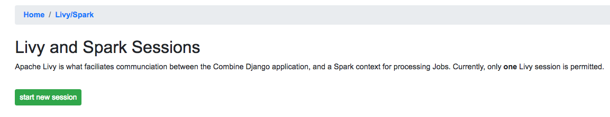

   Livy session page, with no active Livy session

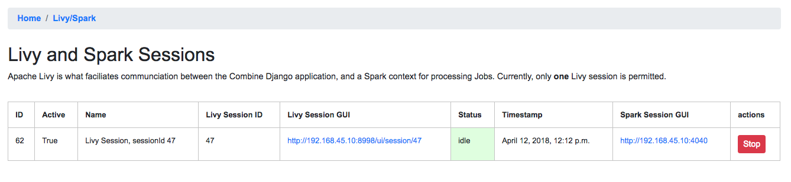

   Idle Livy session

You can check the status of the Livy session at a glance from the
Combine navigation, where ``Livy/Spark`` next to ``System`` should have a green background if active.

Combine Data Model
==================

Organization
------------

The highest level of organization in Combine is an **Organization**.
Organizations are intended to group and organize records at the level of
an institution or organization, hence the name.

You can create a new Organization from the Organizations page at
`Organizations page <http://192.168.45.10/combine/organizations>`__, or by clicking
"Organizations" from navigation links at the top of any page.

For this walkthrough, we can create one with the name "Amazing
University". Only the ``name`` field is required, others are optional.

RecordGroup
-----------

Within Organizations are **RecordGroups**. RecordGroups are a "bucket"
at the level of a bunch of intellectually similar records. It is worth
noting now that a single RecordGroup can contain multiple **Jobs**,
whether they are failed or incomplete attempts, or across time. Suffice
it to say for now that RecordGroups may contain lots of Jobs, which we
will create here in a minute through harvests, transforms, etc.

For our example Organization, "Amazing University", an example of a
reasonable RecordGroup might be this fictional University's Fedora
Commons based digital repository. To create a new RecordGroup, from the
`Organizations page <http://192.168.45.10/combine/organizations>`__,
click on the Organization "Amazing University" from the table. From the
following Organiation page for "Amazing University" you can create a new
RecordGroup. Let's call it "Fedora Repository"; again, no other fields
are required beyond ``name``.

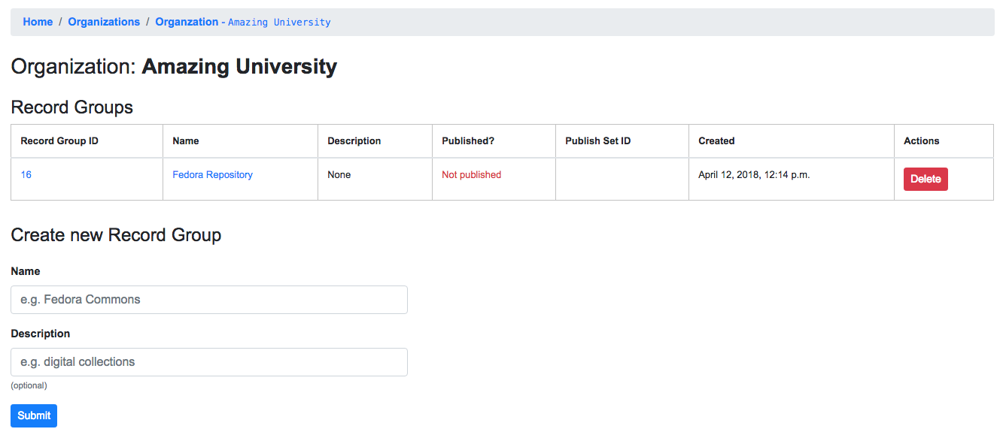

   Demo Organization "Amazing University" and demo Record Group "Fedora Repository"

Finally, click into the newly created RecordGroup "Fedora Repository" to
see the RecordGroup's page, where we can begin to run Jobs.

Jobs
----

Central to Combine's workflow philosophy are the ideas of **Jobs**. Jobs
include any of the following:

-  **Harvest** (OAI-PMH, static XML, and others to come)
-  **Transform**
-  **Merge/Duplicate**
-  **Publish**
-  **Analysis**

Within the context of a RecordGroup, one can think of Jobs as "stages"
of a group of records, one Job serving as the *input* for the next Job
run on those records. i.e.

::

    OAI-PMH Harvest Job ---> XSLT Transform Job --> Publish Job

Record
------

Lastly, the most granular major entity in Combine is an individual
**Record**. Records exist within a Job. When a Job is deleted, so are
the Records (the same can be said for any of these hierarchies moving
up). Records will be created in the course of running Jobs.

Briefly, Records are stored in MySQL, and are indexed in ElasticSearch.
In MySQL, you will find the raw Record XML metadata, and other
information related to the Record throughout various stages in Combine.
In ElasticSearch, you find an flattened, indexed form of the Record's
*metadata*, but nothing much more. The representation of a Record in
ElasticSearch is almost entirely for analysis and search, but the
transactional nature of the Record through various stages and Jobs in
Combine is the Record as stored in MySQL.

It is worth noting, though not dwelling on here, that groups of Records
are also stored as Avro files on disk.

Configuration and Scenarios
===========================

Combine relies on users coniguring "scenarios" that will be used for things like transformations, validations, etc.  These can be viewed, modified, and tested in the Configuration page.  This page includes the following main sections:

-  `Field Mapper Configurations <.>`__
-  `OAI-PMH endpoints <.>`__
-  `Transformation Scenarios <.>`__
-  `Validation Scenarios <.>`__
-  `Record Identifier Transformation Scenarios <.>`__
-  `DPLA Bulk Data Downloader <.>`__

For the sake of this QuickStart demo, we can bootstrap our instance of
Combine with some demo configurations, creating the following:

-  Transformation Scenario

   -  "MODS to Service Hub profile" (XSLT transformation)

-  Validation Scenarios

   -  "DPLA minimum" (schematron validation)
   -  "Date checker" (python validation)

To boostrap these demo configurations for the purpose of this
walkthrough, run the following command from ``/opt/combine``:

.. code-block:: bash

    ./manage.py quickstartbootstrap

You can confirm these demo configurations were created by navigating to
the configuration screen at http://192.168.45.10/combine/configurations.

Harvesting Records
==================

Static XML harvest
------------------

Now we're ready to run our first Job and generate our first Records. For
this QuickStart, as we have not yet configured any OAI-PMH endpoints, we
can run a **static XML** harvest on some demo data included with
Combine.

From the RecordGroup screen, near the bottom and under "Harvest", click
"Static XML". 

.. figure:: img/run_new_job.png
   :alt: Area to initiate new Jobs from the Record Group page
   :target: _images/run_new_job.png

   Area to initiate new Jobs from the Record Group page

You will be presented with a screen to run a harvest job
of static XML files from disk:

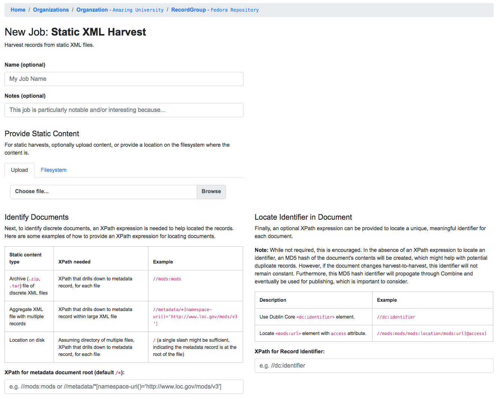

   Static Harvest Job screen

Many fields are optional -- e.g. Name, Description -- but we will need
to tell the Harvest Job where to find the files. 

First, click the tab "Filesystem", then for the form field
``Location of XML files on disk:``, enter the following, which points to
a directory of 250 MODS files (this was created during bootstrapping):

::

    /tmp/combine/qs/mods

Next, we need to provide an XPath query that locates each discrete
record within the provided MODS file. Under the section "Locate Document", for the 
form field ``Root XML Element``, enter the following:

::

    /mods:mods

For the time being, we can ignore the section "Locate Identifier in Document" which would allow us to find a unique identifier via XPath in the document.  By default, it will assign a random identifier based on a hash of the document string.

Next, we can apply some optional parameters that are present for all jobs in Combine.  This looks like the following:

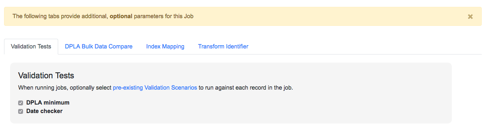

   Optional Job parameters

Different parameter types can be found under the various tabs, such as:

  * Field Mapping Configuration
  * Validation Tests
  * Transform Identifier
  * etc.

Most of these settings we can leave as deafult for now, but one optional parameter we'll want to check and set for this initial job are Validations to perform on the records.  These can be found under the "Validation Tests" tab. If you bootstrapped the demo configurations from steps above, you should see two options, *DPLA minimum* and *Date checker*; make sure both are checked.

Finally, click "Run Job" at the bottom. 

This should return you to the RecordGroup page, where a new Job has
appeared and is ``running`` under the ``Status`` column in the Job
table. A static job of this size should not take long, refresh the page
in 10-20 seconds, and hopefully, you should see the Job status switch to
``available``.

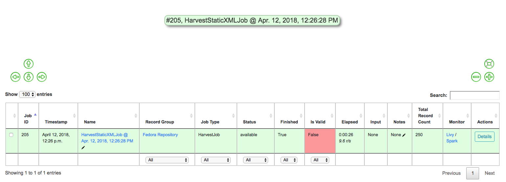

   Status of Static Harvest job, also showing Job failed some Validations

This table represents all Jobs run for this RecordGroup, and will grow
as we run some more. You may also note that the ``Is Valid`` column is
red and shows ``False``, meaning some records have failed the Validation
Scenarios we optionally ran for this Job. We will return to this later.

For now, let's continue by running an XSLT Transformation on these
records.

Transforming Records
====================

In the previous step, we harvestd 250 records from a bunch of static
MODS XML documents. Now, we will transform all the Records in that Job
with an XSLT Transformation Scenario.

From the RecordGroup screen, click the "Transform" link at the bottom.

For a Transform job, you are presented with other Jobs from this
RecordGroup that will be used as an *input* job for this Transformation.

Again, ``Job Name`` and ``Job Note`` are both optional. What *is*
required, is selecting what job will serve as the input Job for this
Transformation. In Combine, most Jobs take a *previous* job as an input,
essentially performing the current Job over all records from the
previous job. In this way, as Records move through Jobs, you get a
series of "stages" for each Record.

An input Job can be selected for this Transform Job by clicking the
radio button next to the job in the table of Jobs (at this stage, we
likely only have the one Harvest Job we just ran).

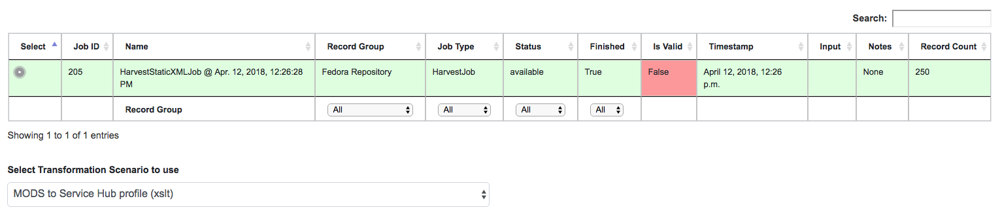

   Input Job selection screen

Next, we must select a **Transformation Scenario** to apply to the
records from the input Job. We have a Transformation Scenario prepared
for us from the QuickStart bootstrapping, but this is where you might
optionally select different transforms depending on your task at hand.
While only one Transformation Scenario can be applied to a single
Transform job, multiple Transformation Scenarios can be prepared and
saved in advance for use by all users, ready for different needs.

For our purposes here, select ``MODS to Service Hub profile (xslt)``
from the dropdown:

.. figure:: img/required_select_transform.png
   :alt: Select Transformation Scenario to use
   :target: _images/required_select_transform.png

   Select Transformation Scenario to use

Once the input Job (radio button from table) and Transformation Scenario
(dropdown) are selected, we are presented with the same optional parameters as we saw in the previous, Harvest Job.  We can leave the defaults again,
double checking that the two Validation Scenarios -- *DPLA minimum* and
*Date checker* -- are both checked under the "Validation Tests" tab.

When running Jobs, we also have the ability to select subsets of Records from input Jobs.  Under the tab "Record Input Filter", you can refine the Records that will be used in the following ways:

  - **Refine by Record Validity**: Select Records based on their passing/failing of Validation tests
  - **Limit Number of Records**: Select a numerical subset of Records, helpful for testing
  - **Refine by Mapped Fields**: Most exciting, select subsets of Records based on an ElasticSearch query run against those input Jobs mapped fields

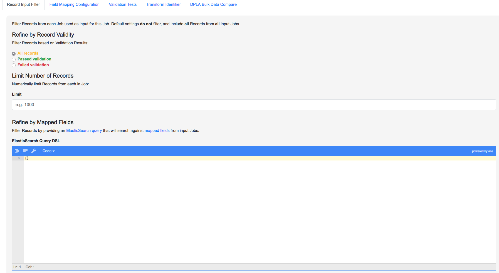

   Filters that can be applied to Records used as input for a Job

For the time being, we can leave these as default.  Finally, click "Run Job" at the bottom.

Again, we are kicked back to the RecordGroup screen, and should
hopefully see a Transform job with the status ``running``. **Note:** The
graph on this page near the top, now with two Jobs, indicates the
original Harvest Job was the *input* for this new Transform Job.

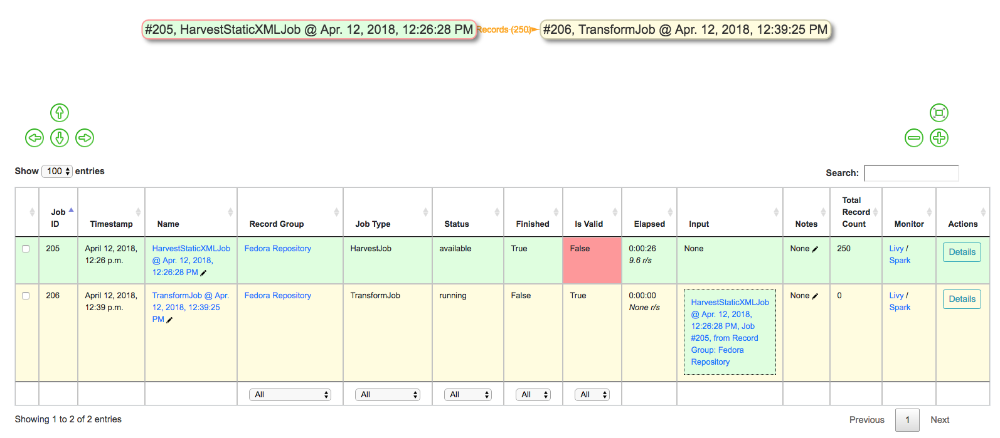

   Graph showing Transform Job with Harvest as Input, and All records sent

Transforms can take a bit longer than harvests, particularly with the
additional Validation Scenarios we are running; but still a small job,
might take anywhere from 15-30 seconds. Refresh the page until it shows
the status as ``available``.

Also of note, hopefully the ``Is Valid`` column is not red now, and
should read ``True``. We will look at validations in more detail, but
because we ran the same Validation Scenarios on both Jobs, this suggests
the XSLT transformation fixed whatever validation problems there were
for the Records in the Harvest job.

Looking at Jobs and Records
===========================

Now is a good time to look at the details of the jobs we have run. Let's
start by looking at the first **Harvest Job** we ran. Clicking the Job name in the table, or
"details" link at the far-right will take you to a Job details page.

**Note:** Clicking the Job in the graph will gray out any other jobs in
the table below that are not a) the job itself, or b) upstream jobs that
served as inputs.

Job Details
-----------

This page provides details about a specific Job. 

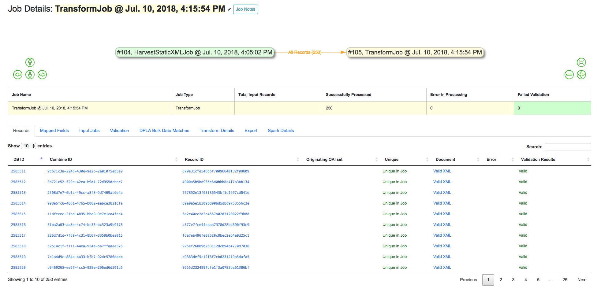

   Screenshot of Job details page

Major sections can be found behind the various tabs, and include:

  - Records

    - *a table of all records contained in this Job*

  - Mapped Fields

    - *statistical breakdown of indexed fields, with ability to view values per field*

  - Input Jobs

    - *what Jobs were used as inputs for this Job*

  - Validation

    - *shows all Validations run for this Job, with reporting*

  - Job Type Specific Details

    - *depending on the Job type, details relevant to that task (e.g. Transform Jobs will show all Records that were modified)*

  - DPLA Bulk Data Matches

    - *if run and configured, shows matches with DPLA bulk data sets*

Records
-------

Sortable, searchable, this shows all the individual, discrete Records
for this Job. This is *one*, but not the only, entry point for viewing
the details about a single Record. It is also helpful for determining if
the Record is unique *with respect to other Records from this Job*.

Mapped Fields
-------------

This table represents all mapped fields from the Record's original source
XML record to ElasticSearch. 

To this point, we have been using the default configurations for mapping, but more complex mappings can be provided when running a new Job, or when re-indexing a Job.  These configurations are covered in more detail in `Field Mapping <configuration.html#field_mapping>`_.

At a glance, field mapping attempts to convert XML into a key/value pairs suitable for a search platform like ElasticSearch.  Combine does this via a library ``xml2kvp``, which stands for "XML to Key/Value Pairs" that accepts a medley of configurations in JSON format.  These JSON parameters are referred to as "Field Mapper Configurations" throughout.

For example, it might map the following XML block from a Record's MODS
metadata:

.. code-block:: xml

    <mods:mods>
      <mods:titleInfo>
          <mods:title>Edmund Dulac's fairy-book : </mods:title>
          <mods:subTitle>fairy tales of the allied nations</mods:subTitle>
      </mods:titleInfo>
    </mods:mods>

to the following *two* ElasticSearch key/value pairs:

.. code-block:: text

    mods|mods_mods|titleInfo_mods|title : Edmund Dulac's fairy-book :
    mods|mods_mods|titleInfo_mods|subTitle : fairy tales of the allied nations

An example of a field mapping configuration that could be applied would be the  ``remove_ns_prefix`` which removes XML namespaces prefixes from the resulting fields.  This would result in the following fields, removing the ``mods`` prefix and delimiter for each field:

.. code-block:: text

    mods_titleInfo_title : Edmund Dulac's fairy-book :
    mods_titleInfo_subTitle : fairy tales of the allied nations

It can be dizzying at a glance, but it provides a thorough and
comprehensive way to analyze the breakdown of metadata field usage
across *all* Records in a Job. With, of course, the understanding that
these "flattened" fields are not shaped like the raw, potentially
hierarchical XML from the Record, but nonetheless crosswalk the values
in one way or another.

Clicking on the mapped, ElasticSearch field name on the far-left will
reveal all values for that dynamically created field, across all
Records. Clicking on a count from the column ``Document with Field``
will return a table of Records that *have* a value for that field,
``Document without`` will show Records that *do not have* a value for
this field.

An example of how this may be helpful: sorting the column
``Documents without`` in ascending order with zero at the top, you can
scroll down until you see the count ``11``. This represents a subset of
Records -- 11 of them -- that *do not* have the field
``mods|mods_mods|subject_mods|topic``, which might itself be helpful to know. This is
particularly true with fields that might represent titles, identifiers,
or other required information.  The far end of the column, we can see that 95% of Records have this field, and 34% of those have unique values.

.. figure:: img/mods_subject_without.png
   :alt: Row from Indexed fields showing that 11 Records do not have this particular field
   :target: _images/mods_subject_without.png

   Row from Indexed fields showing that 11 Records do not have this particular field

Clicking on the button "Show field analysis explanation" will reveal
some information about other columns from this table.

**Note:** Short of an extended discussion about this mapping, and
possible value, it is worth noting these indexed fields are used almost
exclusively for **analysis** and **creating subsets through queries** of Records in Combine, and are not any kind of final mapping or
transformation on the Record itself. The Record's XML is always stored
seperately in MySQL (and on disk as Avro files), and is used for any
downstream transformations or publishing. The only exception being where
Combine attempts to query the DPLA API to match records, which is based
on these mapped fields, but more on that later.

Validation
----------

This table shows all the Validation Scenarios that were run for this
job, including any/all failures for each scenario.

For our example Harvest, under *DPLA minimum*, we can see that there
were 250 Records that failed validation. For the *Date checker*
validation, all records passed. We can click "See Failures" link to get
the specific Records that failed, with some information about which
tests within that Validation Scenario they failed.

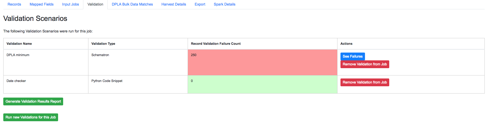

   Two Validation Scenarios run for this Job

Additionally, we can click "Generate validation results report" to generate
an Excel or .csv output of the validation results. From that screen, you
are able to select:

-  which Validation Scenarios to include in report
-  any mapped fields (see below for an explanation of them) that would
   be helpful to include in the report as columns

More information about `Validation Scenarios <.>`__.

Record Details
--------------

Next, we can drill down one more level and view the details of an
individual Record. From the Record table tab, click on the
``Record ID`` of any individual Record. At this point, you are presented
with the details of that particular Record.

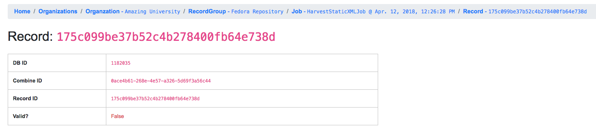

   Top of Record details page, showing some overview information

Similar to a Job's details, a Record details page has tabs that house the following sections:

  - Record XML
  - Indexed Fields
  - Record stages
  - Validation
  - DPLA Link
  - Job Type Specific

Record XML
~~~~~~~~~~

The raw XML document for this Record. **Note:** As mentioned, regardless of how fields are mapped in Combine to ElasticSearch, the Record's XML or "document" is always left intact, and is used for any downstream Jobs. Combine provides mapping and analysis of Records through mapping to ElasticSearch, but the Record's XML document is stored as plain, ``LONGTEXT`` in MySQL for each Job.

Mapped Fields
~~~~~~~~~~~~~

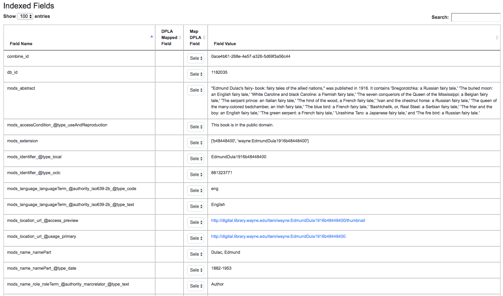

   Part of table showing indexed fields for Record

This table shows the individual fields in ElasticSearch that were mapped
from the Record's XML metadata. This can further reveal how this mapping
works, by finding a unique value in this table, noting the
``Field Name``, and then searching for that value in the raw XML below.

This table is mostly for informational purposes, but also provides a way
to map generically mapped indexed fields from Combine, to known fields
in the DPLA metadata profile. This can be done with the from the
dropdowns under the ``DPLA Mapped Field`` column.

Why is this helpful? One goal of Combine is to determine how metadata
will eventually map to the DPLA profile. Short of doing the mapping that
DPLA does when it harvests from a Service Hub, which includes
enrichments as well, we can nonetheless try and "tether" this record on
a known unique field to the version that might currently exist in DPLA
already.

To do this, two things need to happen:

1. `register for a DPLA API
   key <https://dp.la/info/developers/codex/policies/#get-a-key>`__, and
   provide that key in ``/opt/combine/combine/locasettings.py`` for the
   variable ``DPLA_API_KEY``.
2. find the URL that points to your actual item (not the thumbnail) in
   these mapped fields in Combine, and from the ``DPLA Mapped Field``
   dropdown, select ``isShownAt``. The ``isShownAt`` field in DPLA
   records contain the URL that DPLA directs users *back* to, aka the
   actual item online. This is a particularly unique field to match on.
   If ``title`` or ``description`` are set, Combine will attempt to
   match on those fields as well, but ``isShownAt`` has proven to be
   much more accurate and reliable.

If all goes well, when you identify the indexed field in Combine that
contains your item's actual online URL, and map to ``isShownAt`` from
the dropdown, the page will reload and fire a query to the DPLA API and
attempt to match the record. If it finds a match, a new section will
appear called "DPLA API Item match", which contains the
metadata from the DPLA API that matches this record.

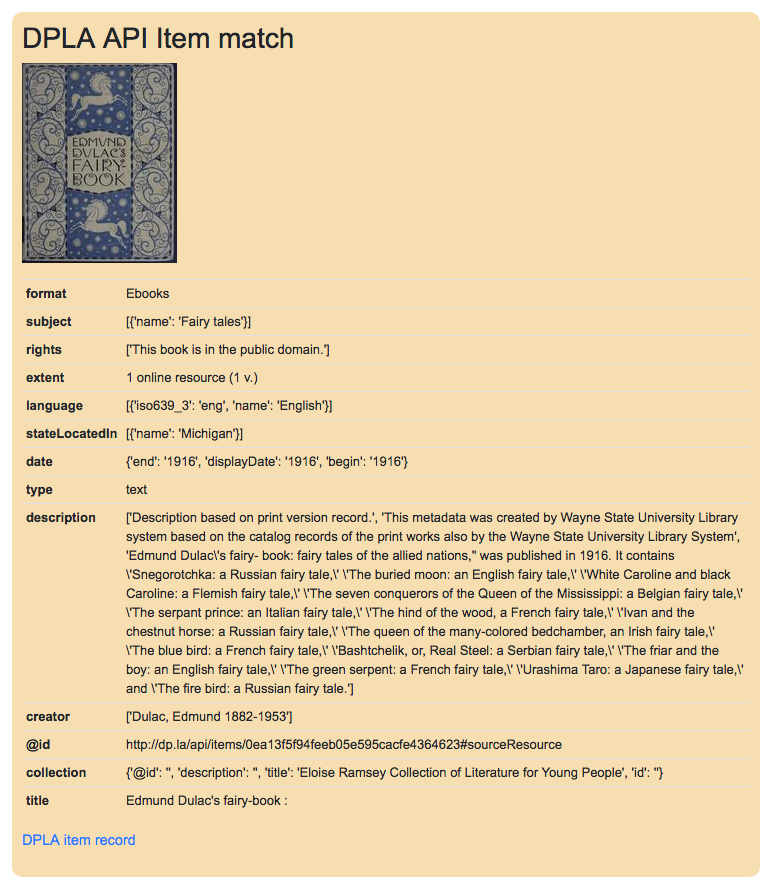

   After isShownAt linked to indexed field, results of successful DPLA API query

This is an area still under development. Though the ``isShownAt`` field
is usually very reliable for matching a Combine record to its live DPLA
item counterpart, obviously it will not match if the URL has changed
between harvests. Some kind of unique identifier might be even better,
but there are problems there as well a bit outside the scope of this
QuickStart guide.

Record stages
~~~~~~~~~~~~~

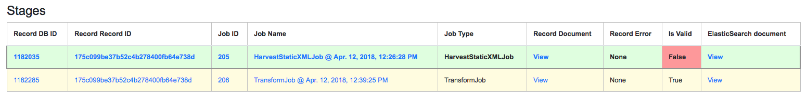

   Showing stages of Record across Jobs

This table represents the various "stages", aka Jobs, this Record exists
in. This is good insight into how Records move through Combine. We
should see two stages of this Record in this table: one for the original
Harvest Job (bolded, as that is the version of the Record we are
currently looking at), and one as it exists in the "downstream"
Transform Job. We could optionally click the ``ID`` column for a
downstream Record, which would take us to that *stage* of the Record,
but let's hold off on that for now.

For any stage in this table, you may view the Record Document (raw
Record XML), the associated, mapped ElasticSearch document (JSON), or
click into the Job details for that Record stage.

**Note:** Behind the scenes, a Record's ``combine_id`` field is used for linking across Jobs.  Formerly, the ``record_id`` was used, but it became evident that the ability to transform a Record's identifier used for publishing would be important.  The ``combine_id`` is not shown in this table, but can be viewed at the top of the Record details page.  These are UUID4 in format.

Validation
~~~~~~~~~~

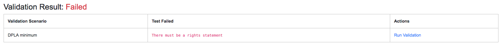

   Showing results of Validation Scenarios applied to this Record

This area shows all the Validation scenarios that were run for this Job,
and how this specific record fared. In all likelihood, if you've been
following this guide with the provided demo data, and you are viewing a
Record from the original Harvest, you should see that it failed
validation for the Validation scenario, *DPLA minimum*. It will show a
row in this table for *each* rule form the Validation Scenario the
Record failed, as a single Validation Scenario -- schematron or python
-- may contain multiples rules / tests. You can click "Run Validation"
to re-run and see the results of that Validation Scenario run against
this Record's XML document.

Harvest Details (Job Type Specific Details)
~~~~~~~~~~~~~~~~~~~~~~~~~~~~~~~~~~~~~~~~~~~

As we are looking at Records for a Harvest Job, clicking this tab will not provide much information.  However, this is a good opportunity to think about how records are linked: we can look at the Transformation details for the same Record we are currently looking at.

To do this:

  - Click the "Record Stages" tab
  - Find the second row in the table, which is this same Record but as part of the Transformation Job, and click it
  - From that new Record page, click the "Transform Details" tab

    - unlike the "Harvest Details", this provides more information, including a diff of the Record's original XML if it has changed

Duplicating and Merging Jobs
============================

This QuickStart guide won't focus on Duplicating / Merging Jobs, but it
worth knowing this is possible. If you were to click "Duplicate / Merge"
link at the bottom of the RecordGroup page, you would be presented with
a familiar Job creation screen, with one key difference: when selecting you input jobs, the radio buttons have been replaced by checkboxes, indicating your can select **multiple** jobs as input. Or, you can select a **single** Job as well.

The use cases are still emerging when this could be helpful, but here
are a couple of examples...

Merging Jobs
------------

In addition to "pulling" Jobs from one RecordGroup into another, it
might also be beneficial to merge multiple Jobs into one. An example
might be:

1. Harvest a single group of records via an OAI-PMH set
2. Perform a Transformation tailored to that group of records (Job)
3. Harvest *another* group of records via a different OAI-PMH set
4. Perform a Transformation tailored to *that* group of records (Job)
5. Finally, Merge these two Transform Jobs into one, suitable for
   publishing from this RecordGroup.

Here is a visual representation of this scenario, taken directly from
the RecordGroup page:

.. figure:: img/merge_example.png
   :alt: Merge example
   :target: _images/merge_example.png

   Merge example

Look for duplicates in Jobs
---------------------------

A more specific case might be looking for duplicates between two Jobs.
In this scenario, there were two OAI endpoints with nearly the same records,
but not identical.  Combine allowed

  1. Harvesting both
  2. Merging and looking for duplicates in the Record table

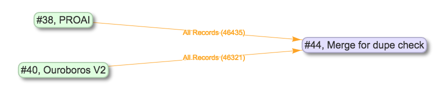

   Merge Job combing two Jobs of interest

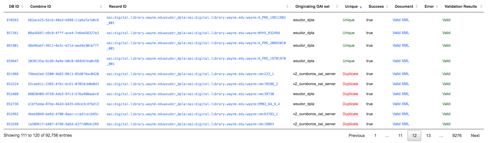

   Analysis of Records from Merge Job shows duplicates

Publishing Records
==================

If you've made it this far, at this point we have:

-  Created the Organization, "Amazing University"
-  Created the RecordGroup, "Fedora Repository"
-  Harvested 250 Records from static XML files
-  Transformed those 250 Records to meet our Service Hub profile

   -  thereby also fixing validation problems revealed in Harvest

-  Looked at Job and Record details

Now, we may be ready to "publish" these materials from Combine for
harvesting by others (e.g. DPLA).

Overview
--------

Publishing is done at the **RecordGroup** level, giving more weight to
the idea of a RecordGroup as a meaningful, intellectual group of
records. When a RecordGroup is published, it can be given a "Publish Set ID", which translates directly to an OAI-PMH **set**. **Note:**
It is possible to publish multiple, distinct RecordGroups with the same
publish ID, which has the effect of allowing multiple RecordGroups to be published under the same OAI-PMH set.

Combine comes with an `OAI-PMH server baked
in <http://192.168.45.10/combine/oai?verb=Identify>`__ that serves all
published RecordGroups via the OAI-PMH HTTP protocol.

Publishing a RecordGroup
------------------------

To run a Publish Job and publish a RecordGroup, navigate to the
RecordGroup page, and near the top click the "Publish" button inside the
top-most, small table.

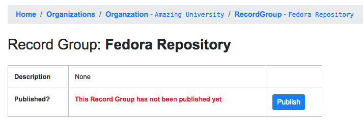

   Record Group has not yet been published...

You will be presented with a new Job creation screen.

Near the top, there are some fields for entering information about an
Publish set identifier. You can either select a previously used Publish set
identifier from the dropdown, or create a new one.  Remember, this will become the OAI set identifier used in the **outgoing** Combine OAI-PMH server.

Let's give it a new, simple identifier: ``fedora``, representing that this RecordGroup is a workspace for Jobs and Records from our Fedora
repository.

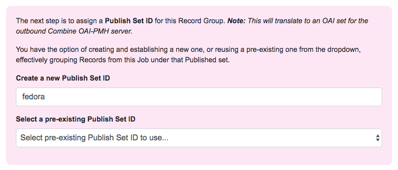

   Section to provide a new publish identifier, or select a pre-existing one

Then, from the table below, select the Job (again, think as a *stage* of
the same records) that will be published for this RecordGroup. Let's
select the Transformation Job that had passed all validations.

Finally, click "Publish" at the bottom.

You will be returned to the RecordGroup, and should see a new Publish
Job with status ``running``, further extending the Job "lineage" graph
at the top. Publish Jobs are usually fairly quick, as they are copy most
data from the Job that served as input.

In a few seconds you should be able to refresh the page and see this Job
status switch to ``available``, indicating the publishing is complete.

Near the top, you can now see this Record Group is published:

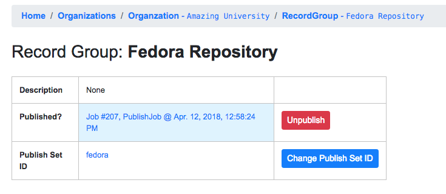

   Published Record Group

Let's confirm and see them as published records...

Viewing published records
-------------------------

From any screen, click the "Published" link at the very top in the
navigation links. This brings you to a new page with some familiar
looking tables.

At the very top is a section "Published Sets". These show all
**RecordGroups** that have been published, with the corresponding OAI
set identifier. This also provides a button to unpublish a RecordGroup
(also doable from the RecordGroup page).

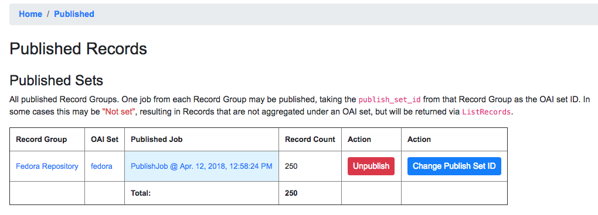

   Currently published Record Groups, with their publish set identifier

To the right is an area that says, "Analysis."  Clicking this button will fire a new Analysis Job -- which has not yet been covered, but is essentially an isolated Job that takes 1+ Jobs from any Organization, and RecordGroup, for the purpose of analysis -- with all the Published Jobs automatically selected.  This provides a single point of analysis for all Records published from Combine.

Below that is a table -- similar to the table from a single Job details
-- showing all **Records** that are published, spanning all RecordGroups
and OAI sets. One column of note is ``Unique in Published?`` which
indicates whether or not this Record is unique among all published
Records. **Note:** This test is determined by checking the ``record_id``
field for published records; if two records are essentially the same,
but have different ``record_id``\ s, this will not detect that.

Below that table, is the familiar "Indexed Fields" table. This table
shows mapped, indexed fields in ElasticSearch for *all* Records across
*all* RecordGroups published. Similar to a single Job, this can be
useful for determining irregularities among published Records (e.g.
small subset of Records that don't have an important field).

Finally, at the very bottom are some links to the actual OAI-PMH serer
coming out of Combine, representing four common OAI-PMH verbs:

-  `Identify <http://192.168.45.10/combine/oai?verb=Identify>`__

   -  basic identification of the Combine OAI-PMH server

-  `List
   Identifiers <http://192.168.45.10/combine/oai?verb=ListIdentifiers>`__

   -  list OAI-PMH identifiers for all published Records

-  `List Records <http://192.168.45.10/combine/oai?verb=ListRecords>`__

   -  list full records for all published Records (primary mechanism for
      harvest)

-  `List Sets <http://192.168.45.10/combine/oai?verb=ListSets>`__

   -  list all OAI-PMH sets, a direct correlation to OAI sets
      identifiers for each published RecordGroup

Analysis Jobs
=============

From any screen, clicking the "Analysis" link at the top in the
navigation links will take you to the Analysis Jobs space. Analysis Jobs
are a special kind of Job in Combine, as they are meant to operate
outside the workflows of a RecordGroup.

Analysis Jobs look and feel very much like Duplicate / Merge Jobs, and
that's because they share mechanisms on the back-end. When starting a
new Analysis Job, by clicking the "Run new analysis job" link at the
bottom of the page, you are presented with a familiar screen to run a
new Job. However, you'll notice that you can select Jobs from any
RecordGroup, and *multiple* jobs if so desired, much like
Duplicate/Merge Jobs.

An example use case may be running an Analysis Job across a handful of
Jobs, in different RecordGroups, to get a sense of how fields are used.
Or run a battery or validation tests that may not relate directly to the
workflows of a RecordGroup, but are helpful to see all the same.

Analysis Jobs are *not* shown in RecordGroups, and are not available for
selection as input Jobs from any other screens; they are a bit of an
island, solely for the purpose of their Analysis namesake.

Troubleshooting
===============

Undoubtedly, things might go sideways! As Combine is still quite rough
around some edges, here are some common gotchas you may encounter.

Run a job, status immediately flip to ``available``, and has no records
-----------------------------------------------------------------------

The best way to diagnose why a job may have failed, from the RecordGroup
screen, is to click "Livy Statement" link under the ``Monitor`` column.
This returns the raw output from the Spark job, via Livy which
dispatches jobs to Spark.

A common error is a stale Livy connection, specifically its MySQL
connection, which is revealed at the end of the Livy statement output
by:

::

    MySQL server has gone away

This can be fixed by `restarting the Livy session <#livy-sessions>`_.

Cannot start a Livy session
---------------------------

Information for diagnosing can be found in the Livy logs at ``/var/log/livy/livy.stderr``.
