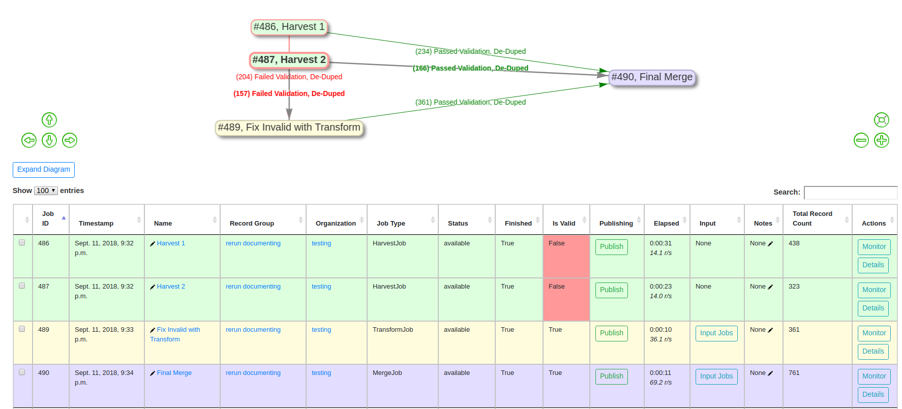
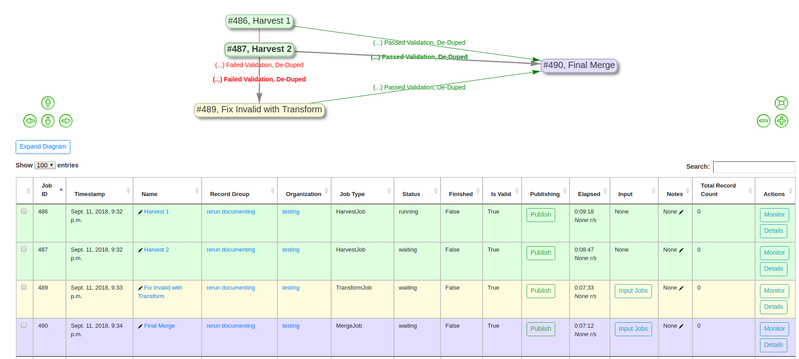

***************
Re-Running Jobs
***************

Overview
========

Jobs in Combine may be "re-run" in a way that makes a series of interlinked Jobs resemble that of a "pipeline".  This functionality can be particularly helpful when a series of harvests, merges, validations, transformations, and other checks, will be repeated in the future, but with new and/or refresh records.  

When a Job is re-run, the following actions are performed in preparation:

  - all Records for that Job are dropped from the DB
  - all mapped fields in ElasticSearch are dropped (the ElasticSearch index)
  - all validations, DPLA bulk data tests, and other information that is based on the Records are removed

However, what remains is important:

  - the Job ID, name, notes
  - all configurations that were used

    - field mapping
    - validations applied
    - input filters
    - etc.

  - linkages to other Jobs; what Jobs were used as input, and what Jobs used *this* Job as input
  - publish status of a Job, with corresponding ``publish_set_id`` (if a Job is published before re-running, the updated Records will automatically publish as well)

Examples
========

Consider the example below, with five Jobs in Combine:

.. figure:: img/job_rerun.png
   :alt: Hypothetical "family" or "lineage" of Jobs in Combine
   :target: _images/job_rerun.png

   Hypothetical "family" or "lineage" of Jobs in Combine

In this figure, Records from an OAI Harvest ``J1`` are used as input for ``J2``.  A subset of these are passed to ``J3``, perhaps failing some kind of validation, and are fixed then in ``J4``.  ``J5`` is a final merge of the valid records from ``J2`` and ``J4``, resulting in a final form of the Records.  At each hop, there may be various validations and mappings to support the validation and movement of Records.

Now, let's assume the entire workflow is needed again, but we know that ``J1`` needs to re-harvest Records because there are new or altered Records.  Without re-running Jobs in Combine, it would be necessary to recreate each hop in this pipeline, thereby also duplicating the amount of Records.  Duplication of Records may be beneficial in some cases, but not alll.  In this example, a user would only need to re-run Job ``J1``, which would trigger all "downstream" Jobs, all the way to Job ``J5``.  

Let's look at a more realistic example, with actual Combine Jobs.  Take the following:

   Combine Re-Run "Pipeline"

In this "pipeline":

  - two OAI harvests are performed
  - all *invalid* Records are sent to a Transform that fixes validation problems
  - all *valid* Records from that Transform Job, and the original Harvests, are merged together in a final Job

The details of these hops are hidden from this image, but there are validations, field mappings, and other configurations at play here.  If a re-harvest is needed for one, or both, of the OAI harvests, a re-run of those Jobs will trigger all "downstream" Jobs, refreshing the Records along the way.

If we were to re-run the two Harvest Jobs, we are immediately kicked back to the Record Group screen, where it can be observed that all Jobs have 0 Records, and are currently running or queued to run:

   Re-Run triggered, Jobs running and/or queued

