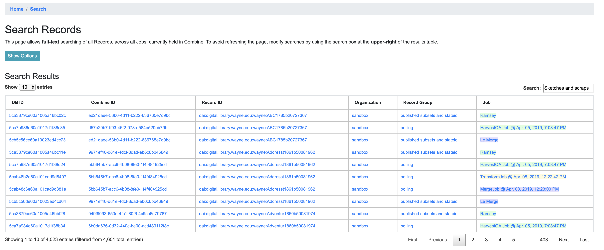
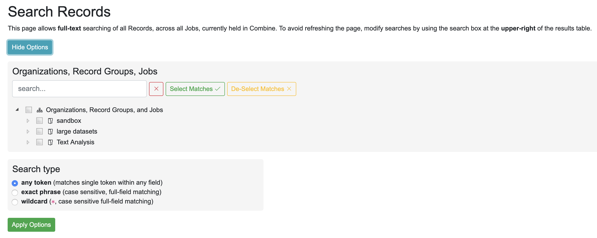
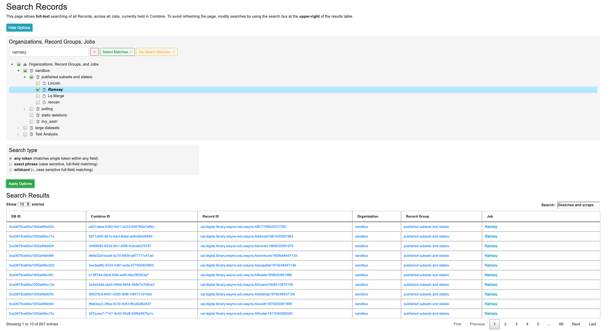
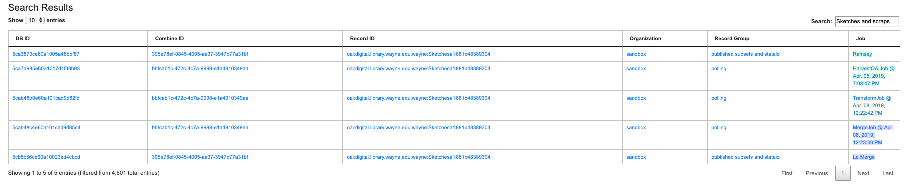
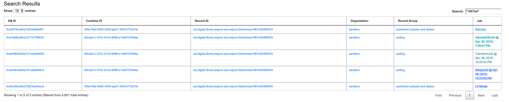
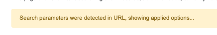

*********
Searching
*********

  - `Global Search <#global-search>`_

Global Search
=============

Global searching in Combine allows the searching of **mapped** fields across all Records, in all Jobs.

To perform a search, use the search box in the upper-right in the main navigation bar at the top:

   Global search box in main Combine navigation bar

A search term is optional, when blank, returning all Records.  This example is using the search term ``Sketches and scraps`` as an example.  This should return a screen that looks like the following:

   Search results for "Sketches and scraps"

Note the search term ``Sketches and scraps`` has automatically been applied to the table search field in the upper-right of the results table.  Modifications to the search can be done here, updating the results in near realtime.

Notice there are ``4,023`` results out of a total ``4,601`` Records.  Why so many for a search term that seems pretty specific?  By default, global search looks for *any* token in the search string.  In this case, it's likely that ``and`` matched most of those records.  The following will outline search options to narrow results.

Global Search Options
---------------------

Clicking the "Show Options" button will reveal a panel of additional search options:

   Search options and filters

Filter by Organization, Record Group, and/or Job
~~~~~~~~~~~~~~~~~~~~~~~~~~~~~~~~~~~~~~~~~~~~~~~~

The first section "Organizations, Record Groups, and Jobs" allows for the filtering of results based on Records from those hierarchical levels.  The following shows limiting to a Job called "Ramsey", clicking the button "Apply Options", and the effect on the results:

   Narrowing by Job ``Ramsey``

The results have dropped to ``657``, but still quite a few.  The Job filter has been applied, limiting the Records to only that Job (which contains ``657`` Records), but the search type is still expansive and capturing all Records with the ``and`` token.

Next, we can change the search type to drill down further.

Search Type
~~~~~~~~~~~

Currently there exists three search types in Global Search:

  - ``any token``

    - *matches any token from the search terms, and is NOT case-sensitive*
    - *default search type*

  - ``exact phrase``

    - *matches the exact phrase, and only the exact phrase, and IS case-sensitive*

  - ``wildcard``

    - *allows for the inclusion of a * wildcard character, matching the entire phrase, and IS case-sensitive*

Global Search is searching the *mapped fields* for Records, which are stored in ElasticSearch.  As such, the power (and complexity) of ElasticSearch is exposed here to some degree.

**Any Token**

The search terms provided are tokenized, and each term is searched.  This is the most general search.

**Exact Phrase**

This search type is case-sensitive, and searches the entire search phrase provided, against un-tokenzied fields for all Records.  To demonstrate, when applied to the example above, only five results are returned (which all contain the exact, case-sensitive value ``Sketches and scraps`` for at least one mapped field):

   Exact phrase search for ``Sketches and scraps``

**Wildcard**

This search type can be particularly helpful for searching various identifiers in records, allowing the match of a sub-string in a field's full, case-sensitive value.  For example, we can take a piece of the ``Record ID`` for these Records -- ``1881b4`` -- and find Records that match that string somewhere in a field:

   Wildcard search for ``*1881b4*``

Note the wildcard character ``*`` on *both* sides of the search term, indicating the field value may *begin* with anything, *end* with anything, but must contain that sub-string ``1881b4``.  Somewhat unsurprisingly, the results are the same.

**Note:** Even blank spaces must be captured by a wild card ``*``.  So, searching for ``public domain`` anywhere in a field would translate to ``*public*domain*``.

Saving / Sharing Searches
~~~~~~~~~~~~~~~~~~~~~~~~~

Note that when options are applied to the search with the "Apply Options" button, the URL is updated to reflect these new search options.  If that URL is returned to, those search options are automatically parsed and applied, as indicated by the following message:

   Options applied to search from URL

This might be particularly helpful for saving or sharing searches with others.
