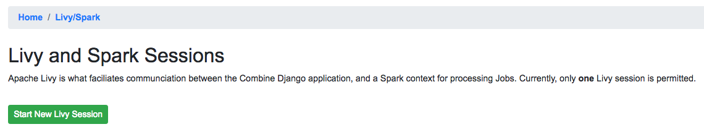
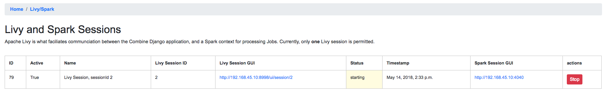
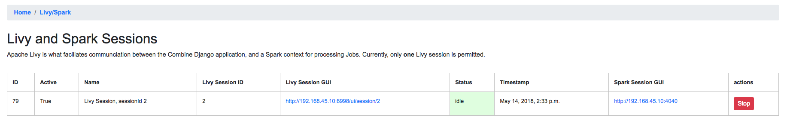

**************
Spark and Livy
**************

Combine was created to provide a single point of interaction for metadata harvesting, transformation, analysis, and publishing.  Another guiding factor was a desire to utilize `DPLA's Ingestion 3 <https://github.com/dpla/ingestion3>`_ codebase where possible, which itself, uses `Apache Spark <https://spark.apache.org/>`_ for processing large numbers of records.  The decision to use Ingestion3 drove the architecture of Combine to use Apache Spark as the primary, background context and environment for processing Records.

This is well and good from a command line, issuing individual tasks to be performed, but how would this translate to a GUI that could be used to initiate tasks, queue them, and view the results?  It became evident that an intermdiary piece was needed to faciliate running Spark "jobs" from a request/response oriented front-end GUI.  `Apache Livy <https://livy.incubator.apache.org/>`_ was suggested as just such a piece, and fit the bill perfectly.  Livy allows for the submission of jobs to a running Spark context via JSON, and the subsequent ability to "check" on the status of those jobs.

As Spark natively allows python code as a language for submitting jobs, Django was chosen as the front-end framework for Combine, to have some parity between the langauge of the GUI front-end and the language of the actual code submitted to Spark for batch processing records.

All this conspires to make Combine fast and efficient, but adds a level of complexity.  When Jobs are run in Combine, they are submitted to this running, background Spark context via Livy.  While Livy utilized in a similar fashion at scale, for large enterprise systems, it is often obfuscated from the front-end interface.  A projected goal, this has not been realized in Combine, and some minor attention to making sure Livy is "ready" to submit Spark jobs is required by Combine users.

Explanations aside, most important for Combine users is `**how to start and stop Livy sessions** <#manage-livy-sessions>`__.

Livy Sessions
=============

Livy creates Spark contexts that can recieve jobs via what it calls "sessions".  In Combine, only one active Livy session is allowed at a time.  This is partially for performance reasons, to avoid gobbling up all of the server's resources, and partially to enforce a sequential running of Spark Jobs that avoids many of the complexities that would be introduced if Jobs -- that require input from the output of one another -- were finishing at different times.

Manage Livy Sessions
--------------------

Navigate to the "Livy/Spark Session" link at the top-most navigation of Combine.  If no Livy sessions are found or active, you will be presented with a screen that looks like this:

   Livy sessions management: No Livy sessions found

To begin a Livy session, click "Start New Livy Session".  The page will refresh and you should see a screen that shows the Livy session is ``starting``:

   Livy sessions management: Livy sesesion starting

After 10-20 seconds, the page can be refreshed and it should show the Livy session as ``idle``, meaning it is ready to receive jobs:

   Livy sessions management: Livy sesesion starting

Barring any errors with Livy, this is the only interaction with Livy that a Combine user needs to concern themselves with.

The color of the always present "Livy/Spark Session" link at the top of Combine's navigation will reveal what state the Livy session is in.  If **red**, it needs attention and may need to be (re)started.  If **yellow**, it's busy, meaning starting or running a Job.  If **green**, it's ready for action!