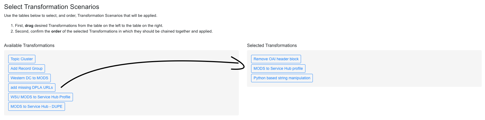

********************
Transforming Records
********************

Transformation Jobs are how Records are transformed in some way in Combine; all other Jobs merely copy and/or analyze Records, but Transformation Jobs actually alter the Record's XML document that is stored.

The following will outline specifics for running Transformation Jobs, with more `general information about running Jobs here <workflow.html#running-jobs>`_.

Similar to Harvest Jobs, you must first configure a, or multiple, `Transformation Scenarios <configuration.html#transformation-scenario>`_ that will be selected and used when running a Transformation Job.

The first step is to select all input Jobs that will serve as the input Records for the Transformation Job:

.. figure:: img/transformation_input_selection.png
   :alt: Selecting an input Job for transformation
   :target: _images/transformation_input_selection.png

   Selecting an input Job for transformation

Next, is the task of **selecting** and **ordering** the Transformation Scenarios that will be performed for this Transform Job.  This is done by:

  1. **selecting** pre-configured, available Transformation scenarios from the box on the left by **dragging** them to the box on the right
  2. then, **ordering** the Transformation scenarios on the right in the order they should be performed

   Selecting, and ordering, Transformation scenarios to be applied during Transform Job

When the Transformation Job is run, the Records will be transformed by these scenarios *in order*.  While it would be possible to setup multiple Transform Jobs, and is a perfectly acceptable alternative approach, that would duplicate the Records at each stage.  The ability to select and order *multiple* Transformation scenarios in a single Job allows only a single group of Records to be creaetd, with all the selected Transformations applied.

When ready, select optional parameters, an finally click "Run Transform Job" at the bottom.