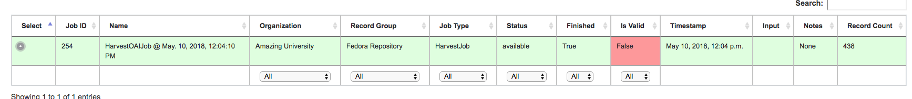
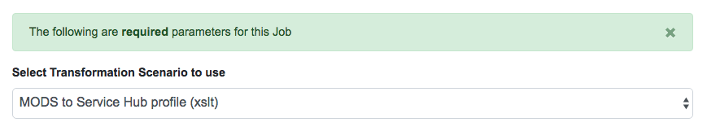

********************
Transforming Records
********************

Transformation Jobs are how Records are transformed in some way in Combine; all other Jobs merely copy and/or analyze Records, but Transformation Jobs actually alter the Record's XML that is stored in MySQL

The following will outline specifics for running Transformation Jobs, with more `general information about running Jobs here <workflow.html#running-jobs>`_.

Similar to Harvest Jobs, you must first `configure a Transformation Scenario <configuration.html#transformation-scenario>`_ that will be selected and used when running a Transformation Job.

The first step is to select a **single** input Job to supply the Records for transformation:

   Selecting an input Job for transformation

Next, will be selecting your pre-configured Transformation Scenario:

   Selecting Transformation Scenario

As most of the configuration is done in the Transformation Scenario, there is very little to do here!  Select optional parameters and click "Run Job" at the bottom.