*****************************
Workflows and Viewing Results
*****************************

This section will describe different parts of workflows for running, viewing detailed results, and exporting Jobs and Records.

Sub-sections include:

  - `Record Versioning <#record-versioning>`__
  - `Running Jobs <#running-jobs>`__
  - `Viewing Job Details <#viewing-job-details>`__
  - `Viewing Record Details <#viewing-record-details>`__
  - `Managing Jobs <#managing-jobs>`__

Record Versioning
=================

In an effort to preserve various stages of a Record through harvest, possible multiple transformation, merges and sub-dividing, Combine takes the approach of copying the Record each time.

As outlined in the `Data Model <data_model.html>`_, Records are represented in both MongoDB and ElasticSearch.  Each time a Job is run, and a Record is duplicated, it gets a new document in Mongo, with the full XML of the Record duplicated.  Records are associated with each other across Jobs by their `Combine ID <data_model.html#identifiers>`_.

This approach has pros and cons:

  - Pros

    - simple data model, each version of a Record is stored separately
    - each Record stage can be indexed and analyzed separately
    - Jobs containing Records can be deleted without effecting up/downstream Records (they will vanish from the lineage)

  - Cons

    - duplication of data is potentially unnecessary if Record information has not changed

Running Jobs
============

**Note:** For all Jobs in Combine, confirm that an `active Livy session is up and running <spark_and_livy.html#manage-livy-sessions>`_ before proceeding.

All Jobs are tied to, and initiated from, a `Record Group <data_model.html#record-group>`_.  From the Record Group page, at the bottom you will find buttons for starting new jobs:

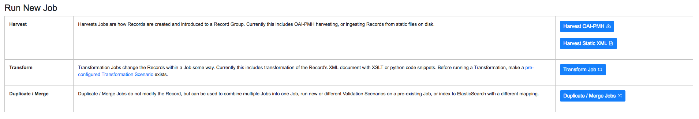

   Buttons on a Record Group to begin a Job

Clicking any of these Job types will initiate a new Job, and present you with the options outlined below.

Optional Parameters
-------------------

When running any type of Job in Combine, you are presented with a section near the bottom for **Optional Parameters** for the job:

.. figure:: img/job_optional_parameters.png
   :alt: Optional Parameters for all Jobs
   :target: _images/job_optional_parameters.png

   Optional Parameters for all Jobs

These options are split across various tabs, and include:

  - `Record Input Filters <#record-input-filters>`_
  - `Field Mapping Configuration <#field-mapping-configuration>`_
  - `Validation Tests <#validation-tests>`_
  - `Transform Identifier <#transform-identifier>`_
  - `DPLA Bulk Data Compare <#dpla-bulk-data-compare>`_

For the most part, a user is required to pre-configure these in the `Configurations section <configuration.html>`_, and then select which optional parameters to apply during runtime for Jobs.

Record Input Filters
~~~~~~~~~~~~~~~~~~~~

When running a new Transform or Duplicate/Merge Job, which both rely on other Jobs as Input Jobs, filters can be applied to filter incoming Records.   These filters are settable via the "Record Input Filter" tab.

There are two ways in which filters can be applied:

  - "Globally", where all filters are applied to all Jobs
  - "Job Specific", where a set of filters can be applied to individual Jobs, overriding any "Global" filters

Setting filters for individual Jobs is performed by clicking the filter icon next to a Job's checklist in the Input Job selection table:

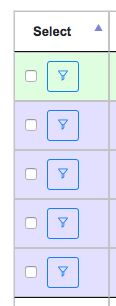

   Click the filter button to set filters for a specific Job

This will bring up a modal window where filters can be set for that Job, and that Job only.  When the modal window is saved, and filters applied to that Job, the filter icon will turn orange indicating that Job has unique filters applied:

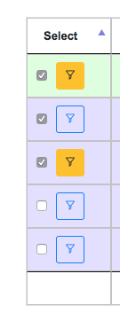

   Orange filter buttons indicate filters have been set for a specific Job

When filters are applied to specific Jobs, this will be reflected in the Job lineage graph:

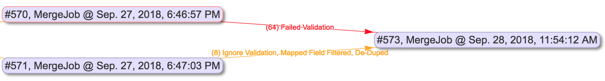

   Job lineage showing Job specific filters applied

and the Input Jobs tab for the Job as well:

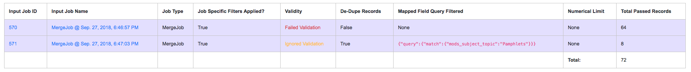

   Job lineage showing Job specific filters applied

Currently, the following input Record filters are supported:

  - Filter by Record Validity
  - Limit Number of Records
  - Filter Duplicates
  - Filter by Mapped Fields

**Filter by Record Validity**

Users can select if **all**, **valid**, or **invalid** Records will be included.

.. figure:: img/select_input_validity.png
   :alt: Selecting Record Input Validity Valve for Job
   :target: _images/select_input_validity.png

   Selecting Record Input Validity Valve for Job

Below is an example of how those valves can be applied and utilized with Merge Jobs to select only only valid or invalid records:

.. figure:: img/merge_valid_shunt.png
   :alt: Example of shunting Records based on validity, and eventually merging all valid Records
   :target: _images/merge_valid_shunt.png

   Example of shunting Records based on validity, and eventually merging all valid Records

Keep in mind, if multiple Validation Scenarios were run for a particular Job, it only requires failing one test, within one Validation Scenario, for the Record to be considered "invalid" as a whole.

**Limit Number of Records**

Arguably the simplest filter, users can provide a number to limit **total** number of Records that will be used as input.  This numerical filter is applied after other filters have been applied, and the Records from each Input Job have been mixed.  Given Input Jobs ``A``, ``B``, and ``C``, all with 1,000 Records, given a numerical limit of 50, it's quite possible that all 50 will come from Job ``A``, and 0 from ``B`` and ``C``.

This filter is likely most helpful for testing and sampling.

**Filter Duplicates**

Optionally, remove duplicate Records based on matching ``record_id`` values.  As these are used for publishing, this can be a way to ensure that Records are not published with duplicate ``record_id``.

**Filter by Mapped Fields**

Users can provide an ElasticSearch DSL query, as JSON, to refine the records that will be used for this Job.

Take, for example, an input Job of 10,000 Records that has a field ``foo_bar``, and 500 of those Records have the value ``baz`` for this field.  If the following query is entered here, only the 500 Records that are returned from this query will be used for the Job:

.. code-block:: json

    {
      "query":{
        "match":{
          "foo_bar":"baz"
        }
      }
    }

This ability hints at the potential for taking the time to map fields in interesting and helpful ways, such that you can use those mapped fields to refine later Jobs by.  ElasticSearch queries can be quite powerul and complex, and in theory, this filter will support any query used.

Field Mapping Configuration
~~~~~~~~~~~~~~~~~~~~~~~~~~~

Combine maps a Record's original document -- likely XML -- to key/value pairs suitable for ElasticSearch with a library called ``XML2kvp``.  When running a new Job, users can provide parameters to the ``XML2kvp`` parser in the form of JSON.

Here's an example of the default configurations:

.. code-block:: json

    {
      "add_literals": {},
      "concat_values_on_all_fields": false,
      "concat_values_on_fields": {},
      "copy_to": {},
      "copy_to_regex": {},
      "copy_value_to_regex": {},
      "error_on_delims_collision": false,
      "exclude_attributes": [],
      "exclude_elements": [],
      "include_all_attributes": false,
      "include_attributes": [],
      "node_delim": "_",
      "ns_prefix_delim": "|",
      "remove_copied_key": true,
      "remove_copied_value": false,
      "remove_ns_prefix": false,
      "self_describing": false,
      "skip_attribute_ns_declarations": true,
      "skip_repeating_values": true,
      "split_values_on_all_fields": false,
      "split_values_on_fields": {}
    }

Clicking the button "What do these configurations mean?" will provide information about each parameter, pulled form the ``XML2kvp`` JSON schema.

The default is a safe bet to run Jobs, but configurations can be **saved**, **retrieved**, **updated**, and **deleted** from this screen as well.

Additional, high level discussion about mapping and indexing metadata `can also be found here <analysis.html#analyzing-indexed-fields>`_.

Validation Tests
~~~~~~~~~~~~~~~~

One of the most commonly used optional parameters would be what Validation Scenarios to apply for this Job.  Validation Scenarios are `pre-configured validations <configuration.html#validation-scenario>`_ that will run for *each* Record in the Job.  When viewing a Job's or Record's details, the result of each validation run will be shown.

The Validation Tests selection looks like this for a Job, with checkboxes for each pre-configured Validation Scenarios (additionally, checked if the Validation Scenario is marked to run by default):

.. figure:: img/select_validations.png
   :alt: Selecting Validations Tests for Job
   :target: _images/select_validations.png

   Selecting Validations Tests for Job

Transform Identifier
~~~~~~~~~~~~~~~~~~~~

When running a Job, users can optionally select a `Record Identifier Transformation Scenario (RITS) <configuration.html#record-identifier-transformation-scenario>`_ that will modify the Record Identifier for each Record in the Job.

.. figure:: img/select_rits.png
   :alt: Selecting Record Identifier Transformation Scenario (RITS) for Job
   :target: _images/select_rits.png

   Selecting Record Identifier Transformation Scenario (RITS) for Job

DPLA Bulk Data Compare
~~~~~~~~~~~~~~~~~~~~~~

One somewhat experimental feature is the ability to compare the Record's from a Job against a downloaded and indexed bulk data dump from DPLA.  These DPLA bulk data downloads can be `managed in Configurations here <configuration.html#dpla-bulk-data-downloads-dbdd>`_.

When running a Job, a user may optionally select what bulk data download to compare against:

.. figure:: img/select_dbdd.png
   :alt: Selecting DPLA Bulk Data Download comparison for Job
   :target: _images/select_dbdd.png

   Selecting DPLA Bulk Data Download comparison for Job

Viewing Job Details
===================

One of the most detail rich screens are the results and details from a Job run.  This section outlines the major areas.  This is often referred to as the "Job Details" page.

At the very top of an Job Details page, a user is presented with a "lineage" of input Jobs that relate to this Job:

.. figure:: img/job_details_top_lineage.png
   :alt: Lineage of input Jobs for a Job
   :target: _images/job_details_top_lineage.png

   Lineage of input Jobs for a Job

Also in this area is a button "Job Notes" which will reveal a panel for reading / writing notes for this Job.  These notes will also show up in the Record Group's Jobs table.

Below that are tabs that organize the various parts of the Job Details page:

  - `Records <#records>`__
  - `Mapped Fields <#mapped-fields>`__
  - `Re-Run <#re-run>`__
  - `Publish <#publish>`__
  - `Input Jobs <#input-jobs>`__
  - `Validation <#validation>`__
  - `DPLA Bulk Data Matches <#dpla-bulk-data-matches>`__
  - `Job Type Details - Jobs <#job-type-details-jobs>`__
  - `Exporting <#export>`__
  - `Spark Details <#spark-details>`__

Records
-------

.. figure:: img/job_details_records_table.png
   :alt: Table of all Records from a Job
   :target: _images/job_details_records_table.png

   Table of all Records from a Job

This table shows all Records for this Job.  It is sortable and searchable (though limited to what fields), and contains the following fields:

  - ``DB ID`` - Record's ObjectID in MongoDB
  - ``Combine ID`` - identifier assigned to Record on creation, sticks with Record through all stages and Jobs
  - ``Record ID`` - Record identifier that is acquired, or created, on Record creation, and is used for publishing downstream.  This may be modified across Jobs, unlike the ``Combine ID``.
  - ``Originating OAI set`` - what OAI set this record was harvested as part of
  - ``Unique`` - True/False if the ``Record ID`` is unique in this Job
  - ``Document`` - link to the Record's raw, XML document, blank if error
  - ``Error`` - explanation for error, if any, otherwise blank
  - ``Validation Results`` - True/False if the Record passed *all* Validation Tests, True if none run for this Job

In many ways, this is the most direct and primary route to access Records from a Job.

Mapped Fields
-------------

This tab provides a table of all indexed fields for this job, the nature of which `is covered in more detail here <analysis.html#analyzing-indexed-fields>`_:

.. figure:: img/job_field_analysis.png
   :alt: Indexed field analysis for a Job, across all Records
   :target: _images/job_field_analysis.png

   Indexed field analysis for a Job, across all

Re-Run
------

Jobs can be re-run "in place" such that all current parameters, applied scenarios, and linkages to other jobs are maintained.  All "downstream" Jobs -- Jobs that inherit Records from this Job -- are also automatically re-run.

One way to think about re-running Jobs would be to think of a group of Jobs that that inherit Records from one another as a "pipeline".

Jobs may also be re-run, as well as in bulk with other Jobs, from a Record Group page.

More information can be found here: `Re-Running Jobs documentation <rerunning_jobs.html>`__.

Publish
-------

This tab provides the means of publishing a single Job and its Records.  This is covered in more detail in the `Publishing section <publishing.html>`_.

Input Jobs
----------

This table shows all Jobs that were used as *input* Jobs for this Job.

.. figure:: img/job_details_input_jobs.png
   :alt: Table of Input Jobs used for this Job
   :target: _images/job_details_input_jobs.png

   Table of Input Jobs used for this Job

Validation
----------

This tab shows the results of all Validation tests run for this Job:

.. figure:: img/job_details_validation_results.png
   :alt: All Validation Tests run for this Job
   :target: _images/job_details_validation_results.png

   Results of all Validation Tests run for this Job

For each Validation Scenario run, the table shows the name, type, count of records that failed, and a link to see the failures in more detail.

More information about `Validation Results can be found here <analysis.html#validation-tests-results>`_.

DPLA Bulk Data Matches
----------------------

If a DPLA bulk data download was selected to compare against for this Job, the results will be shown in this tab.

The following screenshot gives a sense of what this looks like for a Job containing about 250k records, that was compared against a DPLA bulk data download of comparable size:

.. figure:: img/dbdd_compare.png
   :alt: Results of DPLA Bulk Data Download comparison
   :target: _images/dbdd_compare.png

   Results of DPLA Bulk Data Download comparison

This feature is still somewhat exploratory, but Combine provides an ideal environment and "moment in time" within the greater metadata aggregation ecosystem for this kind of comparison.

In this example, we are seeing that 185k Records were found in the DPLA data dump, and that 38k Records appear to be new.  Without an example at hand, it is difficult to show, but it's conceivable that by leaving Jobs in Combine, and then comparing against a later DPLA data dump, one would have the ability to confirm that all records do indeed show up in the DPLA data.

Spark Details
-------------

This tab provides helpful diagnostic information about the Job as run in in the background in Spark.

**Spark Jobs/Tasks Run**

Shows the actual tasks and stages as run by Spark.  Due to how Spark runs, the names of these tasks may not be familiar or immediately obvious, but provide a window into the Job as it runs.  This section also shows additioanl tasks that have been run for this Job such as re-indexing, or new validations.

**Livy Statement Information**

This section shows the raw JSON output from the Job as submitted to Apache Livy.

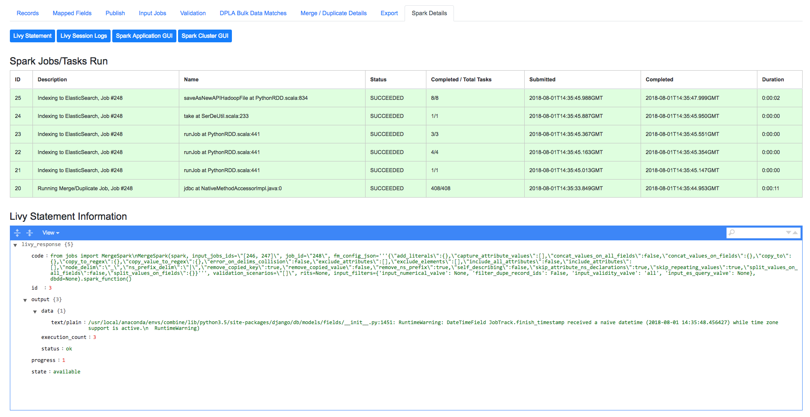

   Details about the Job as run in Apache Spark

Job Type Details - Jobs
~~~~~~~~~~~~~~~~~~~~~~~

For each Job type -- ``Harvest``, ``Transform``, ``Merge/Duplicate``, and ``Analysis`` -- the Job details screen provides a tab with information specific to that Job type.

All Jobs contain a section called **Job Runtime Details** that show all parameters used for the Job:

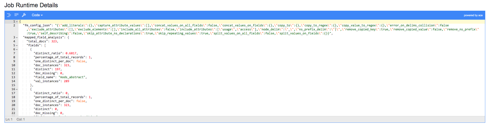

   Parameters used to initiate and run Job that can be useful for diagnostic purposes

**OAI Harvest Jobs**

Shows what OAI endpoint was used for Harvest.

**Static Harvest Jobs**

No additional information at this time for Static Harvest Jobs.

**Transform Jobs**

The "Transform Details" tab shows Records that were transformed during the Job in some way.  For some Transformation Scenarios, it might be assumed that all Records will be transformed, but others, may only target a few Records.  This allows for viewing what Records were altered.

.. figure:: img/transformed_records_table.png
   :alt: Table showing transformed Records for a Job
   :target: _images/transformed_records_table.png

   Table showing transformed Records for a Job

Clicking into a Record, and then clicking the "Transform Details" tab at the Record level, will show detailed changes for that Record (see below for more information).

**Merge/Duplicate Jobs**

No additional information at this time for Merge/Duplicate Jobs.

**Analysis Jobs**

No additional information at this time for Analysis Jobs.

Export
~~~~~~

Records from Jobs may be exported in a variety of ways, `read more about exporting here <exporting.html>`_.

Viewing Record Details
======================

At the most granular level of `Combine's data model <data_mode.html>`_ is the Record.  This section will outline the various areas of the Record details page.

The table at the top of a Record details page provides identifier information:

.. figure:: img/record_details_top.png
   :alt: Top of Record details page
   :target: _images/record_details_top.png

   Top of Record details page

Similar to a Job details page, the following tabs breakdown other major sections of this Record details.

  - `Record XML <#record-xml>`__
  - `Indexed Fields <#indexed-fields>`__
  - `Record Stages <#record-stages>`__
  - `Record Validation <#record-validation>`__
  - `DPLA Link <#dpla-link>`__
  - `Job Type Details - Records <#job-type-details-records>`__

Record XML
----------

This tab provides a glimpse at the raw, XML for a Record:

.. figure:: img/record_details_xml.png
   :alt: Record's document
   :target: _images/record_details_xml.png

   Record's document

Note also two buttons for this tab:

  - ``View Document in New Tab`` This will show the raw XML in a new browser tab
  - ``Search for Matching Documents``: This will search all Records in Combine for other Records with an *identical* XML document

Indexed Fields
--------------

This tab provides a table of all indexed fields in ElasticSearch for this Record:

.. figure:: img/record_details_indexed_fields.png
   :alt: Indexed fields for a Record
   :target: _images/record_details_indexed_fields.png

   Indexed fields for a Record

Notice in this table the columns ``DPLA Mapped Field`` and ``Map DPLA Field``.  Both of these columns pertain to a functionality in Combine that attempts to "link" a Record with the same record in the live DPLA site.  It performs this action by querying the DPLA API (DPLA API credentials must be set in ``localsettings.py``) based on mapped indexed fields.  Though this area has potential for expansion, currently the most reliable and effective DPLA field to try and map is the ``isShownAt`` field.

The ``isShownAt`` field is the URL that all DPLA items require to send visitors back to the originating organization or institution's page for that item.  As such, it is also unique to each Record, and provides a handy way to "link" Records in Combine to items in DPLA.  The difficult part is often figuring out which indexed field in Combine contains the URL.

**Note:** When this is applied to a single Record, that mapping is then applied to the Job as a whole.  Viewing another Record from this Job will reflect the same mappings.  These mappings can also be applied at the Job or Record level.

In the example above, the indexed field ``mods_location_url_@usage_primary`` has been mapped to the DPLA field ``isShownAt`` which provides a reliable linkage at the Record level.

Record Stages
-------------

This table show the various "stages" of a Record, which is effectively what Jobs the Record also exists in:

.. figure:: img/record_details_stages.png
   :alt: Record stages across other Jobs
   :target: _images/record_details_stages.png

   Record stages across other Jobs

Records are connected by their Combine ID (``combine_id``).  From this table, it is possible to jump to other, earlier "upstream" or later "downstream", versions of the same Record.

Record Validation
-----------------

This tab shows all Validation Tests that were run for this Job, and how this Record fared:

.. figure:: img/record_validation_results.png
   :alt: Record's Validation Results tab
   :target: _images/record_validation_results.png

   Record's Validation Results tab

More information about `Validation Results can be found here <analysis.html#validation-tests-results>`_.

DPLA Link
---------

When a mapping has been made to the DPLA ``isShownAt`` field from the Indexed Fields tab (or at the Job level), and if a DPLA API query is successful, a result will be shown here:

.. figure:: img/record_details_dpla_link.png
   :alt: Indexed fields for a Record
   :target: _images/record_details_dpla_link.png

   Indexed fields for a Record

Results from the DPLA API are parsed and presented here, with the full API JSON response at the bottom (not pictured here).  This can be useful for:

  - confirming existence of a Record in DPLA
  - easily retrieving detailed DPLA API metadata about the item
  - confirming that changes and transformations are propagating as expected

Job Type Details - Records
~~~~~~~~~~~~~~~~~~~~~~~~~~

For each Job type -- ``Harvest``, ``Transform``, ``Merge/Duplicate``, and ``Analysis`` -- the Record details screen provides a tab with information specific to that Job type.

**Harvest Jobs**

No additional information at this time for Harvest Jobs.

**Transform Jobs**

This tab will show Transformation details specific to this Record.

The first section shows the Transformation Scenario used, including the transformation itself, and the "input" or "upsteram" Record that was used for the transformation:

.. figure:: img/trans_record_details_table.png
   :alt: Information about Input Record and Transformation Scenario used for this Record
   :target: _images/trans_record_details_table.png

   Information about Input Record and Transformation Scenario used for this Record

Clicking the "Re-run Transformation on Input Record" button will send you to the Transformation Scenario preview page, with the Transformation Scenario and Input Record automatically selected.

Further down, is a detailed diff between the **input** and **output** document for this Record.  In this minimal example, you can observe that ``Juvenile`` was changed to ``Youth`` in the Transformation, resulting in only a couple of isolated changes:

.. figure:: img/trans_record_details_smalldiff.png
   :alt: Record transformation diff, small change
   :target: _images/trans_record_details_smalldiff.png

   Record transformation diff, small change

For transformations where the Record is largely re-written, the changes will be lengthier and more complex:

.. figure:: img/trans_record_details_largediff.png
   :alt: Snippet of Record transformation diff, many changes
   :target: _images/trans_record_details_largediff.png

   Snippet of Record transformation diff, many changes

Users may also click the button "View Side-by-Side Changes" for a GitHub-esque, side-by-side diff of the Input Record and the Current Record (made possible by the `sxsdiff <https://github.com/timonwong/sxsdiff>`_ library):

.. figure:: img/sxsdiff_small.png
   :alt: Side-by-side diff, minimal changes
   :target: _images/sxsdiff_small.png

   Side-by-side diff, minimal changes

.. figure:: img/sxsdiff_large.png
   :alt: Side-by-side diff, many changes
   :target: _images/sxsdiff_large.png

   Side-by-side diff, many changes

**Merge/Duplicate Jobs**

No additional information at this time for Merge/Duplicate Jobs.

**Analysis Jobs**

No additional information at this time for Analysis Jobs.

Managing Jobs
=============

Once you work through initiating the Job, configuring the optional parameters outlined below, and running it, you will be returned to the Record Group screen and presented with the following job lineage "graph" and a table showing all Jobs for the Record Group:

.. figure:: img/record_group_jobs.png
   :alt: Job "lineage" graph at the top, table with Jobs at the bottom
   :target: _images/record_group_jobs.png

   Job "lineage" graph at the top, table with Jobs at the bottom

The graph at the top shows all Jobs for this Record Group, and their relationships to one another.  The edges between nodes show how many Records were used as input for the target Job, what -- if any -- filters were applied. This graph is zoomable and clickable.  This graph is designed to provide some insight and context at a glance, but the table below is designed to be more functional.

The table shows all Jobs, with optional filters and a search box in the upper-right.  The columns include:

  - ``Job ID`` - Numerical Job ID in Combine
  - ``Timestamp`` - When the Job was started
  - ``Name`` - Clickable name for Job that leads to Job details, optionally given one by user, or a default is generated.  This is editable anytime.
  - ``Organization`` - Clickable link to the Organization this Job falls under
  - ``Record Group`` - Clickable link to the Record Group this Job falls under (as this table is reused throughout Combine, it can sometimes contain Jobs from other Record Groups)
  - ``Job Type`` - Harvest, Transform, Merge, or Analysis
  - ``Livy Status`` - This is the status of the Job in Livy

    - ``gone`` - Livy has been restarted or stopped, and no information about this Job is available
    - ``available`` - Livy reports the Job as complete and available
    - ``waiting`` - The Job is queued behind others in Livy
    - ``running`` - The Job is currently running in Livy

  - ``Finished`` - Though Livy does the majority of the Job processing, this indicates the Job is finished in the context of Combine
  - ``Is Valid`` - True/False, True if no validations were run or *all* Records passed validation, False if any Records failed any validations
  - ``Publishing`` - Buttons for `Publishing or Unpublishing <publishing.html>`_ a Job
  - ``Elapsed`` - How long the Job has been running, or took
  - ``Input`` - All input Jobs used for this Job
  - ``Notes`` - Optional notes field that can be filled out by User here, or in Job Details
  - ``Total Record Count`` - Total number of successfully processed Records
  - ``Actions`` - Buttons for Job details, or monitoring status of Job in Spark (see `Spark and Livy documentation <spark_and_livy.html>`_ for more information)

This graph and table represents Jobs already run, or running.  This is also where Jobs can be moved, stopped, deleted, rerun, even cloned.  This is performed by using the bank of buttons under "Job Management":

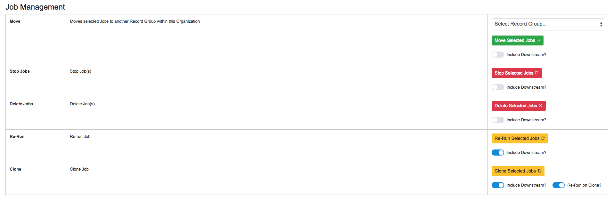

   Buttons used to manage running and finished Jobs

All management options contain a slider titled "Include Downstream" that defaults to **on** or **off**, depending on the task.  When **on** for a particular task, this will analyze the lineage of all selected Jobs and determine which are downstream and include them in the action being peformed (e.g. moving, deleting, rerunning, etc.)

The idea of "downstream" Jobs, and some of the actions like **Re-Running** and **Cloning** introduce another dimension to Jobs and Records in Combine, that of **Pipelines**.

Pipelines
---------

What is meant by "downstream" Jobs?  Take the interconnected Jobs below:

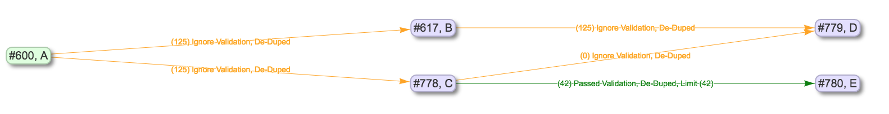

   Five interconnected Jobs

In this example, the OAI Harvest Job ``A`` is the "root" or "origin" Job of this lineage.  This is where Records were first harvested and created in Combine (this might also be static harvests, or other forms of importing Records yet to come).  All other Jobs in the lineage -- ``B``, ``C``, ``D``, and ``E`` -- are considered "downstream".  From the point of view of ``A``, there is a single pipeline.  If a user were to reharvest ``A``, potentially adding, removing, or modifying Records in that Job, this has implications for all other Jobs that either got Records from ``A``, or got Records from Jobs that got Records from ``A``, and so forth.  In that sense, Jobs are "downstream" if changes to an "upstream" Job would potentially change their own Records.

Moving to ``B``, only one Job is downstream, ``D``.  Looking at ``C``, there are two downstreams Jobs, ``D`` and ``E``.  Looking again at the Record Group lineage, we can see then that ``D`` has two upstream Jobs, ``B`` and ``C``.  This can be confirmed by looking at the "Input Jobs" tab for ``D``:

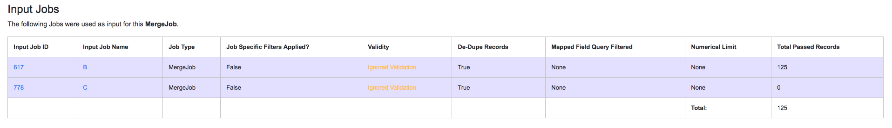

   Input Jobs for Job D, showing Jobs B and C

Why are there zero Records coming from ``C`` as an Input Job?  Looking more closely at this contrived example, and the input filters applied to Jobs ``B`` and ``C``, we see that "De-Dupe Records" is true for both.  We can infer that Jobs ``B`` and ``C`` provided Records with the same ``record_id``, and as a result, were all de-duped -- skipped -- from ``C`` during the Merge.

Another view of the lineage for ``D``, from it's perspective, can be seen at the top of the Job details page for ``D``, confirming all this:

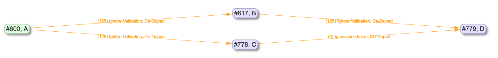

   Upstream lineage for Job D

Getting back to the idea of pipelines and Job management, what would happend if we select ``A`` and click the "Re-Run Selected Jobs" button, with "Include Downstream" turned on?  Jobs ``A``-``E`` would be slated for re-running, queuing in order to ensure that each Jobs is getting updated Records from each upstream Job:

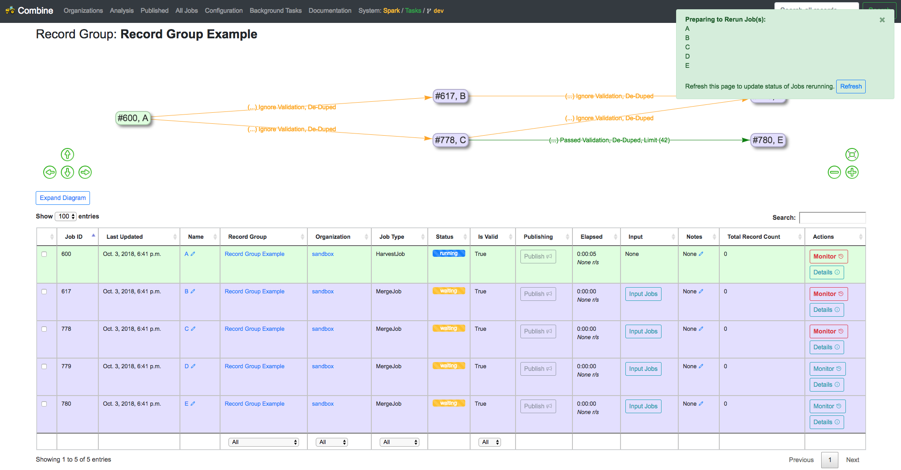

   Re-Running Job A, including downstream Jobs

We can see that status changed for each Job (potentially after a page refresh), and the Jobs will re-run in order.

We also have the ability to **clone** Jobs, including or ignoring downstream Jobs.  The following is an example of cloning ``C``, *not* including downstream Jobs:

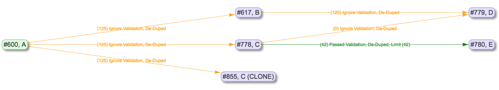

   Cloning Job C

Under the hood, all validations, input filters, and parameters that were set for ``C`` are copied to the new Job ``C (CLONED)``, but because downstream Jobs were not included, ``D`` and ``E`` were not cloned.  But if we were to select downstream Jobs from ``C`` when cloning, we'd see something that looks like this:

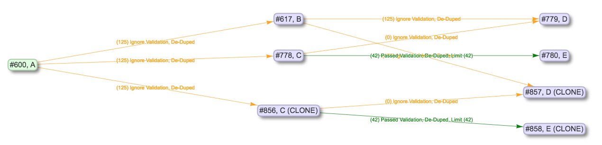

   Cloning Job C, including downstream Jobs

Woah there!  Why the line from ``B`` to the newly created cloned Job ``D (CLONE)``?  ``D`` was downstream from ``C`` during the clone, so was cloned as well, but still required input from ``B``, which was not cloned.  We can imagine that ``B`` might be a group of Records that rarely change, but are required in our pursuits, and so that connection is persisted.

As one final example of cloning, to get a sense about Input Jobs for Jobs that are cloned, versus those that are not, we can look at the example of cloning ``A``, including all its downstream Jobs:

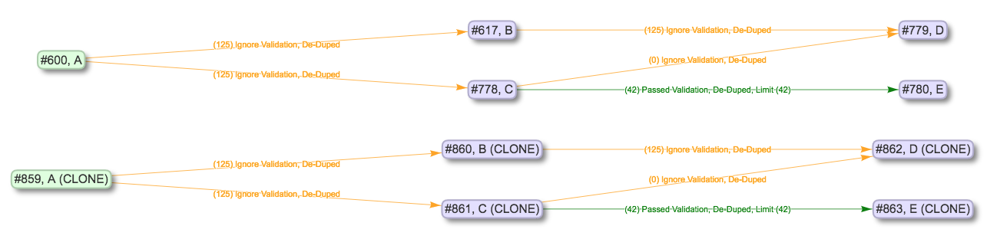

   Cloning Job A, including downstream Jobs

Because ``A`` has every job in this view as downstream, cloning ``A`` essentially clones the entire "pipeline" and creates a standalone copy.  This could be useful for cloning a pipeline to test re-running the entire thing, where it is not desirable to risk the integrity of the pipeline before knowing if it will be successful.

Finally, we can see that the "Include Downstream" applied to other tasks as well, e.g. deleting, where we have selected to delete ``A (CLONE)`` and all downstream Jobs:

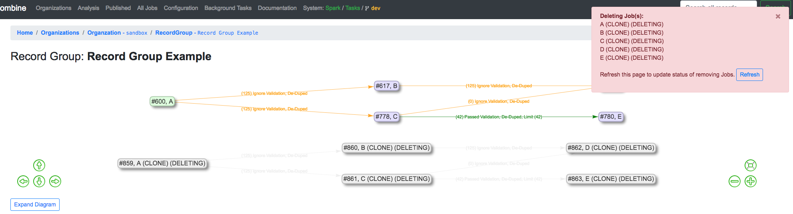

   Deleting Job A (CLONE), and all downstream Jobs

"Pipelines" are not a formal structure in Combine, but can be a particularly helpful way to think about a "family" or "lineage" of connected Jobs.  The ability to re-run and clone Jobs came later in the data model, but with the addition of granular control of input filters for Input Jobs, can prove to be extremely helpful for setting up complicated pipelines of interconnected Jobs that can be reused.

