*****************************
Workflows and Viewing Results
*****************************

This section will describe different parts of workflows for running, viewing detailed results, and exporting Jobs and Records.

Sub-sections include:

  - `Record Versioning <#record-versioning>`__
  - `Running Jobs <#running-jobs>`__
  - `Viewing Job Details <#viewing-job-details>`__
  - `Viewing Record Details <#viewing-record-details>`__

Record Versioning
=================

In an effort to preserve various stages of a Record through harvest, possible multiple transformation, merges, and eventually publishing, Combine takes the approach of copying the Record each time.

As outlined in the `Data Model <data_model.html>`_, Records are represented in both MySQL and ElasticSearch.  Each time a Job is run, and a Record is duplicated, it gets a new row in MySQL, with the full XML of the Record duplicated.  Records are associated with each other across Jobs by their `Combine ID <data_model.html#identifiers>`_.

This approach has pros and cons:

  - Pros

    - simple data model, each version of a Record is stored separately
    - each Record stage can be indexed and analyzed separately
    - Jobs containing Records can be deleted without effecting up/downstream Records (they will vanish from the lineage)

  - Cons

    - duplication of data is potentially unnecessary if Record information has not changed

Running Jobs
============

**Note:** For all Jobs in Combine, confirm that an `active Livy session is up and running <spark_and_livy.html#manage-livy-sessions>`_ before proceeding.

All Jobs are tied to, and initiated from, a `Record Group <data_model.html#record-group>`_.  From the Record Group page, at the bottom you will find buttons for starting new jobs:

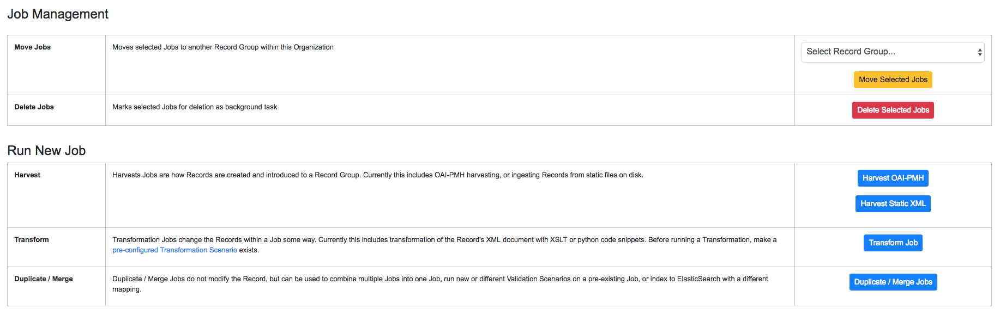

   Buttons on a Record Group to begin a Job

Once you work through initiating the Job, and configuring the optional parameters outlined below, you will be returned to the Record Group screen and presented with the following job lineage "graph" and a table showing all Jobs for the Record Group:

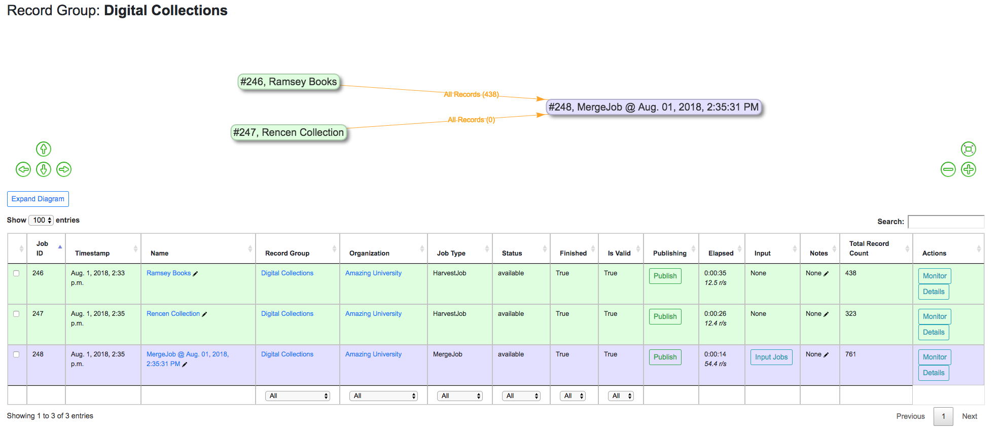

   Job "lineage" graph at the top, table with Jobs at the bottom

The graph at the top shows all Jobs for this Record Group, and their relationships to one another.  The edges between nodes show how many Records were used as input for the target Job, and whether or not they were "all", "valid", or "invalid" Records.

This graph is zoomable and clickable.  This graph is designed to provide some insight and context at a glance, but the table below is designed to be more functional.

The table shows all Jobs, with optional filters and a search box in the upper-right.  The columns include:

  - ``Job ID`` - Numerical Job ID in Combine
  - ``Timestamp`` - When the Job was started
  - ``Name`` - Clickable name for Job that leads to Job details, optionally given one by user, or a default is generated.  This is editable anytime.  
  - ``Organization`` - Clickable link to the Organization this Job falls under
  - ``Record Group`` - Clickable link to the Record Group this Job falls under (as this table is reused throughout Combine, it can sometimes contain Jobs from other Record Groups)
  - ``Job Type`` - Harvest, Transform, Merge, Publish, or Analysis
  - ``Livy Status`` - This is the status of the Job in Livy

    - ``gone`` - Livy has been restarted or stopped, and no information about this Job is available
    - ``available`` - Livy reports the Job as complete and available
    - ``waiting`` - The Job is queued behind others in Livy
    - ``running`` - The Job is currently running in Livy

  - ``Finished`` - Though Livy does the majority of the Job processing, this indicates the Job is finished in the context of Combine
  - ``Is Valid`` - True/False, True if no validations were run or *all* Records passed validation, False if any Records failed any validations
  - ``Elapsed`` - How long the Job has been running, or took
  - ``Input`` - All input Jobs used for this Job
  - ``Notes`` - Optional notes field that can be filled out by User here, or in Job Details
  - ``Total Record Count`` - Total number of successfully processed Records
  - ``Monitor`` - Links for more details about the Job.  See `Spark and Livy documentation <spark_and_livy.html>`_ for more information.
  - ``Actions`` - Link for Job details

To **move** Jobs from one Record Group to another, select the Jobs from the table with their checkboxes and then in the table at the bottom, select the target Record Group and click "Move Selected Jobs".

To **delete** Jobs, select Jobs via their checkboxes and click "Delete Selected Jobs" from the bottom management pane.

As Jobs can contain hundreds of thousands, even millions of rows, this process can take some time.  Combine has background running tasks that handle some long running actions such as this, where using Spark is not appropriate.  When a Job is deleted it will be grayed out and marked as "DELETED" while it is removed in the background.

Optional Parameters
-------------------

When running any type of Job in Combine, you are presented with a section near the bottom for **Optional Parameters** for the job:

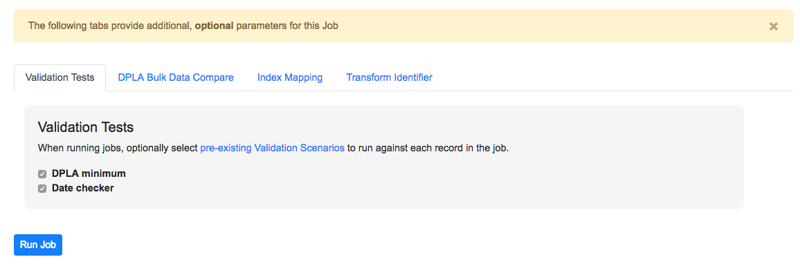

   Optional Parameters for all Jobs

These options are split across various tabs, and include:

  - `Validation Tests <#validation-tests>`_
  - `Index Mapping <#index-mapping>`_
  - `Transform Identifier <#transform-identifier>`_
  - `Record Input Validity <#record-input-validity-valve>`_
  - `DPLA Bulk Data Compare <#dpla-bulk-data-compare>`_

For the most part, a user is required to pre-configure these in the `Configurations section <configuration.html>`_, and then select which optional parameters to apply during runtime for Jobs.

Validation Tests
~~~~~~~~~~~~~~~~

One of the most commonly used optional parameters would be what Validation Scenarios to apply for this Job.  Validation Scenarios are `pre-configured validations <configuration.html#validation-scenario>`_ that will run for *each* Record in the Job.  When viewing a Job's or Record's details, the result of each validation run will be shown.

The Validation Tests selection looks like this for a Job, with checkboxes for each pre-configured Validation Scenarios (additionally, checked if the Validation Scenario is marked to run by default):

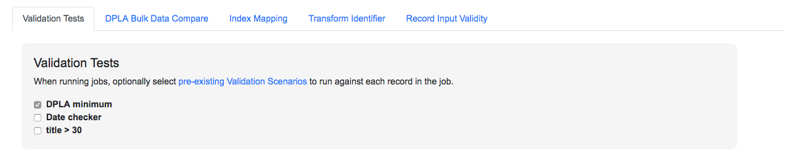

   Selecting Validations Tests for Job

Index Mapping
~~~~~~~~~~~~~

How, and why, metadata fields are indexed is `covered in more detail here <analysis.html#analyzing-indexed-fields>`_.

When running a Job, users can select what index mapper to use.  This defaults to "Generic XPath based mapper":

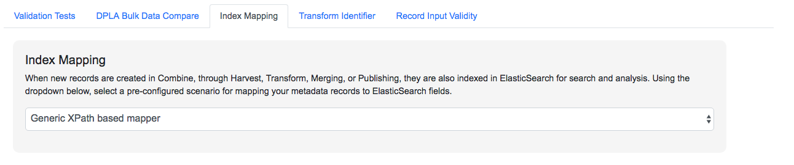

   Selecting Index Mapper for Job

The generic mapper is a good, safe bet until the need for a more custom mapper is needed.

Transform Identifier
~~~~~~~~~~~~~~~~~~~~

When running a Job, users can optionally select a `Record Identifier Transformation Scenario (RITS) <configuration.html#record-identifier-transformation-scenario>`_ that will modify the Record Identifier for each Record in the Job.

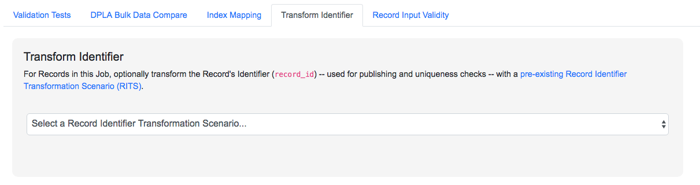

   Selecting Record Identifier Transformation Scenario (RITS) for Job

Record Input Validity Valve
~~~~~~~~~~~~~~~~~~~~~~~~~~~

When running a Job, with respect to *all* input Jobs selected, users can select if **all**, **valid**, or **invalid** Records should be included.  This is referred to as a "Validity Valve" because it very much feels like a valve that is applied to the input Job for the Job that is about to be run.

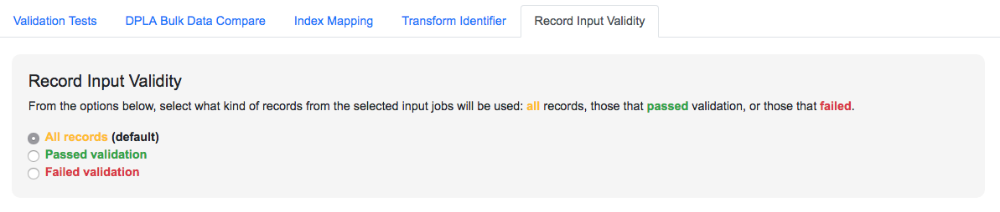

   Selecting Record Input Validity Valve for Job

Below is an example of how those valves can be applied and utilized with Merge Jobs to select only only valid or invalid records:

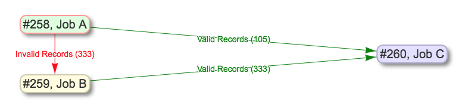

   Example of shunting Records based on validity, and eventually merging all valid Records

Keep in mind, if multiple Validation Scenarios were run for a particular Job, it only requires failing one test, within one Validation Scenario, for the Record to be considered "invalid" as a whole.

DPLA Bulk Data Compare
~~~~~~~~~~~~~~~~~~~~~~

One somewhat experimental feature is the ability to compare the Record's from a Job against a downloaded and indexed bulk data dump from DPLA.  These DPLA bulk data downloads can be `managed in Configurations here <configuration.html#dpla-bulk-data-downloads-dbdd>`_.

When running a Job, a user may optionally select what bulk data download to compare against:

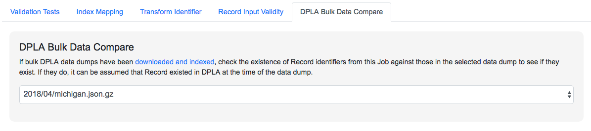

   Selecting DPLA Bulk Data Download comparison for Job

Viewing Job Details
===================

One of the most detail rich screens are the results and details from a Job run.  This section outlines the major areas.  This is often referred to as the "Job Details" page.

At the very top of an Job Details page, a user is presented with a "lineage" of input Jobs that relate to this Job:

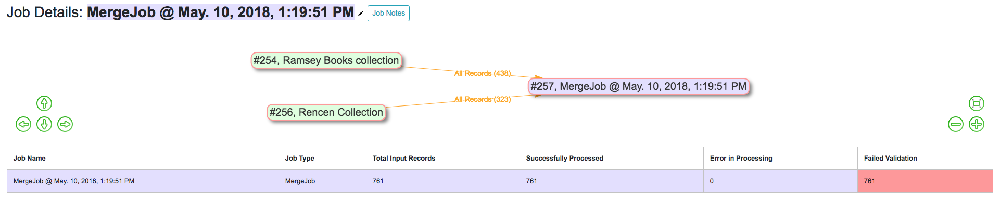

   Lineage of input Jobs for a Job

Also in this area is a button "Job Notes" which will reveal a panel for reading / writing notes for this Job.  These notes will also show up in the Record Group's Jobs table.

Below that are tabs that organize the various parts of the Job Details page:

  - `Records <#records>`__
  - `Field Analysis <#field-analysis>`__
  - `Input Jobs <#input-jobs>`__
  - `Validation <#validation>`__
  - `DPLA Bulk Data Matches <#dpla-bulk-data-matches>`__
  - `Job Type Details - Jobs <#job-type-details-jobs>`__
  - `Exporting <#export>`__

Records
-------

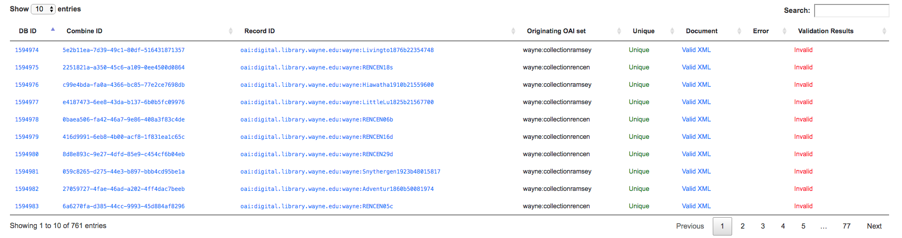

   Table of all Records from a Job

This table shows all Records for this Job.  It is sortable and searchable (though limited to what fields), and contains the following fields:

  - ``DB ID`` - Record's Primary Key in MySQL
  - ``Combine ID`` - identifier assigned to Record on creation, sticks with Record through all stages and Jobs
  - ``Record ID`` - Record identifier that is acquired, or created, on Record creation, and is used for publishing downstream.  This may be modified across Jobs, unlike the ``Combine ID``.
  - ``Originating OAI set`` - what OAI set this record was harvested as part of
  - ``Unique`` - True/False if the ``Record ID`` is unique in this Job
  - ``Document`` - link to the Record's raw, XML document, blank if error
  - ``Error`` - explanation for error, if any, otherwise blank
  - ``Validation Results`` - True/False if the Record passed *all* Validation Tests, True if none run for this Job

In many ways, this is the most direct and primary route to access Records from a Job.

Field Analysis
--------------

This tab provides a table of all indexed fields for this job, the nature of which `is covered in more detail here <analysis.html#analyzing-indexed-fields>`_:

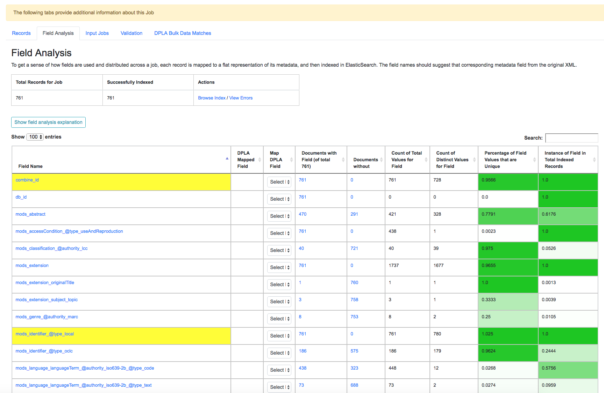

   Indexed field analysis for a Job, across all Records

Input Jobs
----------

This table shows all Jobs that were used as *input* Jobs for this Job.

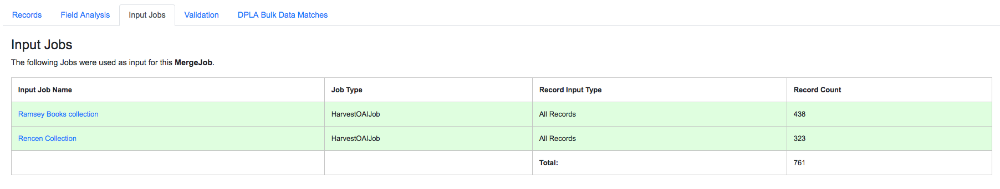

   Table of Input Jobs used for this Job

Validation
----------

This tab shows the results of all Validation tests run for this Job:

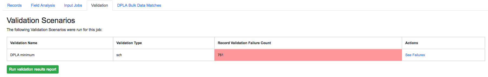

   Results of all Validation Tests run for this Job

For each Validation Scenario run, the table shows the name, type, count of records that failed, and a link to see the failures in more detail.

More information about `Validation Results can be found here <analysis.html#validation-tests-results>`_.

DPLA Bulk Data Matches
----------------------

If a DPLA bulk data download was selected to compare against for this Job, the results will be shown in this tab.

The following screenshot gives a sense of what this looks like for a Job containing about 250k records, that was compared against a DPLA bulk data download of comparable size:

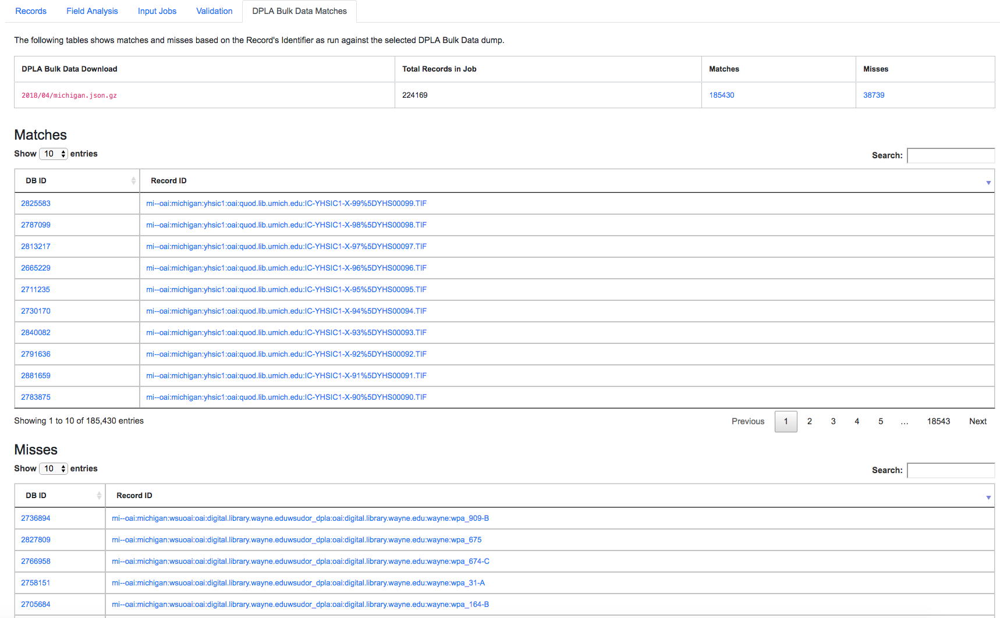

   Results of DPLA Bulk Data Download comparison

This feature is still somewhat exploratory, but Combine provides an ideal environment and "moment in time" within the greater metadata aggregation ecosystem for this kind of comparison.

In this example, we are seeing that 185k Records were found in the DPLA data dump, and that 38k Records appear to be new.  Without an example at hand, it is difficult to show, but it's conceivable that by leaving Jobs in Combine, and then comparing against a later DPLA data dump, one would have the ability to confirm that all records do indeed show up in the DPLA data.

Job Type Details - Jobs
~~~~~~~~~~~~~~~~~~~~~~~

For each Job type -- ``Harvest``, ``Transform``, ``Merge/Duplicate``, ``Publish``, and ``Analysis`` -- the Job details screen provides a tab with information specific to that Job type.

**Harvest Jobs**

No additional information at this time for Harvest Jobs.

**Transform Jobs**

The "Transform Details" tab shows Records that were transformed during the Job in some way.  For some Transformation Scenarios, it might be assumed that all Records will be transformed, but others, may only target a few Records.  This allows for viewing what Records were altered.

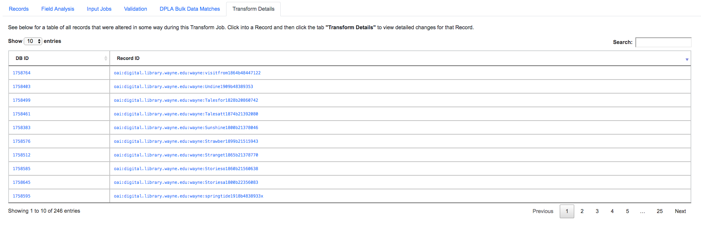

   Table showing transformed Records for a Job

Clicking into a Record, and then clicking the "Transform Details" tab at the Record level, will show detailed changes for that Record (see below for more information).

**Merge/Duplicate Jobs**

No additional information at this time for Merge/Duplicate Jobs.

**Publish Jobs**

No additional information at this time for Publish Jobs.

**Analysis Jobs**

No additional information at this time for Analysis Jobs.

Export
~~~~~~

Jobs may be exported in two ways:

**Record Mapped Fields**

Exporting a Job as Mapped Fields creates a single.csv or Excel file mapped fields stored in ElasticSearch, across all Records, for this Job.

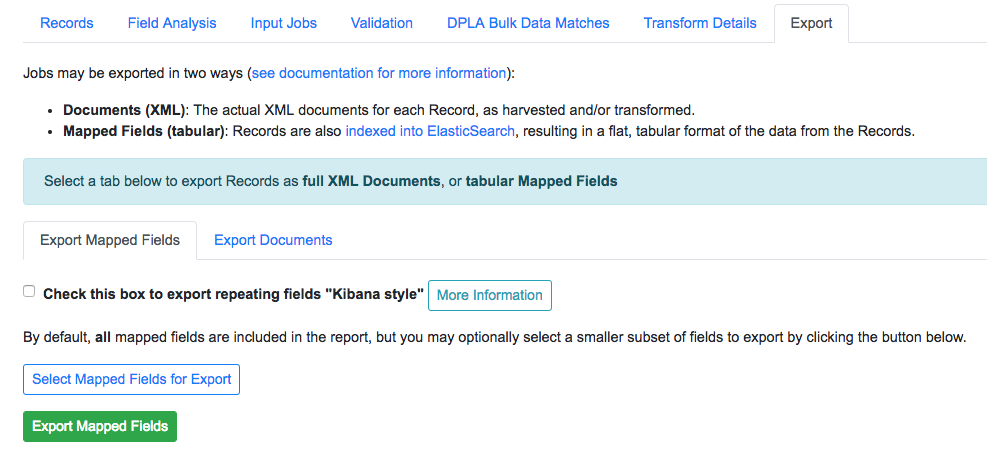

   Exporting Mapped Fields for a Job

By default, **all** mapped fields are included in the export, but a smaller, selected subset is possible by clicking the "Selected Mapped Fields for Export" button:

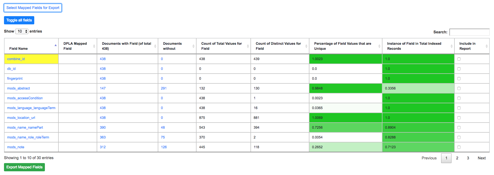

   Exporting Mapped Fields, selecting subset of fields to include

This is similar to selecting fields to include when generating a report of Validation failures.

Exporting mapped fields can be helpful for analysis, or even importing into OpenRefine for more detailed analysis and clustering.  Please note, this exported format cannot be *re-imported* or "round-tripped" into Combine to modify the mapped fields or XML document for each Record in that Job; it is for analysis purposes only.

If a Record contains a mapped field such as ``mods_subject_topic`` that is repeating, the default export format is to create multiple columns in the export, appending an integer for each instance of that field, e.g.,

.. code-block:: text

    mods_subject_topic.0, mods_subject_topic.1, mods_subject_topic.0
    history, michigan, snow

But if the checkbox, ``Check this box to export repeating fields "Kibana style"`` is checked, all multi-valued fields will export in the "Kibana style" where a single column is added to the export and the values are comma separated, e.g.,

.. code-block:: text

    mods_subject_topic
    history,michigan,snow

When a Job is exported as Mapped Fields, this will send users to the `Background Tasks <background_tasks.html>`_ screen where the task can be monitored and viewed.

**Record Documents**

Exporting a Job as Documents takes the stored XML documents for each Record, distributes them across a user-defined number of files, exports as XML documents, and compiles them in an archive for easy downloading.  

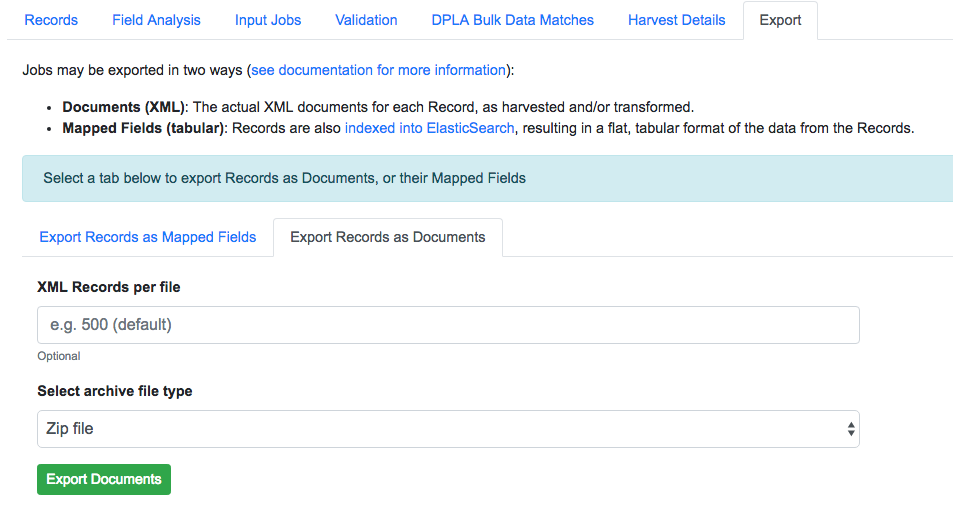

   Exporting Mapped Fields for a Job

For example, 1000 records where a user selects 250 per file, for Job ``#42``, would result in the following structure:

.. code-block:: text

    - archive.zip|tar
        - j42/ # folder for Job
            - part00000.xml # each XML file contains 250 records grouped under a root XML element <documents>
            - part00001.xml
            - part00002.xml
            - part00003.xml

The following screenshot shows the actual result of a Job with 1,070 Records, exporting 50 per file, with a zip file and the resulting, unzipped structure:

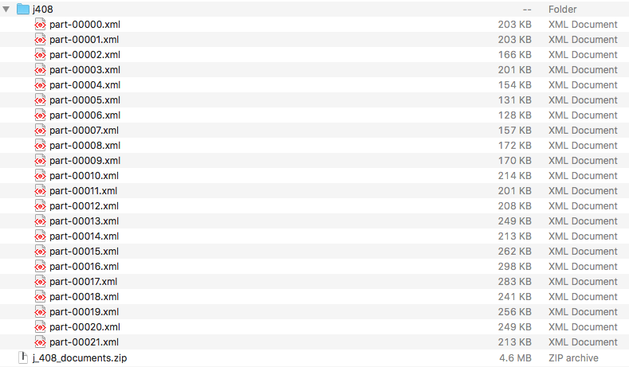

   Example structure of an exported Job as XML Documents

Why export like this?  Very large XML files can be problematic to work with, particularly for XML parsers that attempt to load the entire document into memory (which is most of them).  Combine is naturally pre-disposed to think in terms of the parts and partitions with the Spark back-end, which makes for convenient writing of all Records from Job in smaller chunks.  The size of the "chunk" can be set by specifying the ``XML Records per file`` input in the export form.  Finally, .zip or .tar files for the resulting export are both supported.

When a Job is exported as Documents, this will send users to the `Background Tasks <background_tasks.html>`_ screen where the task can be monitored and viewed.

Viewing Record Details
======================

At the most granular level of `Combine's data model <data_mode.html>`_ is the Record.  This section will outline the various areas of the Record details page.

The table at the top of a Record details page provides identifier information:

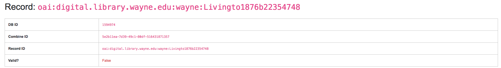

   Top of Record details page

Similar to a Job details page, the following tabs breakdown other major sections of this Record details.

  - `Record XML <#record-xml>`__
  - `Indexed Fields <#indexed-fields>`__
  - `Record Stages <#record-stages>`__
  - `Record Validation <#record-validation>`__
  - `DPLA Link <#dpla-link>`__
  - `Job Type Details - Records <#job-type-details-records>`__

Record XML
----------

This tab provides a glimpse at the raw, XML for a Record:

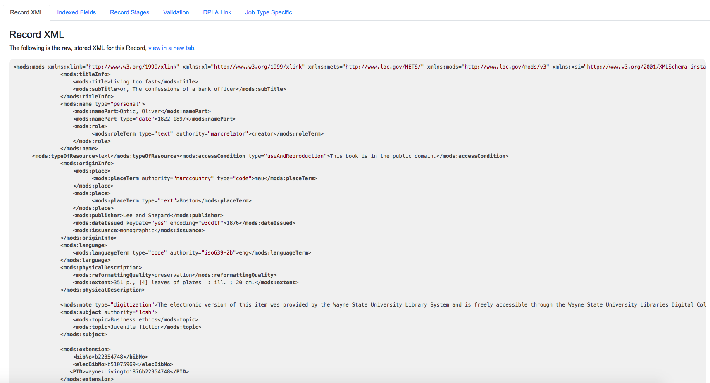

   Record's document

Note also two buttons for this tab:

  - ``View Document in New Tab`` This will show the raw XML in a new browser tab
  - ``Search for Matching Documents``: This will search all Records in Combine for other Records with an *identical* XML document

Indexed Fields
--------------

This tab provides a table of all indexed fields in ElasticSearch for this Record:

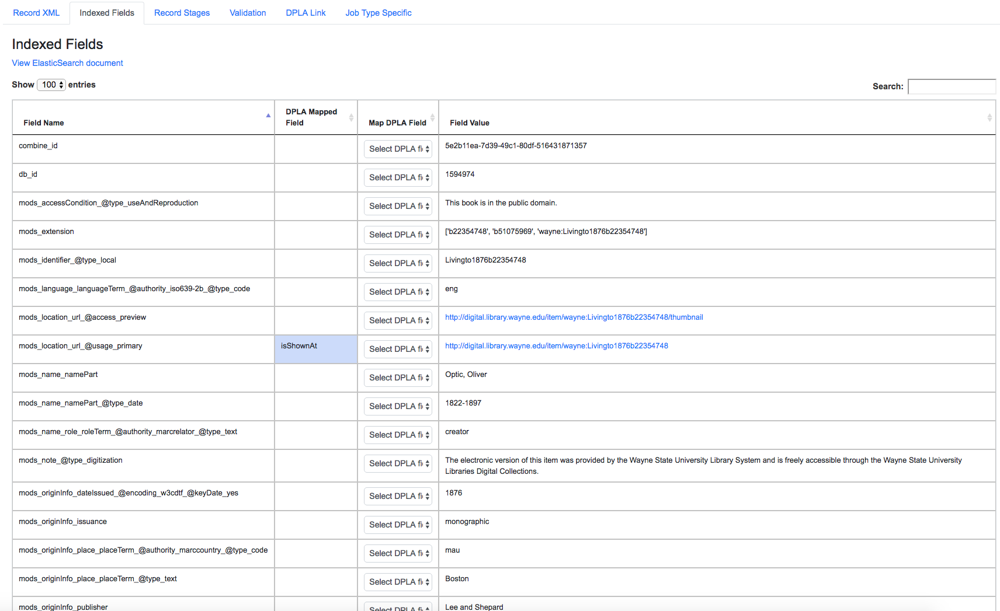

   Indexed fields for a Record

Notice in this table the columns ``DPLA Mapped Field`` and ``Map DPLA Field``.  Both of these columns pertain to a functionality in Combine that attempts to "link" a Record with the same record in the live DPLA site.  It performs this action by querying the DPLA API (DPLA API credentials must be set in ``localsettings.py``) based on mapped indexed fields.  Though this area has potential for expansion, currently the most reliable and effective DPLA field to try and map is the ``isShownAt`` field. 

The ``isShownAt`` field is the URL that all DPLA items require to send visitors back to the originating organization or institution's page for that item.  As such, it is also unique to each Record, and provides a handy way to "link" Records in Combine to items in DPLA.  The difficult part is often figuring out which indexed field in Combine contains the URL.  

**Note:** When this is applied to a single Record, that mapping is then applied to the Job as a whole.  Viewing another Record from this Job will reflect the same mappings.  These mappings can also be applied at the Job or Record level.

In the example above, the indexed field ``mods_location_url_@usage_primary`` has been mapped to the DPLA field ``isShownAt`` which provides a reliable linkage at the Record level.

Record Stages
-------------

This table show the various "stages" of a Record, which is effectively what Jobs the Record also exists in:

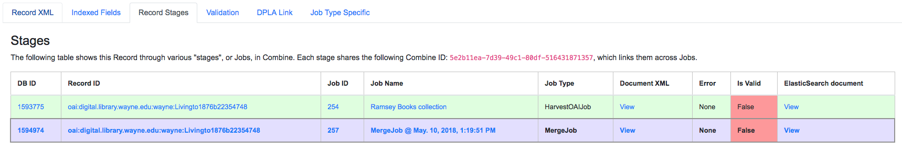

   Record stages across other Jobs

Records are connected by their Combine ID (``combine_id``).  From this table, it is possible to jump to other, earlier "upstream" or later "downstream", versions of the same Record.

Record Validation
-----------------

This tab shows all Validation Tests that were run for this Job, and how this Record fared:

.. figure:: img/record_validation_results.png
   :alt: Record's Validation Results tab
   :target: _images/record_validation_results.png

   Record's Validation Results tab

More information about `Validation Results can be found here <analysis.html#validation-tests-results>`_.

DPLA Link
---------

When a mapping has been made to the DPLA ``isShownAt`` field from the Indexed Fields tab (or at the Job level), and if a DPLA API query is successful, a result will be shown here:

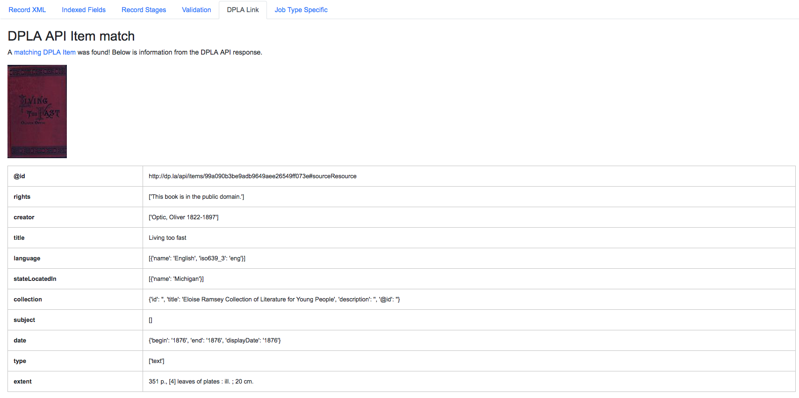

   Indexed fields for a Record

Results from the DPLA API are parsed and presented here, with the full API JSON response at the bottom (not pictured here).  This can be useful for:

  - confirming existence of a Record in DPLA
  - easily retrieving detailed DPLA API metadata about the item
  - confirming that changes and transformations are propagating as expected

Job Type Details - Records
~~~~~~~~~~~~~~~~~~~~~~~~~~

For each Job type -- ``Harvest``, ``Transform``, ``Merge/Duplicate``, ``Publish``, and ``Analysis`` -- the Record details screen provides a tab with information specific to that Job type.

**Harvest Jobs**

No additional information at this time for Harvest Jobs.

**Transform Jobs**

This tab will show Transformation details specific to this Record.

The first section shows the Transformation Scenario used, including the transformation itself, and the "input" or "upsteram" Record that was used for the transformation:

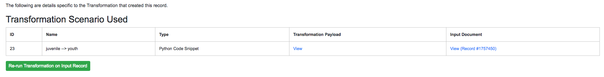

   Information about Input Record and Transformation Scenario used for this Record

Clicking the "Re-run Transformation on Input Record" button will send you to the Transformation Scenario preview page, with the Transformation Scenario and Input Record automatically selected.

Further down, is a detailed diff between the **input** and **output** document for this Record.  In this minimal example, you can observe that ``Juvenile`` was changed to ``Youth`` in the Transformation, resulting in only a couple of isolated changes:

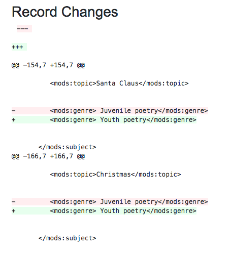

   Record transformation diff, small change

For transformations where the Record is largely re-written, the changes will be lengthier and more complex:

.. figure:: img/trans_record_details_largediff.png
   :alt: Snippet of Record transformation diff, many changes
   :target: _images/trans_record_details_largediff.png

   Snippet of Record transformation diff, many changes

Users may also click the button "View Side-by-Side Changes" for a GitHub-esque, side-by-side diff of the Input Record and the Current Record (made possible by the `sxsdiff <https://github.com/timonwong/sxsdiff>`_ library):

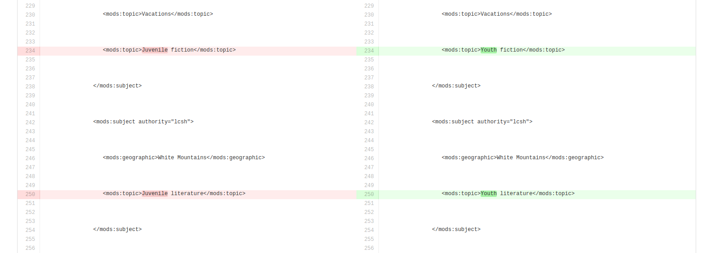

   Side-by-side diff, minimal changes

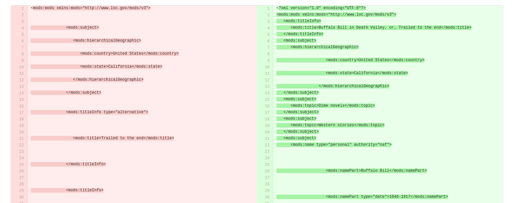

   Side-by-side diff, many changes

**Merge/Duplicate Jobs**

No additional information at this time for Merge/Duplicate Jobs.

**Publish Jobs**

No additional information at this time for Publish Jobs.

**Analysis Jobs**

No additional information at this time for Analysis Jobs.

